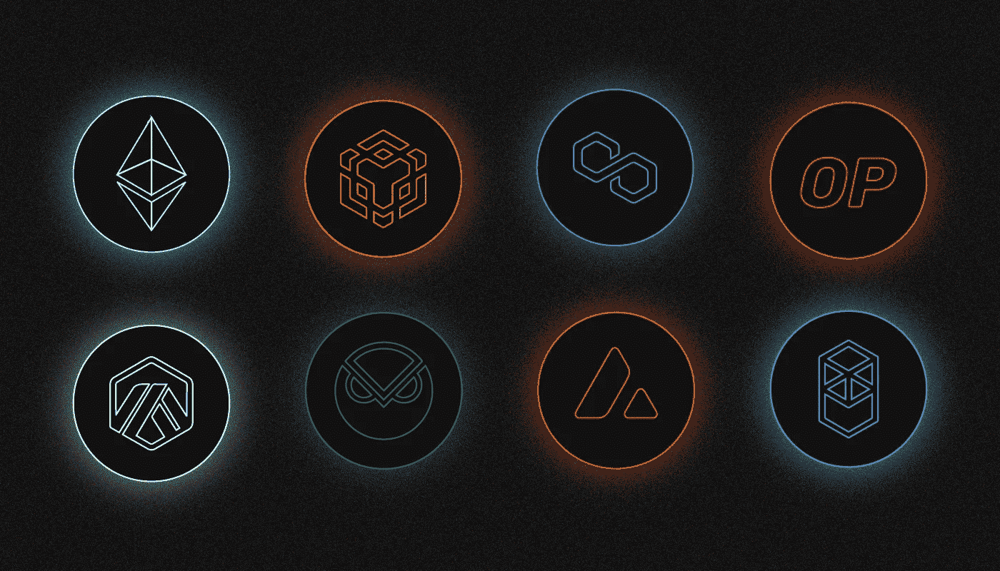

# 什么是 1 英寸？

> 原文：<https://medium.com/coinmonks/what-is-1inch-57c54f577329?source=collection_archive---------23----------------------->

[***1 inch***](https://app.1inch.io/)***是一家来自分散式交易所的流动性集合商，使用技术发送申请和下达限价订单。我们为什么需要它，它是如何工作的？我们来看看吧！***

还包括流动性养殖。

当通过 1inch 协议交换加密货币时，它提供最有利的价格，这是它从几十个来源实时收集的。

该项目有自己的令牌，可以在 1inch DAO 中使用它来减少费用。

# 谁创造了 1inch？

该项目的创始人是 **Sergey Kunts** 和 **Anton Bukov** ，他们在 **2019** 纽约的 ETHGlobal 黑客马拉松上开发了聚合器。

在此之前，他们还参加了许多其他的区块链编程竞赛。

目前，该生态系统正在由非营利组织 [1inch Foundation](https://1inch.io/foundation/) 开发，该组织发放赠款并资助域欺骗项目。此外，一个由 100 多名开发人员组成的社区也为协议的改进做出了贡献。应用代码是[在 Github 上发布](https://github.com/1inch)。

在 2021 年年底，该项目从领先投资基金获得了 1.75 亿美元的资金。

# 什么是应用程序路由？

1inch 使用[聚合协议](https://1inch.io/aggregation-protocol/)对来自各种分散平台的报价进行动态聚合。它的主要功能是在用户通过平台交换数字资产时，在不同平台和区块链上找到并向用户提供最佳报价。

1inch aggregator 与[数十种流动性来源](https://help.1inch.io/en/articles/4585125-what-are-liquidity-sources-and-how-many-of-them-does-1inch-aggregate-from)合作，包括 [Uniswap](/sunflowercorporation/what-is-uniswap-2ab17b51b63b) 、 [Curve](/@SunflowerCorpAdmin/what-is-curve-cad16f139059) 、Balancer、Bancor、PancakeSwap 和其他流行的分散式交易所。

一个特殊的智能合约管理交易的执行，防止用户资金的损失，即使与不可信的流动性来源有关。嵌入在协议中的网络佣金的优化也为加密货币交换提供了有利的价格。

一个特殊的智能合约管理交易的执行，防止用户资金的损失，即使与不可信的流动性来源有关。嵌入在协议中的网络佣金的优化也为加密货币交换提供了有利的价格。

此外，为了节省资金，该协议可以在执行期间“拆分”应用程序，同时从不同平台上的多个池中提取流动性。

# 1inch 与哪些网络合作？

该平台支持在八个区块链上运行的许多 DeFi 协议和池:

*   [以太坊](/@SunflowerCorpAdmin/what-is-ethereum-eth-37e0ff2c7af1)；
*   BNB 链；
*   [多边形](/sunflowercorporation/what-is-polygon-matic-916f4fa2afee)；
*   乐观(链接)；
*   Arbitrum(链接)；
*   灵知链；
*   [雪崩](/sunflowercorporation/what-is-avalanche-5de8f06e2bca)；
*   [Fantom](/sunflowercorporation/what-is-fantom-4ffad859b95a)

# 你怎么能在 1 英寸内交易？

聚合器 web 应用程序的界面简洁，类似于 Uniswap。首先，通过选择网络连接浏览器钱包。一个特殊的按钮用来开关区块链。

在屏幕中央可以找到一个创建应用程序的窗口。用户可以选择订单类型以及加密货币的交易方。还有更微妙的设置:网络佣金的大小，最大允许滑点率，部分执行。

# **1 inch 提供哪些类型的订单？**

由于技术实现的复杂性，传统的交易机会在 DeFi 应用中经常受到限制。特别是大多数协议只允许以当前市场价格进行交易。和集中交易一样，1 英寸增量的限价单也是可用的。[限价单协议](https://1inch.io/limit-order-protocol/)负责该功能。

在用户提交完成的订单后，它被路由到聚合器的分散数据库。它会自动与任何对立的出价组合，包括由 1inch 协议本身发出的出价(它也是流动性的来源)。

不保留用户的资金。因此，如果他们在下订单后将其转移到另一个地址，他们的订单将被忽略。

当限价单被执行时，接受者(买方)也支付网络佣金。只有 1 英寸协议不为天然气付费，允许它向用户提供更低的价格。

用户除了做市和限价单(P2P)之外，还可以在自己之间进行直接交流。2022 年增加了这个选项。

# 有可能在 1 英寸内提供和培养流动性吗？

是的，平台允许你通过[流动性协议](https://1inch.io/liquidity-protocol/)技术供应流动性来赚钱。你可以通过加入[池](https://app.1inch.io/#/1/earn/pools)做到这一点。该应用程序也有自己的 [1inch Earn](https://app.1inch.io/#/1/earn/strategies) 程序，旨在提供一致且高效的资本使用。在这个计划下，一个池，USDC/USDT，将于 2022 年 5 月**可用**，年收益率约为 4.7%。再者，1 寸运行限时[农耕程序](https://app.1inch.io/#/1/earn/farming)。

# 为什么 1inch 有自己的令牌？

聚合器有原生加密货币，于 **2020** 在以太坊网络和 BNB 链上发布(通过跨链桥)。

借助代币，可以参与项目的[道](https://1inch.io/dao/)。参与者提出建议，在论坛上讨论并投票。您需要在特殊的智能合约中阻止 1inch 令牌才能参与投票。假设硬币将用于路由协议的运行。堆叠现在可以用来获得新的代币。

现在有一个针对 1 英寸硬币持有者支付佣金的返现计划。退款金额由钱包中的硬币数量决定。退款的数量取决于钱包里的硬币数量。要参与该计划，您需要至少拥有 100 个代币，在这种情况下，返现将为 25%。

# 为什么 1inch 会有钱包？

除了贸易和农业应用程序，项目团队还在开发一个专门为 DeFi 领域设计的钱包。钱包可用于任何 DeFi 应用，可用于移动设备和 1 英寸显示器。

除了存储和转移加密货币，您还可以执行互换，参与 1inch 令牌堆叠，以及在钱包中搜索分散的应用程序。此外，1 英寸钱包可以存储不可转让的代币(NFT)，用法定货币购买加密资产，甚至可以玩区块链游戏。

> 你有什么想法？如果您对 1 英寸主题有任何补充，请在下面留下您的评论！
> 
> 在[媒体](/@SunflowerCorpAdmin)或[推特](https://mobile.twitter.com/sunflower_corp)上关注[向日葵公司](https://sunflowercorp.com/)定期更新关于趋势加密新闻。

[*向日葵公司*](https://sunflowercorp.com/) *—专注于最佳交易体验和卓越技术的新型加密货币衍生品交易所。*

*我们提供杠杆高达 x100 的 BTC/USDT 永久期货，以及最具趋势性的工具。当您与我们交易时，您将获得一个可定制的交易终端、各种图表、技术分析工具、各种订单类型以及“止损”和“获利”订单选项。*

> 交易新手？尝试[加密交易机器人](/coinmonks/crypto-trading-bot-c2ffce8acb2a)或[复制交易](/coinmonks/top-10-crypto-copy-trading-platforms-for-beginners-d0c37c7d698c)
> 
> 加入 Coinmonks [电报频道](https://t.me/coincodecap)和 [Youtube 频道](https://www.youtube.com/c/coinmonks/videos)获取每日[加密新闻](http://coincodecap.com/)

## 另外，阅读

*   [复制交易](/coinmonks/top-10-crypto-copy-trading-platforms-for-beginners-d0c37c7d698c) | [加密税务软件](/coinmonks/crypto-tax-software-ed4b4810e338)
*   [网格交易](https://coincodecap.com/grid-trading) | [加密硬件钱包](/coinmonks/the-best-cryptocurrency-hardware-wallets-of-2020-e28b1c124069)
*   [密码电报信号](/coinmonks/top-3-telegram-channels-for-crypto-traders-in-2021-8385f4411ff4) | [密码交易机器人](/coinmonks/crypto-trading-bot-c2ffce8acb2a)
*   [最佳加密交易所](/coinmonks/crypto-exchange-dd2f9d6f3769) | [印度最佳加密交易所](/coinmonks/bitcoin-exchange-in-india-7f1fe79715c9)
*   [开发人员的最佳加密 API](/coinmonks/best-crypto-apis-for-developers-5efe3a597a9f)
*   最佳[密码借贷平台](/coinmonks/top-5-crypto-lending-platforms-in-2020-that-you-need-to-know-a1b675cec3fa)
*   [免费加密信号](/coinmonks/free-crypto-signals-48b25e61a8da) | [加密交易机器人](/coinmonks/crypto-trading-bot-c2ffce8acb2a)
*   [杠杆代币的终极指南](/coinmonks/leveraged-token-3f5257808b22)