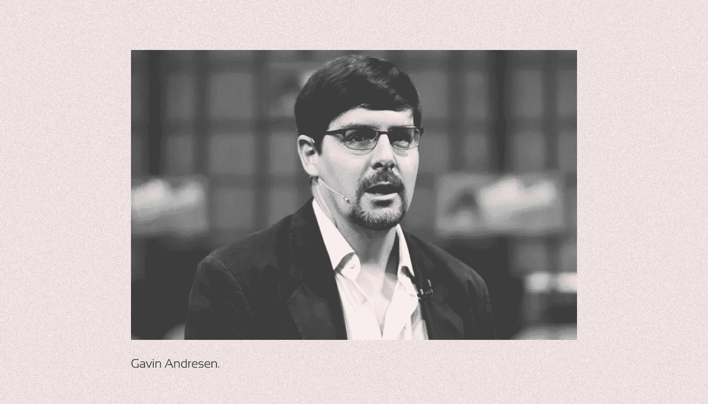

# 什么是比特币地址？

> 原文：<https://medium.com/coinmonks/what-is-a-bitcoin-address-83696279d807?source=collection_archive---------22----------------------->

***比特币地址是允许用户发送和接收加密货币的唯一标识符。有很多地址吗？哪个更好？大家一起想办法吧！***

每个 BTC 地址都是唯一的，由复杂的加密机制生成。在比特币网络中，它的功能类似于银行账户。

# 比特币地址有哪些类型？

比特币网络中有几种地址格式:

*   传统(P2PKH)
*   脚本(P2SH)
*   SegWit (P2WPKH)
*   主根(P2TR)

每种类型的比特币地址都因其技术和用户利益而不同，最显著的是支付较低交易费用的能力。

截至 2022 年 8 月，最流行的比特币地址标准是 **SegWit。**

直根或 Bech32m 格式是比特币协议中的最后一种。它们与 2021 年 11 月**的更新同时实施。**

# 如何才能区分比特币网络的格式？

比特币网络中有几种类型的地址。它们很容易通过地址开头的前缀字符来区分:

1.  **Legacy (P2PKH)** :以数字 **1** 开头。
    举例:*1n 4 qbzg 6 lsxuxyxu 2 mdugfzxwma 7 do 8 ayl*。
2.  **脚本(P2SH** ):从数字 **3** 开始。
    举例:*3j 98 t1 wpez 73 cnmqviecrnyiwrnqrhwnly*。
3.  **SegWit (P2WPKH)** :以“ **bc1q** ”组合开头。
    举例:*BC 1 qfg 9t 7 fwn 0 ATN 4 YF 9 SPCA 5502 vk 8 dy HQ 8 a 9 aqd 8*。
4.  **主根(P2TR)** :以“ **bc1p** ”组合开头。
    举例:*BC 1 peu 5hz zyj 8 cnqm 05 le 6 ag 7 uwry 0 ysmtf 3v 4 uu XV 3 V8 hqhvsatca 8 ss 2 vuwx*。

# 什么是传统格式的比特币地址？

传统地址是比特币网络中第一个地址标准，由中本聪提出。否则称为 P2P (Pay To Public Key Hash)，因为它需要从私钥计算出的签名和接收方的公钥。

传统地址由三部分组成:

*   前缀；
*   对私钥应用 SHA256 和 RIPEMD 算法后生成的公钥；
*   校验和。

比特币网络上的所有钱包和应用程序都支持从这些地址转入和转出。传统地址最大的缺点是高佣金。他们也有一个较慢的校验和双重散列速度和更多的重量在二维码。

# Script (P2SH)和 Legacy 有什么区别？

脚本地址首次出现在 2012 年 1 月的**比特币改进提案 BIP-0016 中，这要感谢比特币基金会的首席研究员**加文·安德森。****

它们遵循与传统地址相同的格式，但以数字 3 开头。这种地址假定接收者在转移资金时必须有一个与散列脚本匹配的脚本。您可以使用此功能降低转账费用，将佣金成本转移给收款人，并创建多签名地址。

# SegWit 格式的优势是什么？

**2016 年春天**，开发者 **Pieter Wuille** 和 **Gregory Maxwell** 在 BIP-0173 更新中提出了一种叫做 Bech32 的新型地址。它也称为隔离见证(SegWit)或 P2WPKH(付费见证公钥哈希)。

此类地址采用 SegWit 协议，该协议允许您通过删除签名来减少比特币网络中的块大小，从而比使用脚本或遗产时的交易费用更低。相关更新于 2017 年 8 月**底上线。**

**截至 2022 年**，SegWit 被认为是行业标准，受所有流行的比特币钱包支持。根据网站 [Transactionfee.info](https://transactionfee.info/charts/transactions-spending-segwit/) 的数据，在 2022 年 8 月中旬的所有对外交易中，约有 85%是从 SegWit 地址进行的。

# 直根是最好的比特币地址类型吗？

几年来，人们一直在等待名为 **Taproot** 的比特币协议更新。其激活于 2021 年 11 月完成**。**

升级包括重大的技术变化，最显著的是 Schnorr 签名方案和 MAST 概念的实现。直根应该可以提高比特币区块链的效率和可扩展性。然而，这一更新还有另一个影响:一种新格式的地址被称为 Pay-to-Taproot (P2TR)或 Bech32m。

主根地址的主要优势是，它们比其他格式的费用更低，并允许更便宜的闪电网络支付。

然而，Taproot 有一个明显的缺点:它目前只支持有限数量的钱包。在 2022 年 8 月中旬**所有传出的比特币网络转账中，只有 0.56%是从这种地址发出的。**

**被大量应用和用户使用的去中心化的比特币网络的特点是逐渐采用新标准。在实施 SegWit 之后，观察到类似的情况。**

# **有没有可能在各种格式之间转移比特币？**

**今天，Legacy、Script 和 SegWit 彼此完全兼容。它们之间允许进行传入和传出的转移。**

**直根的情况有点不一样。大多数非托管钱包支持向 Bech32m 这样的地址发送交易，但它们缺乏创建这样的地址的功能。此外，并非所有的加密货币交易所都允许将资金发送到主根地址。在流行的比特币钱包中实现 Taproot 的当前情况可以在[比特币维基](https://en.bitcoin.it/wiki/Bech32_adoption)网站上查看。**

**使用的很多比特币博客浏览器都支持 P2TR 地址的交易，比如 [Blockchair](https://blockchair.com/) 或者 [Blockstream](https://blockstream.info/) 。**

> **如果你对比特币地址话题有什么补充，欢迎评论！
> 在跟踪更新方面，订阅我们的[媒体提要。](https://medium.com/sunflowercorporation)敬请期待！**

> **交易新手？尝试[加密交易机器人](/coinmonks/crypto-trading-bot-c2ffce8acb2a)或[复制交易](/coinmonks/top-10-crypto-copy-trading-platforms-for-beginners-d0c37c7d698c)**