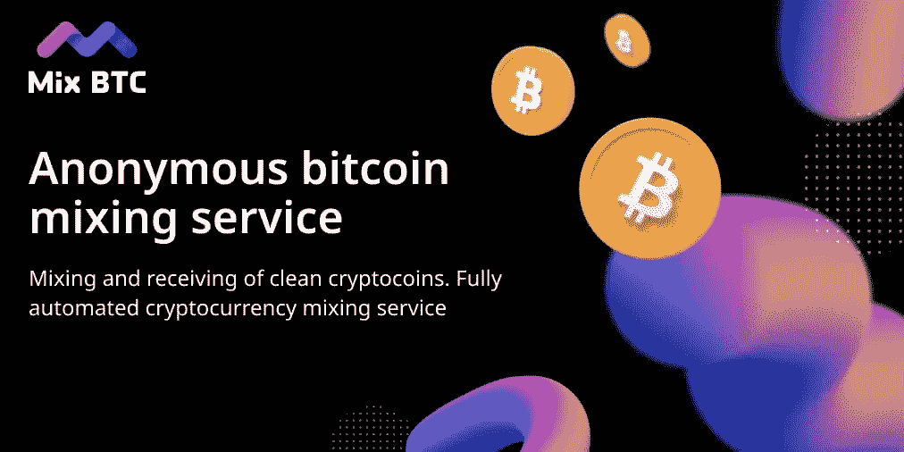

# 什么是比特币混合器，它的功能是什么(匿名等。)

> 原文：<https://medium.com/coinmonks/what-is-a-bitcoin-mixer-and-what-are-its-functions-anonymity-etc-32b6e6e186b?source=collection_archive---------21----------------------->

众所周知，区块链是伪匿名的，尽管它有许多不可否认的优点。每个人都可以看到硬币从哪里来，从谁那里来。如果你曾经使用智能合约或发送你的地址来接收比特币，第二方可以使用你的地址跟踪你在网络上的交易。所有的“步骤”都记录在注册表中，这样就可以跟踪和分析你的所有行动。

[https://mixbtc.online/](https://mixbtc.online/)

一个[比特币混合器](https://mixbtc.online/)是一个将你的一些硬币与其他所有者的硬币混合起来的系统，因此没有人能够在事后追踪硬币的来源。这是一种在交易过程中“破坏线索”的方式，这样就没有人能透露比特币来自哪里，属于谁，去了哪里。通过这种方式，比特币混合器增加了安全性和匿名性。

 [## MixBTC

### 混合量应大于 0.001 BTC。此外，它应该作为一个整体在一个交易中发送，而不是分割…

mixbtc.online](https://mixbtc.online/) 

与混音器协作的算法非常简单，可能会因服务而略有不同，但一般来说，一切都是这样的:

1.  购买比特币(如果你还没有的话)。
2.  将硬币发送到比特币混合器。
3.  硬币是混合的。在这里，您可以选择混合的程度或周期和/或佣金的大小(所有这些因素都会直接影响混合的质量)
4.  你会收到一封来自比特币混合器的保证书，这将帮助你在出现故障时联系技术支持，以找出问题所在。mixer 不会存储或要求任何关于您的数据。
5.  你得到相同数量的硬币，但是是从混合服务中得到的。

最重要的是小心选择一个[比特币混合器](https://mixbtc.online/)，不要把你的加密资金送给骗子。首先，尝试发送少量以测试服务，如果一切正常，混合大量硬币。

[https://mixbtc.online/](https://mixbtc.online/)

> 交易新手？试试[密码交易机器人](/coinmonks/crypto-trading-bot-c2ffce8acb2a)或[复制交易](/coinmonks/top-10-crypto-copy-trading-platforms-for-beginners-d0c37c7d698c)