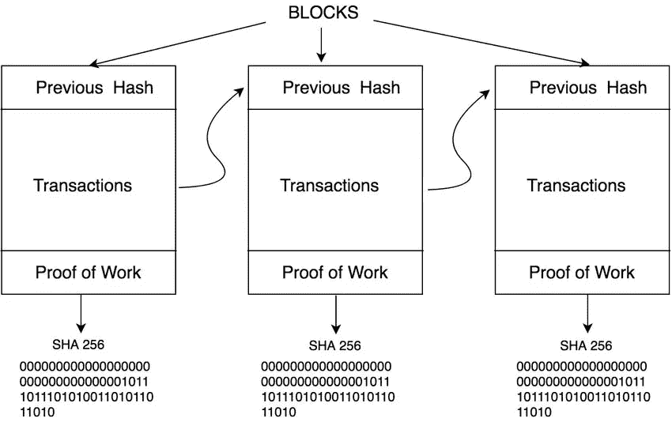

# 什么是区块链？

> 原文：<https://medium.com/coinmonks/what-is-a-blockchain-fe0e42af9968?source=collection_archive---------42----------------------->

在当前的数字时代，区块链是技术的未来。那么什么是区块链呢？让我分享一些我到目前为止了解到的关于区块链的信息。

区块链有多种定义。我们来看一个最简单的。**区块链是一种分布式共享账本，可以认为是交易的共享账本，交易以区块为单位进行排序和分组**。在当前的现实世界中，模型基于每个组织维护的私有数据库。一个分布式账本，它为所有使用区块链的成员提供了单一的真相来源。区块链基本上是一个链表，使用哈希指针而不是普通指针。哈希指针用于指向前一个块。区块链的结构可以形象化，如下图所示。

# 区块链元素。

每个数据块都有一个地址、散列、事务、随机数、时间戳等。还有其他元素，但这 4 个是主要的，我们将在本文中讨论。

**地址**是在区块链交易中用来表示发送方和接收方的唯一标识符。地址通常是公钥或从公钥派生的。

**散列**是一个块中包含的所有数据的加密散列，如前一个块的地址、随机数、事务、时间戳等。在块中，我们存储前一个块的散列，以保持区块链的不变性。

**Nonce** 是一个随机数，用于在期望的目标之间创建散列。

**时间戳**是区块被开采时的时间戳。

# 区块链的特点。

区块链提供**安全**。由于区块链的数据对区块链的节点是可用的，并且它们负责通过使用共识机制在所有节点批准之后向区块链添加区块，所以篡改数据太困难了。

**不变性**是区块链的另一个关键特性:记录一旦被添加到区块链就不可改变。逆转区块链上的数据变化几乎是不可能的，因为这需要一种难以负担的计算能力。

**唯一性**:区块链确保每一笔交易都是唯一的，并且还没有被花掉。

区块链还有更多特色。我现在只分享了区块链的三个特点。

参考资料:掌握区块链一书。

> 交易新手？尝试[加密交易机器人](/coinmonks/crypto-trading-bot-c2ffce8acb2a)或[复制交易](/coinmonks/top-10-crypto-copy-trading-platforms-for-beginners-d0c37c7d698c)