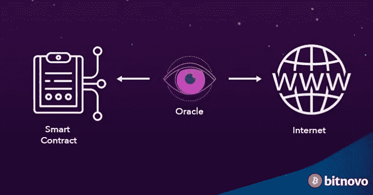

# 区块链甲骨文解释道

> 原文：<https://medium.com/coinmonks/what-is-a-blockchain-oracle-24f49082857d?source=collection_archive---------21----------------------->

blockchain oracle by [bitnovo](https://blog.bitnovo.com/en/what-is-a-blockchain-oracle/#:~:text=A%20Blockchain%20Oracle%20is%20a,that%20they%20can%20make%20decisions.)

智能合约的日益普及创造了对区块链神谕的需求。

先说智能合约。它是当事人之间的一种协议，在满足某些特定条件时，通过计算机代码在区块链上运行。

智能合约主要建立在孤立的网络上，也就是说，它们没有内置的连接来从区块链的外部环境中收集数据。

因此，智能合约依靠神谕来提供外部的真实数据。

在这篇文章中，你将学习区块链神谕的含义、类型和问题。您还将学习神谕的重要性，以及如何在区块链使用它们来解决现实生活中的问题。

## 什么是区块链甲骨文？

区块链 oracle 是一种外部服务，它传递智能合同所需的额外信息，以确定协议的结果。它是区块链和外部环境之间的连接。

换句话说，oracle 不是智能合约的一部分，而是在智能合约中完成协议的数据提供者。因此，Oracles 是一种查询、验证和认证数据的手段。

让我们假设 Bob 向区块链足球博彩公司下了赌注。由于这家博彩公司使用[区块链技术](/coinmonks/understanding-blockchain-77ce52b9b8f5)，它运行在智能合约上，一旦执行就不需要任何人工干预。因此，一旦合同签订，鲍勃和公司都不能更改或增加合同条款。

因为足球比赛是实时进行的，所以如果没有外部来源的通知，智能合同就无法知道比赛的结果。请记住，智能合约是预先编程的。

因此，智能合同需要一个可信的外部来源，向其提供比赛结果，以解决 Bob 和公司之间的打赌。这个外部来源就是神谕。神谕并不产生这种信息，它只是一种可信赖的服务，一种媒介，通过它可以传递这种信息。

## **甲骨文问题**

区块链是无信任系统，也就是说，它们不需要受信任的实体或个人来执行它们的功能。它们依赖于几个安全特性，如去中心化、共识机制等，以确保它们的安全，免受不良行为者的攻击。因此，他们很难妥协。

但是神谕并不使用与区块链相同的安全措施，在那里它们被集成到工作中。他们有私人安全措施。因此，如果 oracle 受到威胁，它会影响它所支持的智能合约。具体来说，它扭曲了其基础智能合约的输出。

## **区块链甲骨文的种类**

根据它们执行的功能，有各种类型的神谕。一些 oracles 将数据中继到智能合约，而其他 oracles 则通过智能合约将数据传输回环境。

1.  **集中式和分散式神谕**

集中式 oracles 由单个实体管理。这种 oracle 的危险在于它是单点故障。因此，它很容易妥协，因此不可靠。

分散的神谕，然而，运行在公共区块链的原则。他们依靠分散的计算机网络(节点)来收集数据，从而使他们更难妥协。它们不是单点故障，所采取的决策必须得到所有参与节点的同意。 [Chainlink](https://chain.link/) 是一个分散式甲骨文网络(DON)的例子。

**2。软件和硬件甲骨文**

软件先知从网络上获取信息。他们依赖网站、数据库和服务器为他们提供信息，并将其传递给基础智能合同。

软件 Oracles 实时传递信息，这是使用它们的智能合约的一个优势。这样，解决智能合同条件变得即时。传递信息的例子可以是预测市场的汇率或博彩公司的体育比赛结果。

硬件 Oracles 将来自现实世界的原始信息转换成数字数据，用于需要并理解它的智能契约。信息可以来自电子传感器或其他信息读取设备的温度读数。

**3。入站和出站甲骨文**

oracle 可以通过两种方式传输信息—入站和出站。入站 oracle 从外部环境收集数据并将其发送到智能合约以供使用，而出站 Oracle 通过其智能合约将数据从区块链传输到外部环境。

**4。人类神谕**

一个在某个领域非常熟练的人可以充当先知。这些人从各种来源获取信息，分析并验证这些信息。然后，他们继续将信息输入智能合约，以满足设定的条件。

人类的神谕不容易被模仿，因为它们依赖于密码术来验证它们的身份。加密信息很难被破解，这就是为什么首先选择加密技术来保护区块链的原因。

**5。特定于合同的预言**

顾名思义，特定于合同的 oracles 只能满足单个(特定)智能合同的需求。有几个协议要解决的智能合同只能使用几个特定于合同的 oracles，才能满足其需求。

这种 oracle 只应在必要时使用，因为它很昂贵，而且需要大量的操作时间。

## **甲骨文应用**

区块链神谕通过“征服”区块链最初不会渗透的某些领域，帮助区块链开发者扩展他们的关注领域。神谕在今天的区块链有如此多的应用。

在[分散财务(DeFi)](https://www.investopedia.com/decentralized-finance-defi-5113835) 中，oracles 用于获取资产和市场的财务数据，这些数据可用于结算智能合同协议和运营。

Oracles 还可以应用在动态[不可替代令牌(NFTs)](https://en.wikipedia.org/wiki/Non-fungible_token) 和游戏中，在这些地方它们需要做出某些决定和结论。动态 NFT 是一种加密资产，其外观根据特定条件(如时间、温度等)而变化。例如，NFT 的颜色可以根据一天中的时间、温度或其他条件而变化。这些非功能性测试依赖于神谕来帮助他们确定和确认这些条件，以达到预期的结果。

在保险行业中，输入和输出 oracles 都可以用来分别验证索赔和支出。

## **结论**

在没有实时数据的情况下执行智能合约将会受到很大限制。区块链甲骨文可以应用于区块链的几个领域，如 DeFi、动态 NFTs 和游戏以及保险。

尽管有不同的 oracle 类型，但像公共区块链这样的分散式 oracle 是最安全的 Oracle。他们有最好的机会解决区块链甲骨文的问题。

如果你喜欢读这篇文章，请鼓掌并关注我以获取更多高质量的内容。

> 交易新手？尝试[加密交易机器人](/coinmonks/crypto-trading-bot-c2ffce8acb2a)或[复制交易](/coinmonks/top-10-crypto-copy-trading-platforms-for-beginners-d0c37c7d698c)