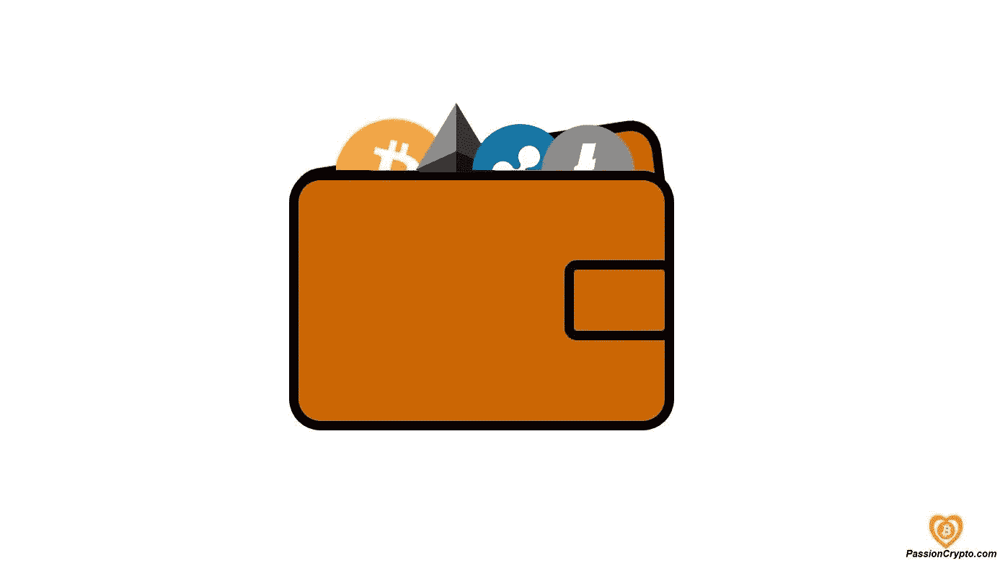
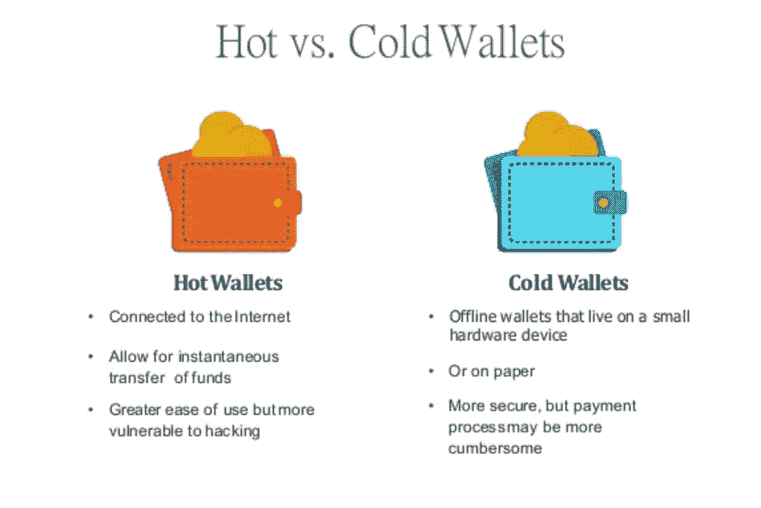
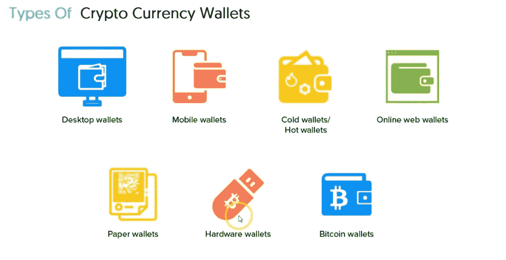

# 什么是区块链钱包&你为什么需要它？

> 原文：<https://medium.com/coinmonks/what-is-a-blockchain-wallet-why-do-you-need-it-51fffc6571b0?source=collection_archive---------15----------------------->

我们都经历过传统的无边界支付有多麻烦！通过多种渠道进行的每一笔交易，不仅增加了成本，也延误了付款。提供简单、安全和灵活的方式与数字资产和加密货币互动的组织和企业在这次熊市中的利润翻了一番。比特币和以太坊等加密货币因其优于传统法定货币的优势而越来越受欢迎。但是要使用这项服务，你需要了解区块链钱包的工作原理。

这篇文章将解释关于区块链钱包的一切，并给你一个拥有钱包的理由。因此，请继续阅读，了解如何让您的全球支付更快、更便宜，并且没有中介延迟！

**什么是区块链钱包？**

区块链钱包就像普通钱包一样，但它的区别在于允许用户携带不同类型的数字加密货币。该钱包可通过网络和移动设备访问，并且区块链安全公司承诺保护用户身份，因为所有交易都经过加密签名(数字签名)。

简单来说！区块链钱包用户可以交换、接收、存储和向不同方发送数字资产，而不必担心黑客攻击或盗窃。它就像 PayPal 或任何其他高安全性的支付网关，适用于所有类型的加密货币，如以太坊、比特币、莱特币、Jaxx、Samurai 等等。

**区块链钱包是如何工作的？**

每个区块链钱夹都有一个公钥和一个私钥，它们在创建钱夹时与之相关联。例如，要接收电子邮件，您必须给收件人您的电子邮件地址。但是您的收件人不能从您的电子邮件地址向他们自己发送电子邮件。为此，他们需要您的密码，这是您的隐私。这同样适用于区块链钱包，你的电子邮件地址是一个公钥，你可以给别人定位你的钱包，但你的密码是你的私钥，应该是一个秘密，这样就没有人能访问你的钱包。

**区块链钱包的种类**

***基于私钥***

基于私钥，有两种类型的区块链钱包:热钱包和冷钱包。热门钱包是用户友好的，用于日常交易。冷钱包可以离线使用，可以存储高安全性的加密货币。

***基于用法***

我们再进一步细分为三种:软件钱包、硬件钱包(插 USB)、纸质钱包(公私钥都可以存储在纸上)。

**软件钱包:**

软件钱包是一种可以在桌面或移动设备上下载的应用程序，也可以用作基于网络的应用程序。一些受欢迎的钱包是 Jaxx，Copay 和面包钱包。让我在这里向你解释它在不同设备上使用时是如何工作的

o ***桌面钱包:***

桌面钱包，也称为冷钱包，其中私钥存储在桌面上(冷服务器)。用户可以进行离线交易。在互联网连接问题的情况下，这种钱包使用桌面作为记录交易的替代服务器。

虽然这些钱包可以在任何计算机上下载，但只能通过被认可的计算机(安装它们的系统)访问，以拒绝未经授权的访问。Electrum 是最受欢迎的桌面钱包，性价比高。

o ***在线钱包***

这些热门钱包很容易在互联网上进行快速交易。用户可以通过任何设备访问此钱包；私钥在线存储并由第三方管理。例如，Green Address 是一个比特币钱包，带有一个 Android 应用程序，可在 web、桌面和 iOS 上使用。

o **手机*钱包***

移动钱包类似于在线钱包，但专门为用户友好的移动界面开发，通常用于[食品服务应用](https://www.linkedin.com/pulse/win-your-fooders-apps-like-uber-eats-complete-guide-sana-ahmad/?trackingId=XjdsCRLmnNwRX31%2Bp23HOw%3D%3D)。菌丝体是下载量最多的手机钱包。

**硬件钱包:**

硬件钱包就像一个 USB 设备(冷存储设备)，将用户的私钥存储在受保护的硬件设备中。它可以只是另一个连接到电脑上的便携设备，但是防黑客且更安全。Trezor、KeepKey 和 Ledger 是市场上顶级的硬件钱包。

**纸质钱包:**

用户可以离线将加密货币存储在纸质钱包中。纸质钱包将用户的私钥和公钥印在纸上，只能通过二维码访问。这些钱包很安全，可以存储大量的加密货币。

纸质钱包需要与软件钱包集成才能转移资金。首先，用户将一些资金存入纸钱包，然后资金从软件钱包转移到印在纸钱包上的公共地址。比特币纸质钱包和 MyEther 钱包是最常用的两种纸质钱包。

**使用区块链钱包的小技巧:**

*   选择一个钱包，让你可以控制私人密钥，并保存在桌面/离线。
*   选择一个有密码等附加安全功能的。
*   选择一个有积极维护和改进支持的。
*   选择界面简单、用户友好的。
*   就拿多操作系统或你个人设备的操作系统来说吧。
*   选择一个可以帮助你保持加密更长的交易时间和长期和短期储蓄。

**总结！**

区块链技术可以为现有的金融系统注入新的活力。对于那些渴望将业务透明地扩展到全球、但一直是传统菲亚特经济受害者的人来说，以象征性成本、无需任何人工干预地轻松接收、发送、存储和共享资金，可能是梦想成真。

***订阅 Techie 的笔记本，获取最新科技趋势的更新。***

*原载于*[*https://www.linkedin.com*](https://www.linkedin.com/pulse/what-blockchain-wallet-why-do-you-need-sana-ahmad/)*。*

> 交易新手？尝试[加密交易机器人](/coinmonks/crypto-trading-bot-c2ffce8acb2a)或[复制交易](/coinmonks/top-10-crypto-copy-trading-platforms-for-beginners-d0c37c7d698c)