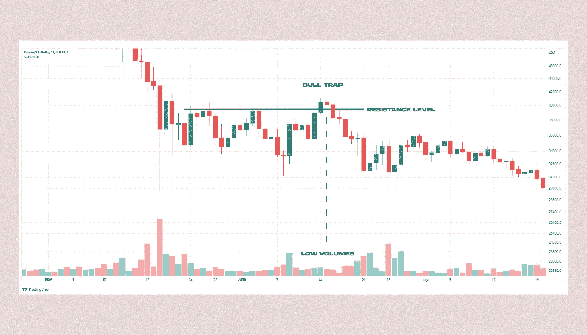
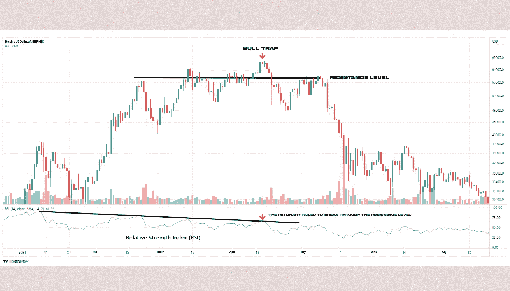

# 什么是捕牛陷阱？

> 原文：<https://medium.com/coinmonks/what-is-a-bull-trap-c7f3f96fffb5?source=collection_archive---------55----------------------->

***多头陷阱是一个交易术语，描述市场通过发出买入资产的信号来“欺骗”投资者，但随后转向相反方向的情况。你如何走出陷阱？让我们一探究竟！***

牛市陷阱是由于交易者没有能力或不愿意保持上涨趋势而产生的。

如果投资者基于有限的交易工具做出情绪化、草率和鲁莽的决定，陷入牛市陷阱的可能性就会增加。

# 人是怎么掉进牛陷阱的？

当持续增长的第一个迹象或资产价格从下跌走向上涨的可能变化出现时，这种陷阱就可以在市场上被识别出来。市场的“把戏”是买家预测价格增长，导致“多头”占据主导地位，而卖家才是真正的市场力量(“空头”)。

牛市陷阱可以在向下运动时形成，例如，当资产价格在向上突破后升至阻力位以上时。在这种情况下，交易者可能认为市场正在出现反转和买方需求。然后，他们开始买入资产，预期价格会进一步上涨，之后，卖方被证明是“更强的”，报价回到下降趋势。

An example of a bull trap: a short-term price increase without an increase in trading volumes

除了牛市陷阱，交易还使用“熊市陷阱”,即市场“欺骗”卖方。许多加密货币交易商在 2020 年**中期**落入了这个陷阱，就在 2020 年**至 2021 年**的下一轮牛市开始之前。

# 捕牛陷阱是什么意思？

牛市陷阱是为卖家创造有利价格条件的一种合乎逻辑的方式:售价越高，你通过出售资产获得的利润就越多。

在交易比特币和其他加密货币时，大型交易商或“空头”利用疲软的价格增长趋势制造一个牛市陷阱。它们不会干扰报价上涨条件的形成，甚至可以将加密资产的价格推高到对买家有利的水平。

这造成了资产价格持续增长和买方主导市场的有利条件的假象。捕牛陷阱并不总是一个“人为”的过程；它可能是市场对新闻或事件的短期积极反应的结果。

# 人为什么会掉进牛陷阱？

尽管市场是复杂多变的，但还是有几个原因导致了牛市陷阱的出现:

***情绪*** 情绪化的市场参与者更容易做出轻率的交易决策。任何微小的价格上涨或反弹都被解读为反转和买入信号，导致轻率的结论，结果是亏损。

***交易工具*** 根据少数因素和指标做出决策的交易者，对正在发生的事情没有一个全面的了解。例如，如果交易量明显低于前几个时期，价格的大幅上涨将是不足的购买信号。

The risk of a bull trap increases when the resistance level is broken through without confirming the trend on other indicators (in this case, the RSI)

已经确信市场反转的交易者会忽略信号，或者试图编造不存在的证实，以便让解释“符合”他们自己的策略。

# 你如何不陷入牛市陷阱？

牛市陷阱可能发生在各种情况下，但在交易时落入陷阱是有风险的。

阻力位上方形成多头陷阱，必须反复测试后观察市场反应。成功地将价格固定在目标价位之上，可以显著降低跌入陷阱的可能性。

交易者必须监控交易的资产量。

交易者需要观察资产交易量。随着交易量的增加，报价的强劲上升可能表明买方兴趣的增加。没有增加的交易量的价格上涨可能表明买方疲软和卖方暂时暂缓，这意味着牛市陷阱。

技术分析工具，如相对强弱指数，随机振荡指标，移动平均线收敛背离，也可以用来逃脱陷阱(MACD)。

> 如果你对牛陷阱话题有任何补充，欢迎评论！
> 在跟踪更新方面，订阅我们的 [Medium feed。](https://medium.com/sunflowercorporation)
> 
> 敬请期待！

> 交易新手？尝试[加密交易机器人](/coinmonks/crypto-trading-bot-c2ffce8acb2a)或[复制交易](/coinmonks/top-10-crypto-copy-trading-platforms-for-beginners-d0c37c7d698c)