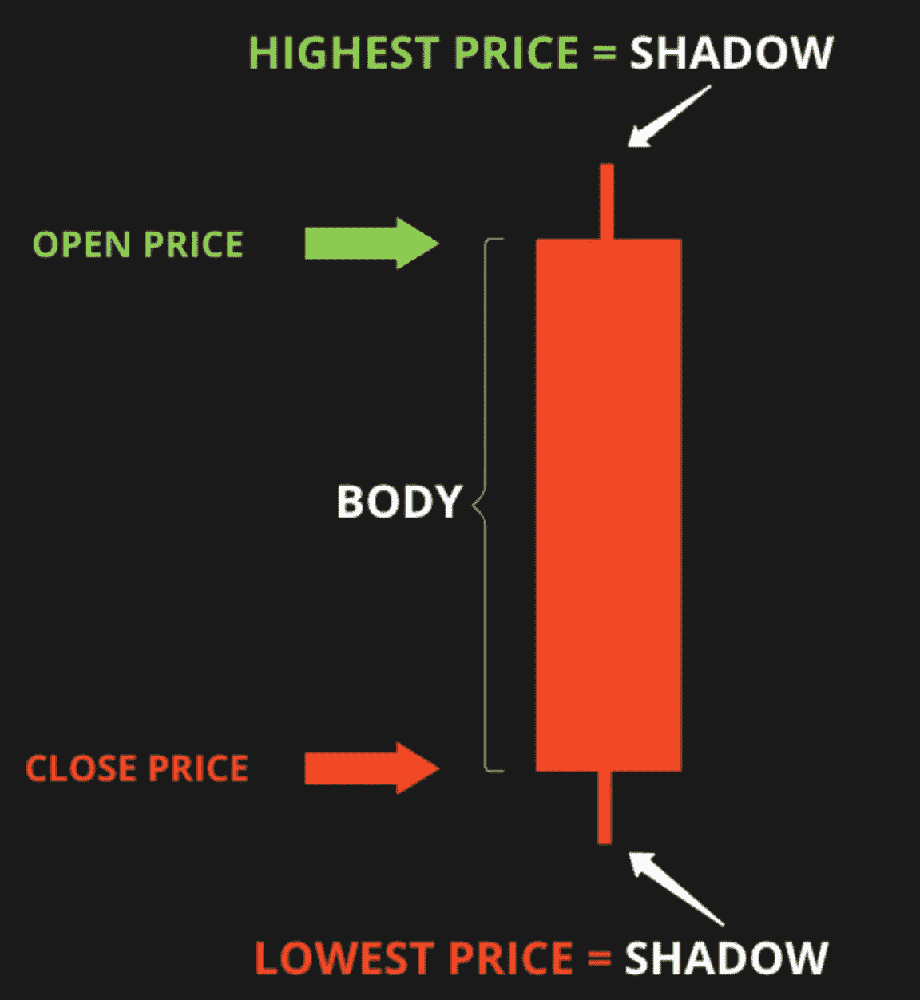
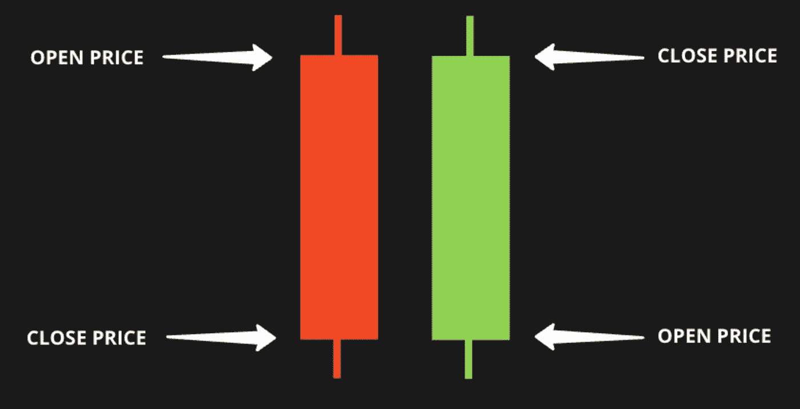
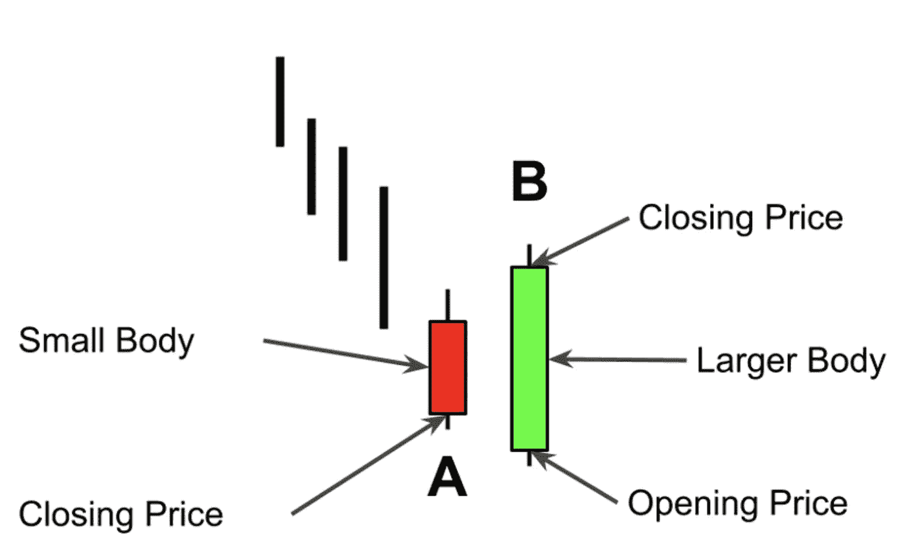
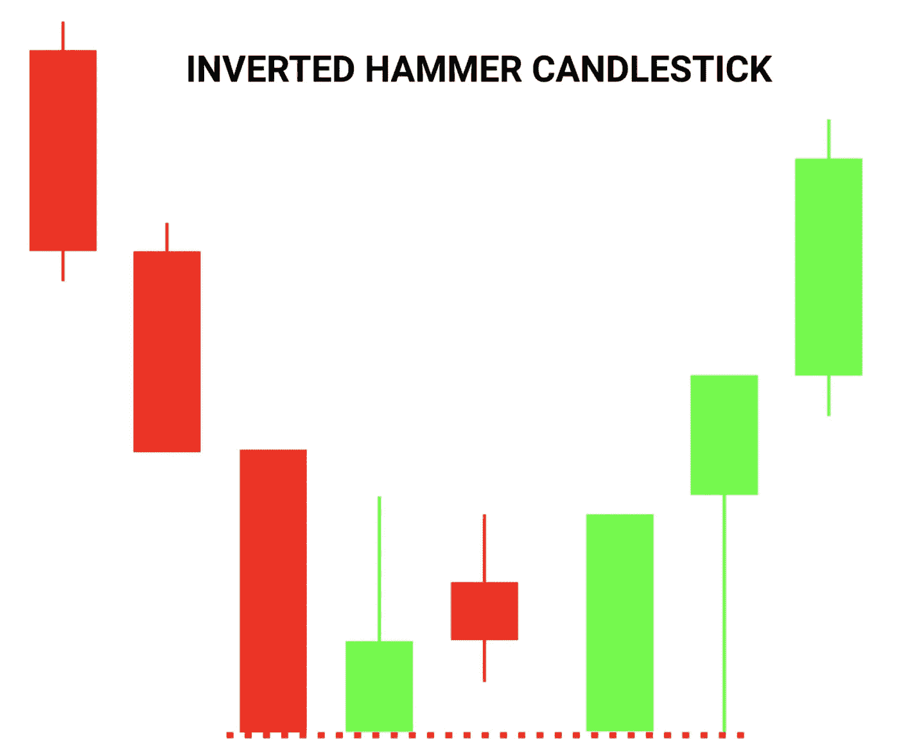
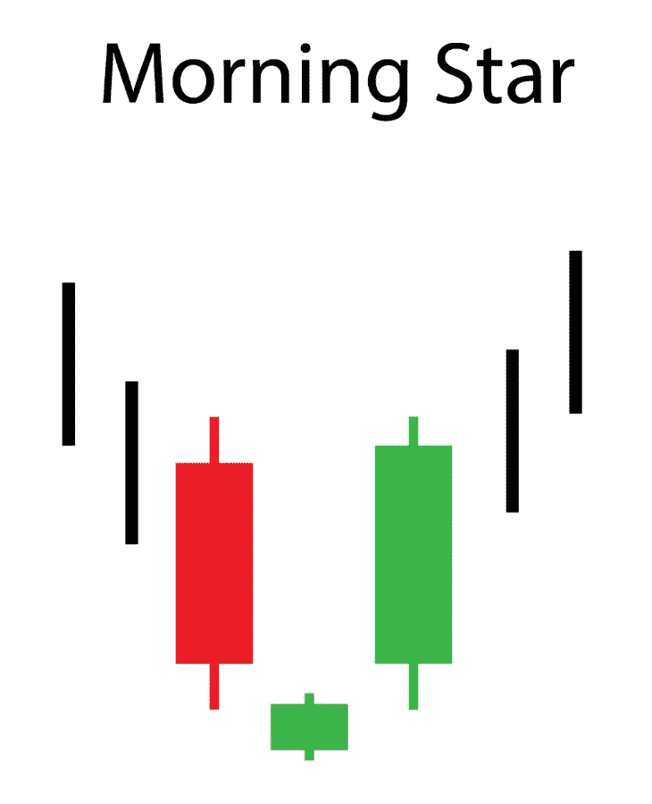
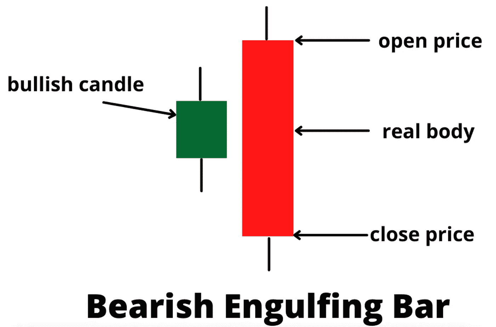
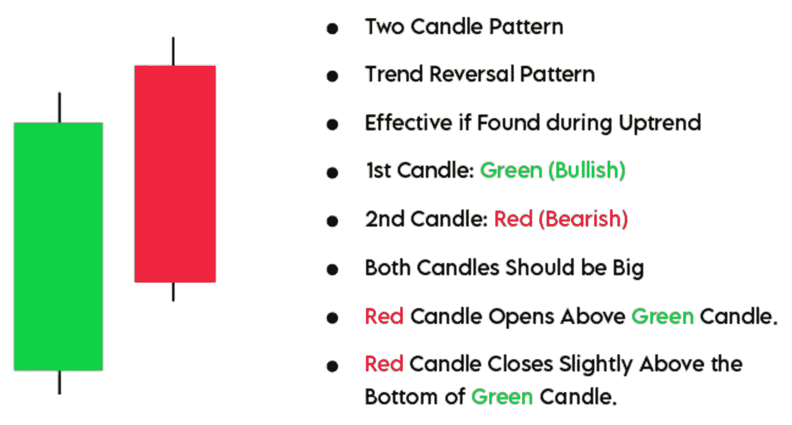
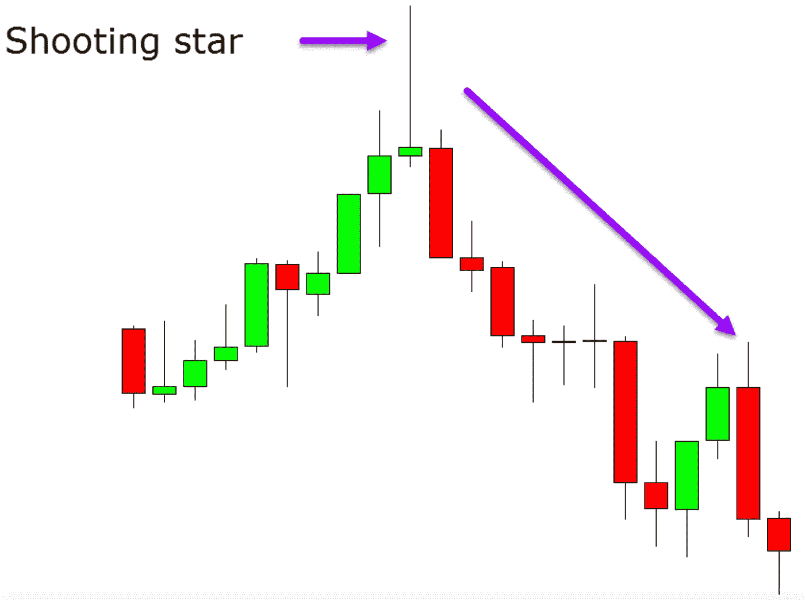

# 什么是蜡烛图？专业交易者使用的一些模式。

> 原文：<https://medium.com/coinmonks/what-is-a-candlestick-chart-and-some-patterns-pro-traders-use-1e2275f875e7?source=collection_archive---------37----------------------->

Photo by [regularguy.eth](https://unsplash.com/@moneyphotos) on [Unsplash](https://unsplash.com/)

# 什么是蜡烛图？

蜡烛图是由单根蜡烛组成的图表，交易者用它来了解价格的变化。烛台价格行动包括查明价格**在哪里开始**一段时间，价格**在哪里结束**一段时间，以及价格**在特定时期的高点和低点**。

Explanation of candlestick body.

主体显示了特定时间段内开盘价和收盘价之间的范围，阴影描绘了在设定的时间间隔内达到的最高价和最低价。

红色蜡烛表示价格在下降，绿色蜡烛表示价格在上升。

如果你在看 10 分钟图表，每根蜡烛线代表 10 分钟的时间间隔。

Candlestick open and close price for a sell and buy.

当开盘价低于收盘价时，我们看到绿色蜡烛线。如果收盘价比开盘价低，蜡烛是红色的。

# **图案**

显示市场可能改变方向的形态被称为**反转形态**。他们可能是看跌的，这表明从上升趋势到下降趋势的变化，应该被视为一个可能的卖出信号。

## **看涨形态**

***看涨吞没***

在看涨吞没形态中，市场必须处于明确定义的下降趋势中，它由一根红色蜡烛组成，后面是一根更大的绿色蜡烛，绿色蜡烛完全吞没了红色蜡烛。这种模式是市场转折点的标志。市场可能会开始上涨，这可能是买入的好时机。

如果绿色烛台吞噬了两三支红色蜡烛，这种迹象就更明显了。

Bullish Engulfing pattern. Reference from [learn.bybit](https://learn.bybit.com/candlestick/how-to-use-bullish-engulfing-candle-to-trade-entries/)

***锤子***

你会通过它的短身体和较低的阴影认出锤子，并且大约是身体长度的两到三倍。通常是下跌价格反转并开始上涨的明确迹象，这样你就可以开始考虑买进了。

Hammer pattern. Reference from [learn.bybit](https://learn.bybit.com/candlestick/how-to-read-the-inverted-hammer-candlestick-pattern/)

但是为了安全起见，你可以等待进一步的确认。例如，这种确认是锤子开口上方的绿色蜡烛。

***晨曦多奇***

当市场出现轻微波动，三根蜡烛线一致时，就会出现这种形态:一根红蜡烛线，接着是一根多支蜡烛线，接着是一根绿蜡烛线，在第一根蜡烛线的中间收盘。

如果绿色的比红色的长，信号就更可靠了。

发现晨星是买入的好信号。

Morning Star pattern. Reference from [gauravheera](https://gauravheera.com/sharemarket/morning-star-evening-star-candlestick-patterns-episode-3-of-multi-candlestick-patterns/)

## **看跌形态**

***看跌吞没***

是看涨吞没的反义词。一根绿蜡烛被后面的红蜡烛完全吞没了。当你发现它时，你可能会开始考虑卖出，因为市场上的卖家可能已经设法压倒了买家，价格方向可能会逆转。

Bearish Engulfing pattern. Reference from [digiteckworlds](https://digiteckworlds.wordpress.com/2021/03/06/bullish-and-bearish-engulfing-candlestick-pattern/)

***乌云盖顶***

在价格下跌之前出现。一根长绿蜡烛后面跟着一根红蜡烛，红蜡烛在新高打开，在绿蜡烛中间以下关闭。

请记住，当交易货币时，第二根蜡烛线打开新高是很罕见的，所以红色蜡烛线通常在绿色蜡烛线的收盘水平打开。

一旦你看到这种模式，这可能是一个很好的卖出机会，或者你可以等待另一个更小的红烛形成并确认乌云覆盖。

Cark Cloud Pattern. Reference from [indiacharts](https://www.indiacharts.com/blogs/dark-cloud-cover-candlestick-pattern/)

***流星***

是一个红色的烛台，小小的主体，长长的上阴影，短短的下阴影。当它出现在上升趋势的末端时，它可以表明你可以卖出，因为一直上涨到那个点的价格可能会开始下跌。

Shooting Star pattern. Reference from [learnpriceaction](https://learnpriceaction.com/shooting-star-candlestick-pattern/).

*我不提供个人投资建议，也不是合格的持牌投资顾问。以上信息都不是财务建议。我不会也不可能对你因在此阅读的任何内容而采取的任何行动负责。*

> 交易新手？尝试[加密交易机器人](/coinmonks/crypto-trading-bot-c2ffce8acb2a)或[复制交易](/coinmonks/top-10-crypto-copy-trading-platforms-for-beginners-d0c37c7d698c)