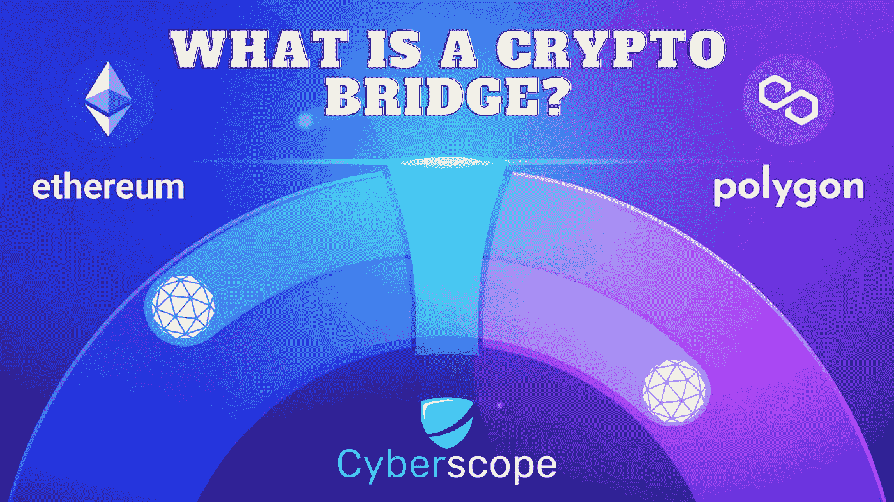

# 什么是加密桥？

> 原文：<https://medium.com/coinmonks/what-is-a-crypto-bridge-5cbeb4f2eb66?source=collection_archive---------34----------------------->

区块链空间正在快速增长，但仍然是分散的和新生的。这意味着，如果你拥有一种或另一种类型的加密货币，那么与尚不支持你首选货币的项目进行互动可能会很有挑战性。区块链大桥为投资 DeFi 经济的任何资产创造了一个入口，并将通过巩固互操作性来加强对该领域的信任。

## 什么是区块链桥

区块链桥是一种允许从一个区块链到另一个交换数字或物理资产的协议。通过在两个区块链之间建立连接，桥使得跨链交易成为可能。

一座区块链大桥可以将两个经济上和技术上分离的区块链连接起来，实现它们之间的互动。这些协议就像一座物理桥梁，将一个岛屿与另一个岛屿连接起来，使这些岛屿成为独立的区块链生态系统。

区块链桥实现了互操作性，这是互联网的一个本质属性。互操作性允许在协议之间无缝地交换价值和信息。

## 为什么我们需要区块链桥

区块链被设计成孤立的。不同的区块链由不同的矿池经营，它们之间没有桥梁。一个链上的数据不能移植到另一个链上，您在一个区块链上挖掘的令牌不能在另一个链上使用。区块链更大的生态系统对人们如何使用区块链技术、消费区块链应用程序、交换令牌和数据、开展业务以及相互交流产生了现实影响。

换句话说，区块链桥是区块链工业可互操作未来的关键组成部分。

## 区块链桥是如何工作的？

区块链桥最常见的用例是令牌传输。当您将 1 BTC 桥接至以太坊钱包时，区块链桥接合约将锁定您的 BTC，并创建等量的包装 BTC (WBTC)，这是一种与以太坊网络兼容的 ERC20 令牌。您想要移植的 BTC 数量被锁定在智能合约中，而目的地区块链网络上的等效令牌被发行或铸造。包装令牌是另一种加密货币的令牌化版本。它与它所代表的资产价值挂钩，通常可以在任何时候赎回。

## 加密桥的风险

为了克服可扩展性问题并满足用户需求，区块链互操作平台通过基于智能合同的桥梁连接竞争网络。

近年来，攻击者已经利用智能合同中的[漏洞](/coinmonks/the-top-10-cryptocurrency-hacks-of-all-time-34b8d042c548)为其中一些桥梁供电，导致盗用加密货币。为了避免这种情况，用户应该选择可信的保管解决方案。交易者可能还想考虑为大规模跨链交易引入单一瓶颈可能会限制可伸缩性和互操作性。

## 现代网络中的桥梁 3

区块链桥梁对于增强区块链行业的互操作性和大规模采用至关重要。随着互联网向 Web3 发展，对区块链桥的需求可能会继续增长。未来的创新可能会为用户和开发人员提供更大的可扩展性和效率。可能会有创新的解决方案来解决与桥梁相关的安全风险。

互联网历史上最有远见的时刻是当人们意识到他们可以用它在不同的网络间发送信息。当今许多最具创新性和革命性的应用程序都依赖于这种互操作性，使人们能够跨越全球边界相互联系，并在几秒钟内共享信息。

## 结束语

由于规则和技术不同，他们需要区块链桥来实现互联。通过桥梁连接的区块链生态系统更具凝聚力和互操作性，为更好的可扩展性和效率创造了机会。随着对交叉链桥的大量攻击，对更安全和更坚固的桥设计的研究仍在继续。在 [Cyberscope](https://cyberscope.io/) 我们专注于合同安全，并对包括桥梁在内的各种类型的合同进行[智能合同审计](https://www.coinscope.co/audit)。

[*Cyberscope*](https://www.cyberscope.io/) *是密码行业领先的智能合同审计& KYC 公司之一，已经审计了 500 多个区块链项目和 NFT。所有主要发射台的官方合作伙伴。*

…

*最初发布于*[*https://www . cyber scope . io*](https://www.cyberscope.io/)*。*

> 交易新手？试试[加密交易机器人](/coinmonks/crypto-trading-bot-c2ffce8acb2a)或者[复制交易](/coinmonks/top-10-crypto-copy-trading-platforms-for-beginners-d0c37c7d698c)