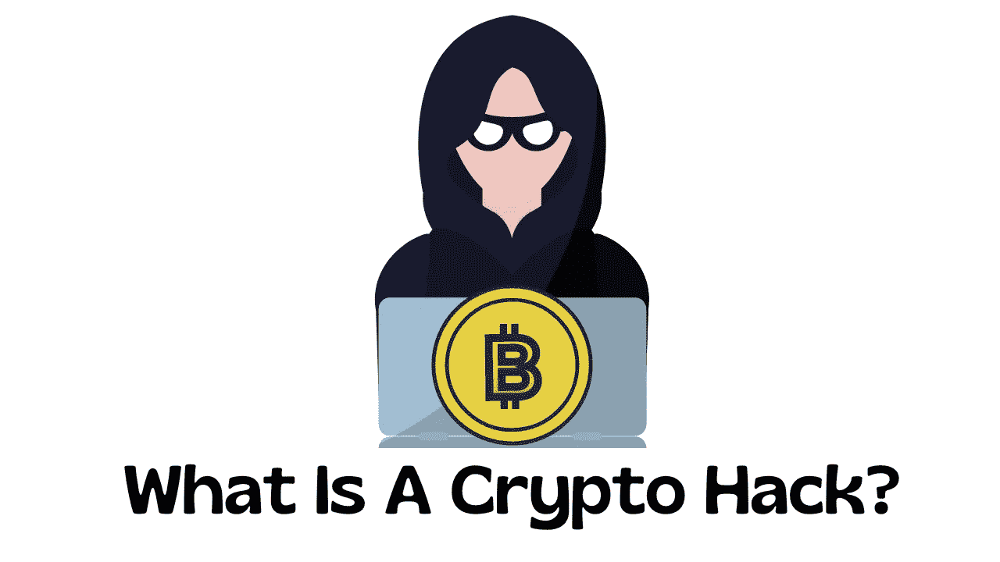
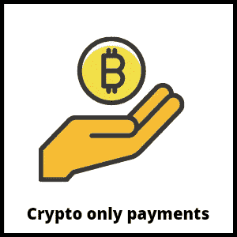
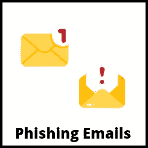
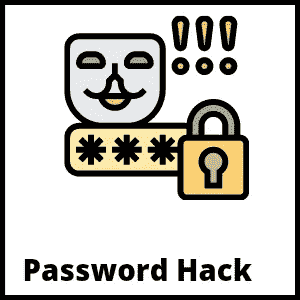
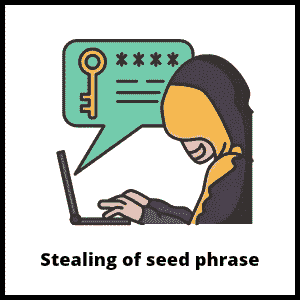

# 什么是加密黑客？—以下是如何保护你的钱包免受黑客攻击的方法

> 原文：<https://medium.com/coinmonks/what-is-a-crypto-hack-heres-how-to-secure-your-wallet-from-getting-hacked-8262f7ed080?source=collection_archive---------24----------------------->

What is a crypto hack

今天的帖子是关于加密黑客*——一个和加密货币本身一样古老的术语！*

是的……加密货币可能成为*T3 的热门话题，但这并不意味着这是一条平坦的道路。*

*相信我，外面是狂野的西部！！！*

新手以及加密领域的专业人士都可能成为加密黑客的牺牲品。

在本文中，我将讨论常见的加密攻击，以及如何保护您的钱包免受黑客攻击。

但是首先，

# 帖子摘要

1.  什么是加密黑客？
2.  [6 种常见的加密攻击以及如何避免它们](#77b9)
3.  [结论](#bc32)

点击其中任何一个，直接进入你想阅读的部分。

所以，

# 1.什么是加密黑客？

Crypto hack

加密黑客是加密货币从钱包或交易所被盗的另一种说法。

**但是在这篇文章中，我将重点讨论钱包加密技术。**

这些窃贼，也称为骗子或黑客，有策略地窃取加密货币。

黑客可以窃取您的加密货币，如果他们访问您的私钥。

任何有钱包私钥的人都可以发送密码。

把你的私钥当成你的 ATM 卡 pin 只有你和任何知道你密码的人才能从你的帐户中提款。

这就是为什么你应该全力保护你的私人钥匙。

但是，黑客不一定需要您的私钥来窃取您的信息。他们有其他方法得到他们想要的东西。

黑客使用不同的策略引诱你把钱送到他们的钱包里。

没错！他们那么聪明。

这些黑客非常擅长他们所做的事情，以至于那些不知情的受害者很容易成为牺牲品。

这也是为什么在区块链空间做任何事情都必须小心谨慎的原因。

现在你知道了加密攻击的含义，让我们深入了解日常的加密攻击以及如何避免它们。

以下是:

# 2.6 种常见的加密攻击以及如何避免它们

# 一、虚假谷歌广告

Fake google ads

这些骗子可能是小偷，但有一点我们不能否认，他们很聪明。

创建虚假广告，以弹出窗口的形式出现在我们的屏幕上，这是加密攻击的一种实施方式。

老实说，从一个真实的广告中识别出一个虚假的广告是很有挑战性的。但是，千万不要通过广告提供的链接登录你的钱包。

有时这些黑客甚至会克隆正版网站，比如索拉纳、T2、币安和 T3；如果你不警惕，你可能会落入他们的圈套。

为了避免这种情况发生在你身上，只有通过合法网站登录你的钱包。

但是，当然，如果你不知道这个网站，一个简单的谷歌搜索总是能解决问题。

根据一般经验，永远不要在广告引导的网站上登录你的钱包。

# 二。电报、不和或推特上的直接信息

Direct Messaging

有时候，这些黑客会大胆地在社交媒体平台上直接给你发信息。

这些骗子克隆交易所高层官员的账户，或者一个[有影响力的加密人](https://www.nigeriabitcoincommunity.com/crypto-influencers-nigeria/)的账户。这个简单的动作可以让他们看起来很真实。

他们用一些令人信服的故事和你聊天，然后试图让你给一个未知的钱包发送一定数量的密码。

尽管这种加密技术由来已久，但骗子们仍在用它来骗人。可悲的是，许多人就这样丢失了他们的密码。

就像我之前说的，这些骗子很聪明；他们能想出最可信的谎言。

如果骗子试图窃取你的密码是非常好的，它可能很难发现，直到为时已晚。

然而，你必须永远不要忘记，没有一个有声望的官员或合法的人会搭讪你，让你往钱包里寄钱。

如果有人让你往任何钱包里汇款，**屏蔽掉。他们绝对是冲着你的硬币来的！**

# 三。只要求加密支付

Crypto only payments

纯加密支付本身并没有错。一些组织接受仅加密的付款以鼓励加密的采用。

但问题是，区块链提供了一个去中心化的平台，让你完全掌控自己的钱。

然而，这种独立性意味着区块链上的交易是匿名进行的。

简单来说，如果你把钱寄给一个冒充商贩的骗子，就无法追踪到钱进入的钱包。

没有一个集中的机构意味着这个空间没有规则。

所以，如果你要用 crypto 支付任何东西，确保你和一个有信誉的人或组织打交道。

总是对你正在打交道或将要打交道的任何人或组织做自己的研究。不要只相信他们对自己的评价。

遇到无法核实的人或组织，**跑。和这样的人做生意有风险！你可能永远得不到你所付出的。**

由于交易是在区块链进行的，你将无法追踪收到资金的钱包。

# 四。通过网络钓鱼邮件进行加密攻击

phishing emails

犯罪分子发送的声称您的钱包已被阻止或禁止的电子邮件称为网络钓鱼电子邮件。

出于他们黑暗灵魂的善良，他们要求你点击电子邮件中的链接来帮助快速解锁你的钱包。

你无辜的点开这个链接，怕自己钱包被封了。之后，您会被重定向到一个请求您登录钱包的页面。

你输入你的详细资料，它就像变魔术一样消失了！

你的硬币不见了！

不，我不是想让自己听起来吓人或者戏剧化；人都会这样。不幸的是，许多人的加密货币就这样被抢走了。

这是一种可悲的赔钱方式，但事情还是发生了，对吗？

然而，这里是如何确保它不会发生在你身上。

首先，**千万不要点击电子邮件中任何加密或钱包相关的链接**，不要这样做！

如果你担心自己的钱包被封，一定要查看主网站。一旦您打开钱包，您的钱包提供商将通知您，您的钱包已被阻止或有问题。

如果你的钱包里没有收到这样的信息，就忽略这样的邮件。

如果他们的钱包出现技术问题，网络提供商将在其官方网站或 Twitter 页面上发布公告。他们不会给你发邮件。

如果您可以访问您的钱包，它不会被阻止。只需忽略并屏蔽该电子邮件地址。如果你没有点击任何链接或采取任何行动，你的钱包是安全的。

# 动词 （verb 的缩写）密码破解

Password Hack

如果你的密码很简单，黑客可以轻易破解。所以让你的密码尽量复杂，尽量长；混合使用字母、数字和符号。

不要对你所有的账户和邮件使用同一个密码。还有，经常换密码；*6 个月的期限没问题*。

把你的密码写在一个安全的本子上，这样你就不会忘记了。此外，确保您是唯一可以访问这本书的人。

您可以设置一个双因素认证器；这提供了额外的安全层。

# 不及物动词访问您的种子短语

Stealing of seed phrase

一般来说，你不要和任何人分享你的种子短语。不管这个人听起来有多有说服力，都不要分享。

在 crypto 中，带有种子短语的是钱包的所有者，而不是实际的所有者。因此，任何拥有您的种子短语的人都可以从您的钱包中汇款。

当黑客想要得到你的种子短语时，他们会使用许多操纵策略。不幸的是，我们无法掌握他们所有的计划。

所以为了避免黑客攻击，不要和任何人分享你的种子短语。

这里有各种各样的密码破解，以及如何避免它们。

在下一部分和我一起总结这篇文章。

# 结论

这部分结束今天的帖子。

不管你有多富有，没有人希望自己的硬币被偷。

但不幸的是，黑客不关心你或你的感受。所以总会有加密攻击。

这些黑客不尊重任何人；你在太空中的经验水平并不重要。

如果你曾经对你的钱包信息漫不经心，黑客会用你的硬币帮助他们自己。

为了避免这种情况，请遵循本文中提供的所有建议。

现在，我们来谈谈:

您是否知道更多我在本文中没有讨论的加密技术或这些欺诈者创造的新方案？

在评论区让我知道；你今天可能会保存某人的密码。

还有一件事:点击下面的任何按钮来分享这篇文章，帮助传播这个词。

你也可以看看我们发的这些精彩的帖子:

*   [如何立即识别假密码交易所！](https://www.nigeriabitcoincommunity.com/fake-crypto-exchange/)
*   [投资加密货币安全吗？](https://www.nigeriabitcoincommunity.com/is-it-safe-to-invest-in-the-worlds-largest-cryptocurrency/)
*   [什么是点对点加密？](https://www.nigeriabitcoincommunity.com/peer-to-peer/)
*   如何购买密码的初学者指南

*最初发表于*[*https://www.nigeriabitcoincommunity.com*](https://www.nigeriabitcoincommunity.com/crypto-hacks/)

> 交易新手？尝试[加密交易机器人](/coinmonks/crypto-trading-bot-c2ffce8acb2a)或[复制交易](/coinmonks/top-10-crypto-copy-trading-platforms-for-beginners-d0c37c7d698c)