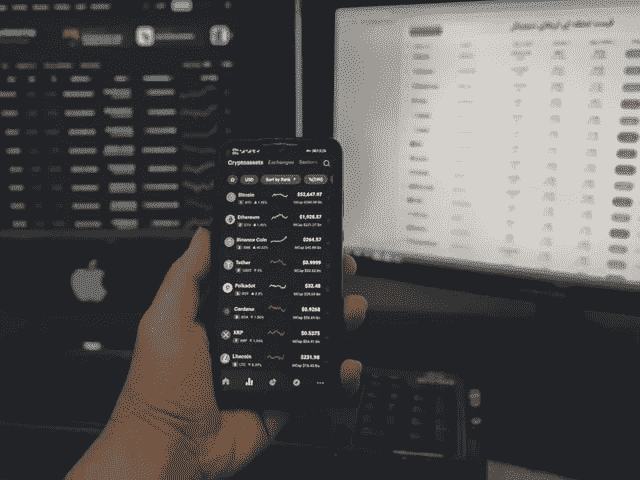

# 什么是秘密风险投资？

> 原文：<https://medium.com/coinmonks/what-is-a-crypto-venture-capital-d5b93e75d5ca?source=collection_archive---------35----------------------->

**风险投资基金定义**其实很简单。风险投资是从外部投资者那里筹集资金的一种形式，交换条件是投资者在有限的时间内持有一家公司的股份。风险资本家投资于具有显著增长潜力的公司，如果风险投资成功，将提供高于平均水平的投资资本增值。通常在最近几年，早期初创企业受益于风险投资基金。

什么是风险投资基金，它们是如何运作的？

财务投资者作为股东加入一家公司。换句话说，与其他股东共担风险，并与他们分享共同的目标。像其他股东一样，当公司股票增值或支付股息时，该基金就能赚钱。

此外，风险资本基金通常会在公司呆 3 到 7 年，这取决于个人采取的投资政策。在此期间，使用所提供的资本不需要支付利息。

**此外，投资风险资本基金可以改善公司的资本结构，提高其信誉，并为发展筹集更多资金。**

最重要的是，风险资本基金通过提供资本和他们的经验和专业知识来帮助公司——特别是在财务管理和法律问题上。作为股东，他们从公司发展的角度从事战略活动。它们之所以与众不同，是因为它们通常不向公司董事会委派代表。他们只支持董事会制定和实施进一步发展的战略。由于他们的存在，公司被认为更可靠，经常获得新的商业伙伴。

# 投资风险资本基金的好处

*   不需要抵押品，
*   没有双方同意很难撤回，
*   只有当公司产生利润时，
*   处理的成本对于达到的结果是足够的。

# 区块链技术——投资革命

当区块链技术随着 2009 年比特币的出现而出现时，很少有人怀疑它在加密货币世界之外也有价值。然而，随着时间的推移，软件工程师和商业领袖看到分布式账本技术有可能改变全球贸易、金融或法律。

据估计，大约有 10，000 个区块链加密货币网络和数百个非加密货币解决方案。这些数字几乎每天都在变化。虽然数字交易货币是区块链技术发明背后的原始概念，但今天，它正在保险、贷款和房地产行业成功实施。

区块链技术应用数量的增加促进了高需求和包括风险资本在内的资本流入，这些资本流向了希望开发基于这一技术的产品的公司。因此，今年我们在加密风险投资方面创下了纪录。

# 秘密风险投资——2022 年的新纪录

根据总部位于纽约的金融服务公司[银河数字研究](https://ncfacanada.org/galaxy-digital-research-crypto-vcs-biggest-year-ever-2021/)的一份报告，2022 年第一季度，风险投资(VC)投资者向加密初创公司投资了超过 100 亿美元。相比之下，2021 年风险投资家对加密货币初创企业的投资超过 330 亿美元。这是一个比以往任何一年加起来都要好得多的成绩。**有趣的是，报价中有 220 亿美元(67%)进入了融资轮，交易规模超过 1 亿美元，加密初创企业筹集了近 5%的风险资本。**在全球地图上，向 crypto 分配最多 VC 资金的国家是美国(第三季度超过 29 亿美元)、亚洲(14 亿美元)和欧洲(11 亿美元)。

# 加密风投的未来会怎样？

现在你知道了，**什么是秘密风险投资**以及投资者如何使用它。风险资本基金一直在寻找有潜力获得巨大竞争优势或甚至建立新市场并因此提供最高投资回报的创新公司和企业家。硅谷的安德森·霍洛维茨和 NFX 等大型风险投资公司拥有专门用于加密和区块链投资的基金，但这仍然只是他们业务的一小部分。

然而，毫无疑问，这一细分市场的发展现在是而且很快就会是非常活跃的。为分配闲置资金寻找有利可图选择的投资者无疑会分析加密风投提供的机会。

**类似文章:**

*   [区块链技术在商业中的十大优势](https://blufol.io/top-10-benefits-of-blockchain-technology-in-business/)
*   [银行业的区块链技术](https://blufol.io/blockchain-technology-in-banking/)
*   [物流中的区块链。它是如何改变行业的？](https://blufol.io/blockchain-in-logistics-how-is-it-changing-the-industry/)

[www.blufol.io](http://www.blufol.io)

> 加入 Coinmonks [电报频道](https://t.me/coincodecap)和 [Youtube 频道](https://www.youtube.com/c/coinmonks/videos)了解加密交易和投资

# 另外，阅读

*   [加拿大最佳加密交易机器人](https://coincodecap.com/5-best-crypto-trading-bots-in-canada) | [库币评论](https://coincodecap.com/kucoin-review)
*   [用于 Huobi 的加密交易信号](https://coincodecap.com/huobi-crypto-trading-signals) | [HitBTC 审查](/coinmonks/hitbtc-review-c5143c5d53c2)
*   [TraderWagon 回顾](https://coincodecap.com/traderwagon-review) | [北海巨妖 vs 双子 vs 比特亚德](https://coincodecap.com/kraken-vs-gemini-vs-bityard)
*   [如何在 FTX 交易所交易期货](https://coincodecap.com/ftx-futures-trading)
*   [OKEx vs KuCoin](https://coincodecap.com/okex-kucoin) | [摄氏替代品](https://coincodecap.com/celsius-alternatives) | [如何购买 VeChain](https://coincodecap.com/buy-vechain)