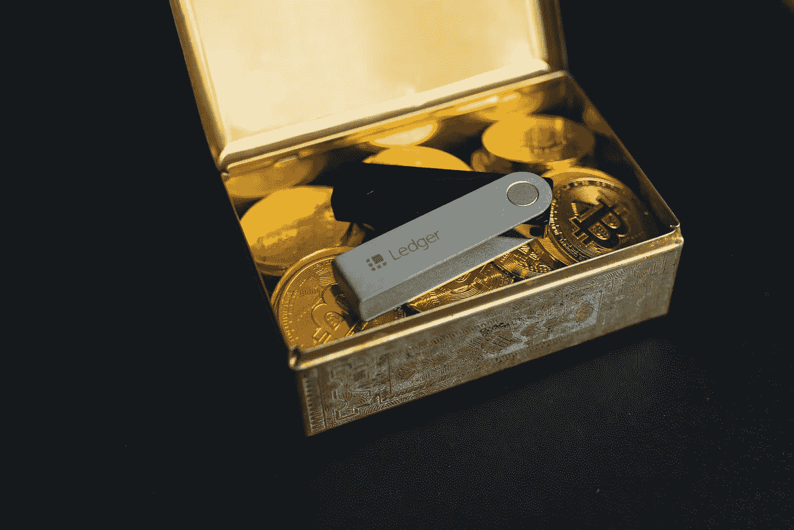

# 什么是加密钱包？

> 原文：<https://medium.com/coinmonks/what-is-a-crypto-wallet-b4e75e7a8157?source=collection_archive---------24----------------------->

Source photo [Free Security bitcoin Image on Unsplash](https://unsplash.com/photos/Grk4L0ZJeAU)

为了存储、发送和接收像比特币和以太坊这样的加密货币，其所有者需要一个加密货币钱包。钱包是加密货币生态系统的重要组成部分，因为它们允许用户以安全、便捷的方式存储和访问他们的比特币。

加密货币钱包使用公钥和私钥来存储和访问数字货币。公钥是一大串字母和…