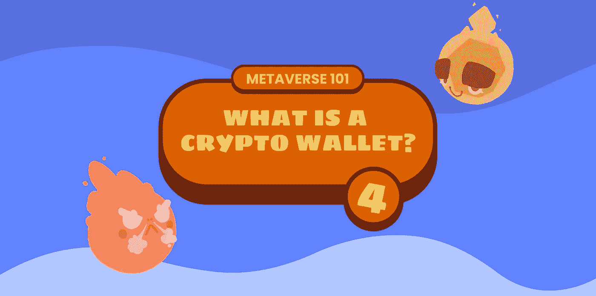

# 什么是加密钱包？元宇宙 101

> 原文：<https://medium.com/coinmonks/what-is-a-crypto-wallet-metaverse-101-ade6d82b7f78?source=collection_archive---------37----------------------->

正如我们在[之前的故事](/@gushiland)、**、【区块链】、**和【元宇宙】、**中看到的，它们正在改变我们世界的某些方面，尤其是经济方面。然而，为了在这个新的数字世界中安全有效地前进，你需要知道从哪里开始。**这就是为什么今天我们要谈论用于加密货币的**钱包，这是能够开始买卖硬币和 NFT 的必要条件。**

如果你还不知道什么是 NFT，看看我们的故事:

 [## 什么是 NFT？元宇宙 101

### NFT(不可替换令牌的首字母缩写)是区块链技术最有趣的应用之一…

medium.com](/coinmonks/metaverse-101-what-are-nfts-995fa91be19b) 

# 但是钱包到底是什么？

加密货币钱包是一种**数字钱包**，它允许你在虚拟口袋中存储你拥有的所有数字硬币和非加密货币。更具体地说，它是一个可以存储和处理前述**加密货币数据的软件。**钱包可以通过特定的应用程序存储在你的电脑上，也可以链接到众多提供这种服务的在线平台上。市场上也有各种各样的硬件产品(笔驱动器或 SD 存储卡)，让你有一个可以随身携带的实体钱包。

不管它采取什么样的形式，钱包体现了几个重要的功能。首先，它允许你**管理你的加密货币** **的销售、购买、兑换和保管**，就像银行账户管理传统货币一样。此外，钱包可以**安全地存储**识别你在区块链所有股票和持股的代码(如果你想了解更多关于区块链的工作原理，[点击这里](/coinmonks/metaverse101-what-is-the-blockchain-f263193dbec?source=user_profile---------7----------------------------))。

为了能够快速使用钱包，最简单的选择是依赖众多在线加密货币服务中的一种。除此之外，这些在线钱包服务允许你通过输入一个特定的访问码从任何设备上取回你的硬币，功能类似于银行账户

# 钱包是如何工作的？

要拥有自己的加密货币钱包，你需要做的就是连接到这些平台之一，并创建一个新的平台。重要的是要记住，与银行账户不同，钱包是完全匿名的，允许在不需要提供任何个人信息的情况下进行货币交易。事实上，注册钱包只需要提供一个电子邮件地址。

打开钱包时，会生成两个代码，称为*“钥匙”*。第一个密钥与*钱包密码*相关联，它使*钱包能够恢复。*务必**不要将此密钥透露给任何人**，否则其他人可能会在未经您同意的情况下获取您的钱包并使用您的货币。此外，该密钥不应丢失，因为没有它，您将无法再恢复您的加密货币。

第二个密钥被称为*“公钥”*，因为它是一个可以被传输到**以认证加密货币的购买**和出售的代码。其功能类似于更常见的国际银行账户的 IBAN 代码。

实际上，我们拥有的加密货币**并不直接存储在钱包**中(就像纸币不直接存储在所有者的银行账户中一样)。然而，一个钱包能够通过存储我们所拥有的货币数据来与各种区块链进行交互，让我们可以像在手中一样使用它们。

> 嘿，古什，来看看我们最后一个故事中的古什吧！点击下方！

 [## DracoGushi 岩浆和熔岩——gushelium

### 岩浆和熔岩是生活在卡尔德拉科火山周围的两个家族，它们在火山里筑巢…

medium.com](/@gushiland/dracogushi-magma-e-lava-gushellium-60baaf6e2b0b) 

# **用哪个钱包？**

有必要根据哪一个更适合我们的需要来选择我们的钱包，，就像我们选择银行一样。

您可以使用许多钱包，但是尽管它们看起来很相似，但它们有一些差异，应该始终考虑在内。首先，你需要考虑钱包的安全级别:保护级别低的提供商更有可能遭受黑客攻击，这可能会让你面临损失金钱的风险。此外，考虑到你有兴趣购买的加密货币，你也应该选择你的钱包**。事实上，每种加密货币和每种 NFT 都可以在需要不同钱包的不同类型的区块链上运行。**

例如，[**algrand**](https://www.algorand.com)是目前世界上最可靠、最环保的区块链生态系统之一，依靠 [**Pera Wallet**](https://perawallet.app) 提供快速、安全、开源的加密货币兑换服务。

然而，鼓浪屿的生态系统将动摇钱包的概念。通过注册我们的市场，您将获得一个基于 Algorand 网络的**虚拟钱包**。你将**立即能够获得你的固始**并管理你的 **Play2Build 奖励**，无需繁琐的设置或困难的步骤。如果您愿意，您还可以将您的固始导出到您的个人 Pera 钱包中。

**玩加密游戏从未如此简单！**

# **结论**

通过这篇文章，我们希望为您提供理解和使用加密货币钱包所需的工具。关于钱包，你还有什么想知道的吗？你还知道其他什么可靠的钱包吗？

# 关于古士兰

《孤岛惊魂》是基于 [Algorand](https://medium.com/u/bb4a269b69c3?source=post_page-----6ce0f6ee14b2--------------------------------) 的全新区块链游戏体验。从玩到建的生态系统中的策略、动作和乐趣对于休闲游戏玩家和专业玩家来说都是可行且有利可图的。在我们的[第一个故事](/@gushiland/gushiland-the-first-play-to-build-gaming-ecosystem-on-algorand-6ce0f6ee14b2)中发现更多。

> *加入我们的部落，关注鼓室岛的最新动态。
> 在 Medium 上报名或者在* [*上找我们不和谐*](https://discord.gg/68Tu6k7MHr)*[*推特*](https://twitter.com/gushiland) *和*[*insta gram*](https://www.instagram.com/gushi.land/)*。**

> *交易新手？尝试[加密交易机器人](/coinmonks/crypto-trading-bot-c2ffce8acb2a)或[复制交易](/coinmonks/top-10-crypto-copy-trading-platforms-for-beginners-d0c37c7d698c)*