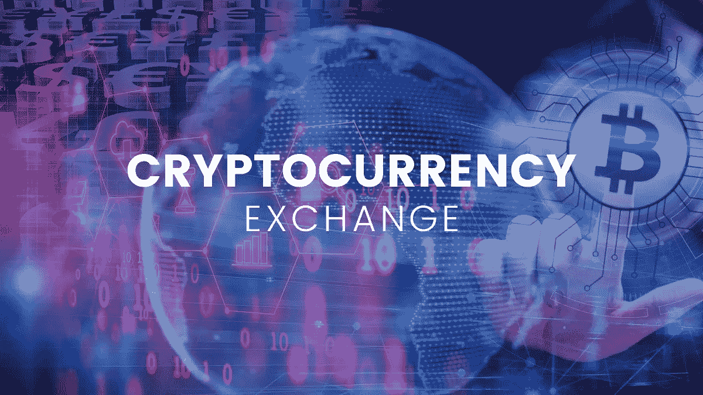

# 什么是加密货币交易所？

> 原文：<https://medium.com/coinmonks/what-is-a-cryptocurrency-exchange-d35774344720?source=collection_archive---------35----------------------->

在本文中，我们将深入了解什么是加密货币交易平台，并向您展示在选择交易平台之前需要注意的事项。

随着加密货币趋势每年都在增长，你可能会想到投资加密货币。加密货币是数字货币，不同于传统的本地法定货币。

如果你是一个初学者，对加密货币和如何购买加密货币感到好奇，你一定听说过术语*“加密货币交易所”*或*“加密交易所”*，并且可能想知道它是什么。

# 什么是加密货币交易所？

如果你一直想知道在哪里以及如何购买加密货币，那么使用加密交易所是第一个开始的地方。加密货币交易所是一个在线平台或市场，在这里你可以买卖加密货币。

除了买卖加密货币，你还可以在这些平台上用一种密码交换另一种密码。他们在买方和卖方之间充当中间人或中介。

加密货币交易所也显示可用于在其平台上交易的加密的实时价格。请记住，市场上有很多交易平台，每个平台都有自己的交易费用，有些会比其他平台高。

此外，值得一提的是，并非所有的交换平台都对初学者友好。有些比其他的更容易使用，所以在最终决定使用哪一个之前，了解和理解每个平台之间的差异是非常重要的。

加密交易所还配有一个内置的钱包，你可以在里面保存你购买的数字资产(就像你存放钱的本地银行账户一样)。此外，如果您想将密码存入您的账户或提取到您当地的银行账户，您可以将密码转换成美元。

我想说，没有一个交易平台比另一个更好，你所要做的就是寻找一个适合你想做的事情并提供你想买的东西的平台。你只需要做大量的研究和比较，就能知道哪一个适合你的需要。

此外，泰隆·罗斯( [Onramp Invest](https://onrampinvest.com/) 的财务顾问兼首席执行官)也持有相同的观点。他举了一个例子:

*“我是否正在寻找类似于 Casa 的东西，因为 Casa 为我做了很多工作，我不必担心公钥和私钥？我要去双子座吗，因为双子座有我想要的奇怪硬币，他们会允许我买吗？或者我去比特币基地是因为比特币基地有这些很酷的工具，可以让我学习并获得加密技术？”*

上面提到的“卡萨”、“双子”、“T1”、“T2”、“比特币基地”、“T3”都是密码交易所的名字，以防你感到疑惑。从他的例子可以看出，这三个平台除了一般的买卖之外，还提供不同的东西。因此，总的来说，知道你想要什么，从而简化你对某个特定平台的搜索是很容易的。

# 加密货币交易所是如何工作的？

使用加密交易所购买资产就像走进银行开立银行账户并存入现金一样容易，我发现甚至更容易。只有一个决定和你必须遵循的几个步骤，如下所示:

1.  选择一个交易所并创建一个帐户
2.  向您的帐户添加资金
3.  用一个法令购买密码来加密交易
4.  保留您的加密帐户
5.  把它移到加密钱包里
6.  开始交易

***相关:*** [***新手最佳加密货币交易所***](https://36crypto.com/the-best-cryptocurrency-exchanges-for-beginners/)

*   **选择一个交易所并创建一个账户:**这就是决策的来源。在做了大量的研究后，下一件事就是选择一个符合你目标的。一旦你从一长串可用的列表中选择了一个，接下来要做的就是在上面创建一个帐户。
*   **向您的帐户添加资金:**现在，根据您最终选择的交易所平台，您必须通过交易所列出的一种公认方法向您的帐户添加资金。有些人通过借记卡接受资金，有些人通过直接银行转账，有些人通过贝宝，甚至通过电汇。
*   **购买加密交易:**一旦资金进入你的账户，你就可以进行第一笔交易了。在 exchange 应用程序上找到“市场”，然后选择您想要购买的硬币，然后支付。
*   把你的密码存在账户里:买了你想要的密码后，你可以把它存在你的交易账户里，也可以把它转移到一个密码钱包里。如果您想移动它，请按照下面的下一步操作:
*   **移动到加密钱包:**加密钱包更像是一个钱包，你可以在里面保存你购买的资产。有不同类型的钱包，具有不同的安全级别。例如，有硬件钱包、纸质钱包、在线钱包和移动钱包，它们都有不同的安全级别。
*   开始交易:拿到硬币后，如果你不想把它存起来或放在钱包里，下一个最好的办法就是交易它。你可以用加密换加密或者用菲亚特换加密。

# 加密货币交易所的类型

正如我们前面所说的，在决定要使用的特定交换平台之前，做好研究是很重要的，了解不同类型的交换是一个很好的起点。

加密货币交易所有两种类型，即；

*   **集中式**
*   **分权**

# 集中式加密货币交易所

一些用户可能会发现这具有误导性，因为加密货币本身被标榜为一种分散的资产。尽管如此，它也是最常见的交流平台。这种类型使用第三方来监控和提供安全性，也有助于连接贸易伙伴。

# 分散式加密货币交易所

这是一种不太常见的加密交换类型。与集中式交易不同，这种交易不需要第三方来帮助提供安全或监控，相反，它使用[区块链技术](https://36crypto.com/blockchain-definition-what-is-blockchain-technology-and-how-does-it-work/)来实现这一目的，并且交易是使用智能合约以 P2P(点对点)形式完成的。

# 在加密交换中要注意什么

在选择要使用的加密交换平台时，在了解了存在的两种类型的交换之后，接下来的事情是在决定之前知道在交换中要寻找什么。

*   易接近
*   安全性
*   费用
*   资产流动性
*   可用硬币
*   储存；储备

可访问性:一些加密交换仅在有限的位置可用。不知道哪一个在你的国家运行良好可能是个问题。正如我们所知，并非所有国家都接受加密货币的概念，它在一些国家仍然被禁止。在像中国这样的地方，公民被禁止访问任何密码交易所。

即使在美国，围绕加密货币也有一定的法规，一些州甚至已经实施了他们的法规。您可以访问首选交易所的网站，浏览服务条款页面，查找支持的国家和接受的当地货币类型。

安全:这也是在交易中采取任何行动之前要注意的另一个非常重要的细节。没有人想在一个不太安全的平台上交易，在那里你有很高的损失资产的风险。

如你所知，加密货币不像你存在银行里的钱那样受到任何中央机构的支持(这就是为什么它是一种分散的资产)。一些顶级交易所，如比特币基地交易所和双子座交易所，会将你持有的美元余额存入 FDIC 保险的银行账户。

此外，一些交易所有保险政策来保护用户的资产以防黑客攻击。像比特币基地这样的一些公司拥有价值 2.55 亿美元的保险，这意味着如果平台遭到黑客攻击，价值高达 2.55 亿美元的资产被盗，用户可以得到保护。

正如 2022 年所报告的那样，总共有大约 25 起针对加密交易所的攻击记录在案，其中被盗金额最大的是新加坡加密交易所 KuCoin 的约 2 亿美元。

所以在决定注册之前，这是一件非常重要的事情。在我个人看来，我会说最好是选择一个已经建立的，有好名字和好名声的交易所，而不是去一个不太熟悉的。

费用:费用是另一个需要考虑的事情，但是请注意，一个平台提供的交易费用比另一个低并不意味着它更好。交换费有时可能是固定的，但它是你交易的一部分。

一些交易所收取的费用比其他交易所低。不同的费用取决于你是买方还是卖方，也取决于你选择交易的货币。

确保你了解你所选择的交易所的费用结构，并试图了解你的交易如何以及何时收费。

**流动性:**确保选择一家交易量非常大的交易所，以确保你的资产具有流动性，这意味着你可以随时出售它们。大多数时候，一个交易所越受欢迎，他们的交易量就越大。

根据 CoinMarketCap(一个价格追踪网站)的数据，[【比特币基地】](https://36crypto.com/coinbase-review-2022/)和火币网是全球交易量最大的交易所。

**可用硬币:**市场上有成千上万的硬币可用，但并非所有交易所的平台上都有这些硬币。因此，如果你有一个特定的硬币想要购买，你应该进行研究，找到提供该硬币的平台。

如果你对比特币和以太坊等流行的硬币感兴趣，你会在所有的交易平台上找到它们，但如果你想要另一种市值较小的替代硬币，那么你可能需要多挖一点。

**存储:**存储是一个值得考虑的好东西，尤其是对于不太熟悉存储加密货币的不同方式或选项的新手来说。通常，选择一个允许你将购买的资产存入账户的交易所是一个非常好的选择。当你对不同类型的钱包有了更多的了解，或者当你选择增加你的持有量时，你可以决定将你的持有量转移到你的钱包中。

一些流行的加密交换包括:

*   比特币基地
*   币安
*   火币
*   北海巨妖
*   双子星座
*   库科恩
*   罗宾汉

***查看本内容上****[***2022 年最佳加密货币交易所***](https://36crypto.com/the-best-cryptocurrency-exchanges-in-2022/)*

# *结论*

*加密货币交易所是一个可以购买、出售或交易加密货币的平台。有很多交易平台可供选择，但在选择一个之前，有些事情你应该留意。*

*首先，试着熟悉两种可用的交易所类型，然后检查它们的特点并进行比较。在投入资金之前，确保尽可能多的学习。*

*在做出决定之前，考虑费用、安全性、可用硬币、流动性和可访问性等因素。有很多加密货币交易所，但一些受欢迎的是币安，比特币基地，北海巨妖，KuCoin，Huobi 和 Robinhood。*

*最初发布于 [36crypto](https://36crypto.com/what-is-a-cryptocurrency-exchange/)*

> *交易新手？尝试[加密交易机器人](/coinmonks/crypto-trading-bot-c2ffce8acb2a)或[复制交易](/coinmonks/top-10-crypto-copy-trading-platforms-for-beginners-d0c37c7d698c)*