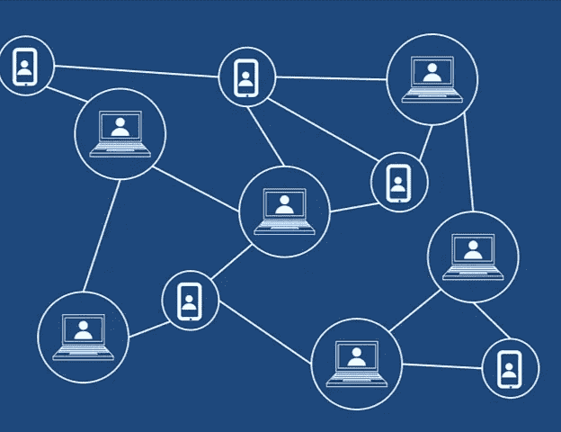

# 什么是刀？

> 原文：<https://medium.com/coinmonks/what-is-a-dao-7d876e802f78?source=collection_archive---------36----------------------->

Decentralized Autonomous Organization (DAO) has no central authority

DAO 是“分散自治组织”的缩写如果你最近接触过密码行业，有一个流行词可能会比你想象的更频繁地出现，那就是 DAOs。如果你暂时还不知道 DAOs 是什么意思，也没关系。我也花了一段时间才明白过来。

我们直接进入正题怎么样？

想象一下，一个透明的系统不会给中央政府留下任何控制权。那清楚地定义了一个“[分散系统](https://www.computerhope.com/jargon/d/decentral.htm#:~:text=A%20decentralized%20system%20is%20an,the%20form%20of%20networked%20computers.)”，对吗？这正是道斯会做的事情；然而，这些分散的系统这次将与常规组织相关联。

一个"一体行动"代表一个组织，其活动是透明的(公众很容易接触到)，没有中央理事机构，从而使与该组织有利害关系的每个人都有机会作出与该组织相关的决定。DAO 是透明的，因为它们利用区块链技术、编写代码和定义 DAO 如何运行的智能契约。与普通公司不同，Dao 由社区领导，采用自下而上的方法，这使得即使是投资最少的投资者/股东也有发言权。

> 交易新手？试试[密码交易机器人](/coinmonks/crypto-trading-bot-c2ffce8acb2a)或者[复制交易](/coinmonks/top-10-crypto-copy-trading-platforms-for-beginners-d0c37c7d698c)

既然您已经知道了 DAOs 的意思，您可能会开始怀疑，为什么这很重要？嗯，我们很快就会调查的。

在传统组织中，有关组织活动的决策权仅限于少数人，即董事会。只有董事会成员才能就一个组织的短期和长期目标/决策达成共识。首席执行官和组织内的其他部门只能执行董事会已经批准的行动。这意味着一个组织中的几个大投资者/名字可以在很大程度上影响该组织内部发生的事情。正因为这些少数人拥有如此大的权力，他们可以操纵某些决定，批准最有利于他们的活动。通过这种方式，他们可以继续找到一种方法来保持胜利，而不必担心这对其他非董事会成员的投资者意味着什么。虽然董事会可能总是想表现得好像他们正在做出对组织最有利的决定，但事实是他们大多只是在为自己着想。

哎呀！这是一个很好的类比。

你现在明白为什么我们需要 DAOs 了吗？我们需要 Dao 能够从选定的少数人那里获得权力，并将其分配给愿意成为该系统一部分的个人。这样，在一个组织内达成的最终决策更有可能着眼于帮助组织成长，而不是只为少数人谋福利。

假设你是一个音乐迷，你觉得颁奖礼对你的艺人不公平；你可以参加颁奖典礼，主办方会在投票机制中加入一个 DAO。这样，一切都保持透明，基于大众意见的最佳艺人更有可能胜出。

在大多数情况下，主动参与 DAO 需要拥有 DAO 的治理令牌(也称为 DAO 令牌)。

例如，自动做市商 Uniswap 将其治理令牌构建在以太坊链上，即 [UNI](https://uniswap.org/governance) 。其社区使用这一令牌就与联合国妇女和平研究所业务有关的决定进行投票。

虽然 Uniwap 是一个 DeFi 平台，但 DAO 在加密领域的另一个应用是 T4 颁布的区块链。区块链有它自己的硬币，那就是 DCR 硬币。DCR 硬币的持有者可以对区块链使用的共识机制做出决定。Decred 同时使用[利害关系证明](https://www.investopedia.com/terms/p/proof-stake-pos.asp#:~:text=Proof%2Dof%2Dstake%20is%20a,and%20keeping%20the%20database%20secure.)和[工作证明](https://www.investopedia.com/terms/p/proof-work.asp#:~:text=Proof%20of%20work%20(PoW)%20describes,launching%20denial%20of%20service%20attacks.)共识机制，使其社区能够选择用于验证链上数据的共识机制类型。

作为一个密码爱好者，或者任何一个偶然接触到与密码相关的材料和主题的人，您都无法避免围绕 DAO 及其使用的讨论，至少不会太久。嗯，没有人说 DAO 将来会无处不在，因为 DAO 可能不适用于每种形式的决策(一些决策仍然必须保持有限)。尽管如此，DAOs 仍将是我们走向的去中心化未来的重要组成部分。

DAOs 在这个时代与正规组织的一个相关应用是作为 DAO 运行的足球俱乐部。假设我们有一个名为 Crypto FC 的足球俱乐部，以 DAO 的形式运营。该足球俱乐部将利用区块链，创建一个智能合同或代码，通过区块链声明和验证俱乐部的活动。也就是说，足球俱乐部将着手创建自己的道令牌，其球迷可以购买。让我们将这个令牌命名为“CFC DAO”现在，这个令牌可以让任何持有它的人投票决定俱乐部的结构，新球员入股俱乐部，决定谁被任命为经理，谁留在或离开俱乐部。它仍将决策权留在人类手中，由区块链的代码运行，但不会将这些决策权局限于少数人，即董事会。拥有其令牌的 Crypto FC 的球迷成为足球俱乐部的社区，并将做出他们认为与球队发展相关的决定。

目前，DAO 仍然将许多决策权掌握在那些拥有大部分 DAO 令牌的人手中。然而，大多数 Dao 仍然会在他们的社区内通过一系列提案来消除各种形式的操纵，然后再就决策达成一致。

一个计划作为 DAO 运行的组织愿意接受来自公众的决策。

Dao 的一种更高级的形式将是典型地在没有人工干预的智能合同上运行的组织。这是对 DAOs 将如何运作的一个更具未来性的观察。

现在您知道了 DAO 可能是什么样子，也可能知道了一两个 DAO 治理令牌。也许您将创建自己的具有独特用例的 DAO 令牌；一定要让我知道它什么时候出来！