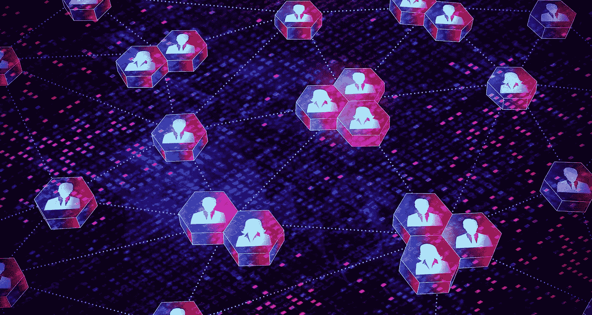
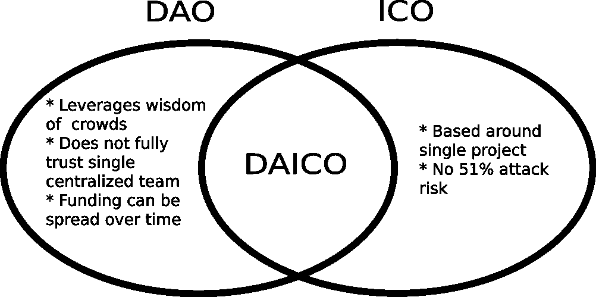

# 什么是刀？:关于分散自治组织的所有知识

> 原文：<https://medium.com/coinmonks/what-is-a-dao-everything-to-know-about-decentralized-autonomous-organizations-f94706841901?source=collection_archive---------43----------------------->

DAO 或分散式自治组织是一种由智能契约支持的分散式治理形式。这是一个通常以开放源代码为特征的组织，它不归个人或实体所有，有一套管理组织的规则，组织内的任何变化都由我的成员投票决定。组织内部的成员或组织外部的任何人都可以查看和审计源代码和托管数据的区块链，从而使其对所有人都是透明的。

# 创建 DAO 的步骤

创建基础:DAO 的基本规则是由核心社区成员创建的，并且是用智能契约编写的。在这些智能契约中有 DAO 的规则以及如何治理它的指导方针

将智能合约存储在区块链上。这使得任何人都可以访问和看到智能契约和规则，以了解更多关于 DAO 的信息。

筹集资金:这是通过令牌发行完成的，协议通过出售令牌来筹集资金。代币给予投票权，你买的代币越多，你得到的投票权就越多。

代码被推送和部署。在这一点上，没有一个人或实体控制着 DAO，或者它是如何工作的。对"道"的任何修改都将通过提案和表决来完成。

# Dao 的使用

NFT 投资:有些 NFT 太贵，一个人买不起。Dao 的创建是为了将 NFT 分解成更小的可投资块。

分散治理:以分散土地为例，这是一个众所周知的元宇宙。分散式治理是分散式治理，对平台的变更必须提出并投票表决。因此，举例来说，如果分散土地的创造者想要增加可用的虚拟土地，他们必须首先向社区提出建议，并要求他们投票表决。

初始硬币发行或 ICO:初始硬币发行(ICO)是加密货币行业的首次公开发行(IPO)的等价物。寻求筹集资金以创造新硬币、应用或服务的公司可以推出 ICO 作为筹集资金的一种方式。道可以帮助限制集资诈骗，对 ico 来说简直是天作之合

# 重要的道

[DAOhaus](https://daohaus.club/) : DAOhaus 是一个启动和运行 Dao 的无代码平台。它由社区拥有和经营。

[马克尔道](https://makerdao.com/en/):如果你愿意为推出世界上第一枚无偏稳定硬币的协议做出贡献

[RaidGuild](https://www.raidguild.org/) :这个基于服务的 DAO 源于 [MetaCartel](https://www.metacartel.org/) 网络，深深扎根于 Web3 世界。

[人性的证明](https://www.proofofhumanity.id/):这个抗 sybil 的人类注册使用社会验证和 [Kleros 的](https://kleros.io/)法庭来分发通用基本收入(UBI)令牌给链上验证的人类。

[奥波利斯](https://opolis.co/):这是一个会员制的数字就业合作社，为独立工作者提供福利和共享服务。

[BanklessDAO](https://www.bankless.community/) :有兴趣通过内容传播 Web3 单词并教育大众吗？您可能会对这个以媒体为中心的 DAO 感兴趣。你可以在这里了解更多[。](/bankless-dao/getting-started-with-bankless-dao-94b0b60e052e)

[MolochDAO](https://www.molochdao.com/):OG DAO 授予补助金以推进以太坊生态系统。

> 交易新手？尝试[加密交易机器人](/coinmonks/crypto-trading-bot-c2ffce8acb2a)或[复制交易](/coinmonks/top-10-crypto-copy-trading-platforms-for-beginners-d0c37c7d698c)