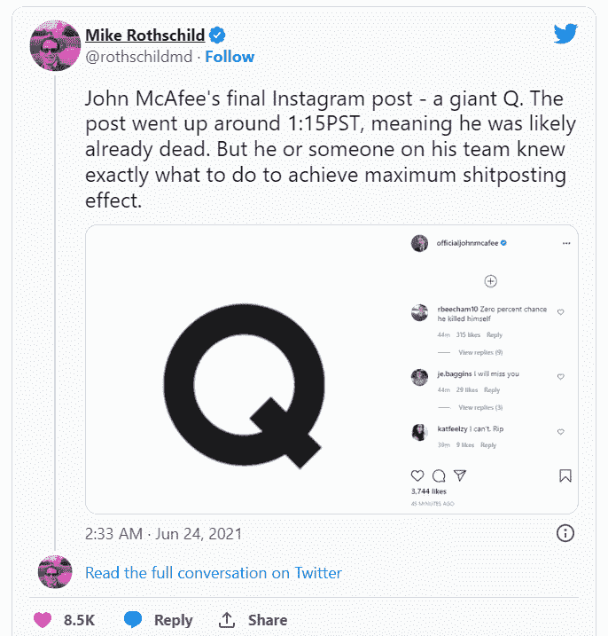
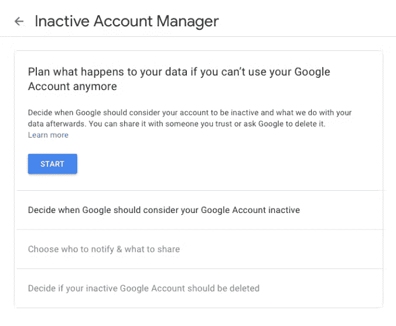

# 什么是“死人开关”？👻

> 原文：<https://medium.com/coinmonks/what-is-a-dead-mans-switch-30b1ee19b87?source=collection_archive---------36----------------------->

> 死亡开关是一种设计用于在人类操作员丧失行为能力(如死亡、失去知觉或身体失去控制)时激活或停用的开关。—维基百科

这个术语最初用于机器中的开关，但是现在在密码中变得更加流行。

这里需要提一下 McAfee Antivirus 的创始人 John McAfee 的案例。约翰·麦卡菲声称他有一个死人开关，如果他被捕或失踪，这个开关就会启动。他声称他有 31tb 的关于几个政府腐败的数据。

约翰·迈克菲去世时，除了在他的 Instagram 手柄上发布了一张带有大 Q 的图片外，什么都没发生。这可能是指 QAnon 运动。

最近，当 FTX 加密交易所因财务管理不善而倒闭时，FTX 潜逃的首席执行官山姆·班克曼-弗里德发来了神秘的推文。一些用户猜测这是一个死人的开关，但没有证据表明这一点。

死人的开关是如何工作的？

通常，所有安全开关都遵循一个基本原则，即用户必须以加密格式存储关键数据。关键数据可能是密码、私钥或其他敏感数据。用户必须创建触发器，如果在预先确定的时间内没有用户干预，触发器将自动激活。触发示例可能是在特定天数内未登录应用程序或未回复自动发送的电子邮件。

就连谷歌都在账号设置里提供了一个死人开关。

你怎么能创造一个死人的开关？

如果你有技术专长，你可以创建自己的‘死人开关’。否则，你可以使用像 https://www.deadmansswitch.net/这样的服务。

如果你特别想找一个“死亡开关”来保护你的密码，你可以使用一个像 https://sarcophagus.io/[这样的应用。这里有一个石棺如何工作的好例子——https://sarcophagus.io/how_it_works.html](https://sarcophagus.io/)

在创建安全开关时，考虑以下几个方面很重要-

*   你希望在你死后将哪些数据/资产传递下去？
*   确保你信任将继承你的资产/数据的人
*   激活安全开关的触发和规则是什么

还有其他传统方式将你的财产转移给你的后代。但如果你想以正确的方式将数字资产继承给正确的人，一个死人的开关是值得考虑的。

免责声明:不是财务建议。请在投资前做好自己的研究。

> 交易新手？试试[加密交易机器人](/coinmonks/crypto-trading-bot-c2ffce8acb2a)或者[复制交易](/coinmonks/top-10-crypto-copy-trading-platforms-for-beginners-d0c37c7d698c)