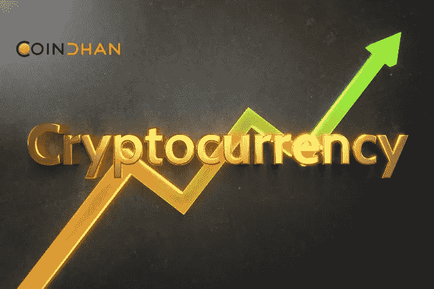

# 什么是分散的货币市场，为什么它是有益的？

> 原文：<https://medium.com/coinmonks/what-is-a-decentralized-money-market-and-why-is-it-beneficial-c258576de67d?source=collection_archive---------29----------------------->

典型的传统货币市场完全不同于区块链驱动的分散货币市场。在典型的货币市场中，有经纪人和中介操纵市场。相反，一个分散的货币市场是由一个巨大的社区管理的，这个社区可以由分散空间的所有参与者组成。

# 为什么分散的货币市场是有益的？

# 无权限

典型的货币市场是由一个中央集权的机构管理的。因此，用户需要向这些管理机构寻求许可。但是一个分散的货币市场是没有许可的，这意味着任何人都可以把他们拥有的任何东西押上，并从他们的资本中赚取利息。因此，它使进入市场相当简单，并满足其用户。

# 非监禁

现代古老的货币标记有集中的权力控制资金。但去中心化的货币市场是由智能合约管理的，这种合约有一个预先定义的逻辑，可以简化操作，并经受挑战的考验。

# 超额抵押

当你看传统货币市场时，它们总是抵押不足。但是分散的货币市场遵循过度抵押的过程。因此，它们给市场带来了更高程度的稳定性，并允许更大程度的参与。

# 可组合性

可组合性是去中心化货币市场的一个基本要素，在这个市场中，它们可以与其他市场互操作，为用户创造无限的可能性。

# 分散的货币市场是如何运作的？

传统的货币市场基于中介概念，借款人在提供一些抵押品后会寻求贷款。一旦他们还清了贷款，他们就可以收回抵押品。然而，如果他们不能还清贷款，抵押品将被出售。然而，传统货币市场中的许多贷款都没有抵押。

当将其与分散的货币市场并列时，它由智能合约管理，其中它们在系统中嵌入了特定的代码。如果借款人未能还清贷款，他们的抵押品将被清算。由于这是一个完全去中心化的货币市场，没有虚假数据，生态系统可以在艰难时期轻松维持自身。

# 在一个分散化的货币市场中有什么新情况发生？

边缘金融已经设想了新的用例，在这些用例中，他们更加强调市值最低的加密货币。通过这种方式，分散的货币市场甚至向低市值的加密货币开放。通过这种方法，即使是有更好的用例的低上限 alt 币也会得到急需的关注，它们可以在[密码生态系统](https://www.coindhan.com/)中成长！

> 交易新手？试试[加密交易机器人](/coinmonks/crypto-trading-bot-c2ffce8acb2a)或者[复制交易](/coinmonks/top-10-crypto-copy-trading-platforms-for-beginners-d0c37c7d698c)