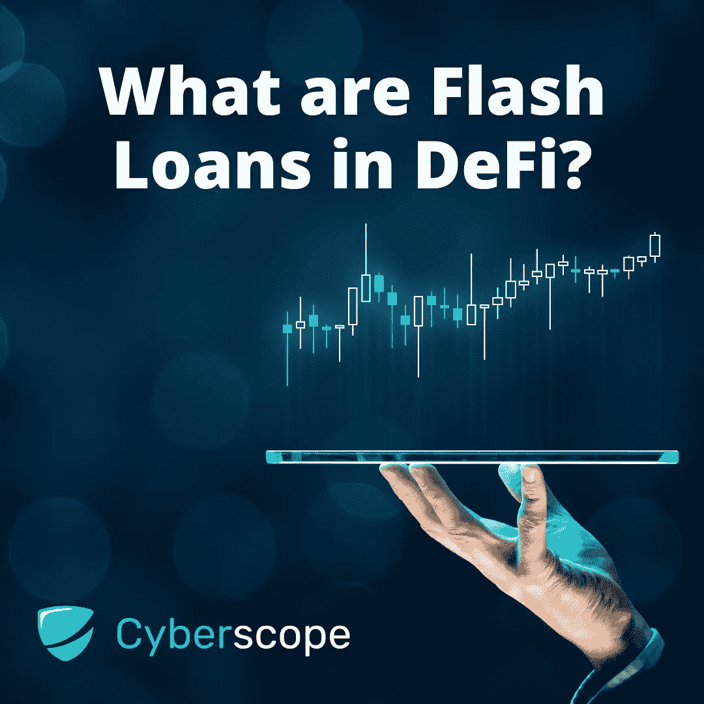

# DeFi 里的闪贷是什么？

> 原文：<https://medium.com/coinmonks/what-is-a-flash-loan-in-defi-b6c7853edbb8?source=collection_archive---------22----------------------->

## 在本指南中，我们将探索快速贷款以及如何在 DeFi 和 crypto 中使用它们

说到加密货币和数字资产，有很多选择。你可以选择不同类型的加密货币，使用交易所或钱包服务提供商，甚至研究其他 DeFi 协议，如 Aave 和 Compound。然而，有一件事直到最近才被发现，那就是用你的加密资产来借钱。当然，你可以通过正常的银行或信用卡提供商，但这违背了使用区块链的全部目的。现在，如果你能借一笔贷款，并在几秒钟内偿还，会怎么样？听起来很疯狂，但快速贷款可以让你做到这一点。

# 什么是闪贷？

快速贷款是短期无担保贷款，由 Defi(分散金融)组织以智能合同的形式发行。快速贷款允许你在不提供任何抵押品的情况下借入任何可用的资产，只要借入的金额在同一笔交易中归还给 DeFi。

2019 年，以太坊区块链上的[大理石协议](/marbleorg/introducing-marble-a-smart-contract-bank-c9c438a12890)首次推出了闪贷，或称闪贷。这项创新被描述为“智能银行”，允许用户通过智能合同获得零风险贷款。快速贷款随着 [Aave 协议](https://docs.aave.com/developers/guides/flash-loans)变得流行，这使得开发者可以很容易地在他们的智能合同中使用快速贷款。

> 通过消除持有任何资本的需要，我们的目标是使清算市场民主化，并使清算更快更容易。整个生态系统的安全性会更好，“坏账”的风险会低得多。
> 
> 来自 Aave 的马克·泽勒

# 为什么我们需要在 DeFi 快速贷款？

你可能想知道，如果你必须立即偿还贷款，并支付所有的天然气交易，那么快速贷款的意义何在。快速贷款最受欢迎的用途之一是套利。

[套利](https://online.hbs.edu/blog/post/what-is-arbitrage#:~:text=Arbitrage%20is%20an%20investment%20strategy,multiplied%20by%20a%20large%20volume.)是以低于卖方成本的价格买入一种产品，然后以更高的价格卖出的做法。在交易中，套利涉及利用不同市场之间相同资产的价格差异。当一种资产可以在一个市场上买入，在另一个市场上卖出并获利而没有任何风险时，套利机会就存在了。在 DeFi 中，这意味着你可以在 PancakeSwap 这样的分散交易所(DEX)购买加密资产，并在另一个 DEX(如 UniSwap)以更高的价格出售。闪贷套利(几乎)是一种无风险的交易策略，因为所有交易都是同时进行的。

闪贷的另一个有趣的使用案例是降低交易费用。由于快速贷款将几项交易合并到同一个智能合同中，因此交易费用降低。交易的费用是从贷款金额中扣除的，因此借款人的费用较低。

# 闪贷是怎么运作的？

为了帮助你更好地理解快速贷款是如何运作的，让我们看一个假设的套利例子。假设一个加密资产(或令牌)在一个交易所的交易价格为 0.50 美元，在另一个交易所的交易价格为 1 美元。这为精明的交易者提供了一个很好的机会，他们可以在第一个交易所获得价值 50 美元的代币的快速贷款，并在第二个交易所以 100 美元的价格出售，偿还贷款，并获得额外的 50 美元利润，减去交易中使用的所有汽油费。现在假设你拿了一笔价值 5000 万美元的贷款，而不是 5000 万美元，那么在前面的例子中，你会得到 5000 万美元的利润。

正如你可以想象，如果你找到机会，快速贷款可以给你带来巨大的收益，假设你知道你在做什么。然而，就像区块链的每一项新发明一样，总有恶意的参与者试图利用潜在的漏洞。快速贷款一直是黑客试图利用新交易所的焦点，经常导致数亿美元的损失。

# 快速贷款攻击

有记录以来最大的闪贷攻击(在撰写本文时)发生在名为豆茎农场的 stablecoin 协议上。这次黑客攻击导致了 1 . 82 亿美元的损失。Beanstalk 攻击者通过这种方式成功逃脱了 8000 万美元的非法加密资金，BEAN token 的价值一夜之间从 1 美元暴跌到 11 美分。攻击者获得了流动性协议 Aeve 的快速贷款，并获得了足够数量的 Stalk 本机治理令牌，从而有能力通过恶意提案。这种攻击使黑客能够通过一项提案(通过利用 Beanstalk 的多数表决治理系统)，从而允许攻击者直接从协议的钱包中吸走资金。

# 结论

在像 DeFi 这样一个高度实验性的领域，快速贷款是一个相对较新的创新。当数以百万计的人处于危险之中，而没有监管，这意味着这些新的创新可以被黑客或骗子利用。另一方面，闪贷也可以给专业交易者机会，以较低的风险赚取额外的利润。

为了确保你的资金是安全的，如果你使用的是 DEX，一定要确保所有的智能合约都经过像 Cyberscope 这样的知名公司的审计。

[*Cyberscope*](https://www.cyberscope.io/) *是密码行业领先的智能合同审计& KYC 公司之一，已经审计了 700 多个区块链项目和 NFT。所有主要发射台的官方合作伙伴。*

*…*

*原载于*[*www . cyber scope . io*](https://www.cyberscope.io/)

> 交易新手？尝试[加密交易机器人](/coinmonks/crypto-trading-bot-c2ffce8acb2a)或[复制交易](/coinmonks/top-10-crypto-copy-trading-platforms-for-beginners-d0c37c7d698c)