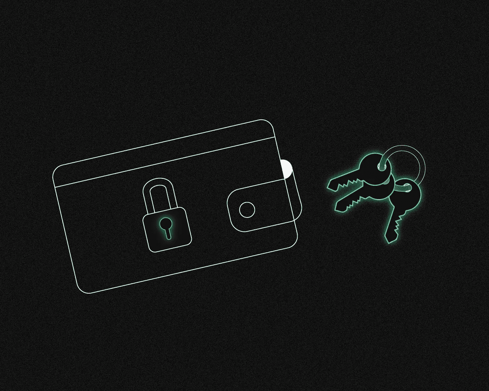
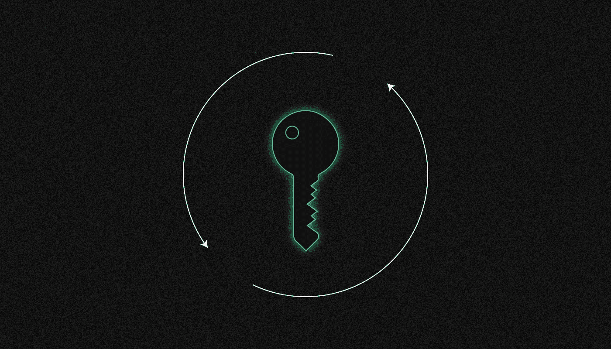
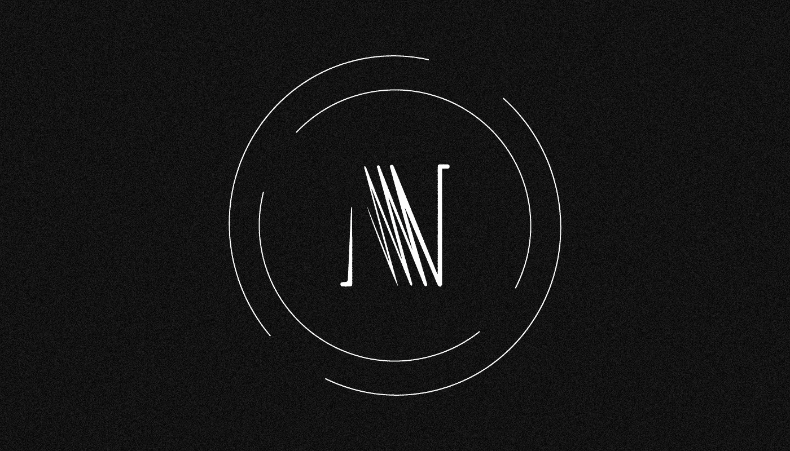

# 什么是多重签名？

> 原文：<https://medium.com/coinmonks/what-is-a-multisignature-fcd1707d2f10?source=collection_archive---------35----------------------->

***多重签名(Multisignature)也称为 multisig，是一种允许多个私钥对交易进行签名的技术，目的是在批准交易转移的同时增加安全性和隐私性。它是如何工作的，我们为什么需要它？有这么有用吗？让我们来了解一下！***

多重签名是一种阈值签名，它是作为对加密货币的基本脚本语言所做条款的验证而创建的。

# **多重签名技术是何时以及如何出现的？**

尽管多重签名技术在密码行业越来越受欢迎，但它的基本原理早在比特币之前就存在了。

数百年来，多重签名原则被用来保护保存圣人遗物的修道院墓穴。修道院的院长给了修道士们打开坟墓各个部分的钥匙。没有一个修道士可以独自接近圣徒的遗骸并偷走它们。

多重签名技术于 2012 年首次在比特币地址中实施。首款具有多重签名功能的钱包是 2013 年推出的[。今天他们有十几个。](/@willobrien/its-time-to-end-the-cold-storage-ice-age-and-adopt-multi-sig-8589733c9fd6)

# **多重签名技术是如何工作的？**

如果同时出现两个或更多签名，您只能访问存储在 multisig 钱包中的工具。

它类似于有两把锁和两把钥匙的保险箱。玛丽有一把钥匙，胡安有另一把。他们只有同时给钥匙才能打开箱子。他们不能自己打开盒子。

因此，multisig 钱包增加了一层额外的安全保障。由于这项技术，用户可以避免钱包只有一个私钥、单点故障以及容易受到网络犯罪攻击的情况。

由于 multisig 钱包需要多个签名，因此非常适合希望在共享钱包中存储资金的企业和公司。

# **多西格码有哪些不同类型？**

**1-of-2** 两个业务伙伴的合并账户——任何一方签字就足以支出资金。

**2-of-2**
两个业务合作伙伴的组合储蓄账户——需要双方签字才能使用资金，因此任何一个账户持有人都不能在没有对方批准的情况下使用资金。

具有双重认证的钱包:一个存储在电脑中，另一个存储在智能手机中。没有两个设备的签名，资金不能被花费。

低信任捐赠地址——项目的五个受信任参与者都有一个私钥。钱只能三个人花，但是任何人都可以捐款到项目地址。如果其中一个参与者对项目失去兴趣，像这样的计划可以降低盗用、黑客攻击、病毒感染和金钱损失的风险。区块链显示在最终签名中使用了哪个私钥，这改进了记帐。

**2-of-3**一个不可信的条件账户(托管)的买卖关系——买方将资金转移到 2-of-3 地址，卖方担任第三仲裁人。

如果交易成功，买卖双方签署协议，协议将资金返还给卖方。如果失败，他们可以签署一项交易，将资金返还给买家。

如果他们不能达成协议，他们就求助于第三方，由第三方充当仲裁人，并向其认为有资格的一方提供第二次签名。因为他只有一把钥匙，仲裁者无法窃取资金。

由三名经理组成的董事会负责公司或组织的资金；没有三位经理中两位的批准，这些资金不能动用。较大的多重签名交易—5 之 3、9 之 5 等。—适用于大型组织。

**2-of-3**
一款商务热门储物钱包。比特币交易所在线存储一个私钥，另一个作为纸质储备。一家独立的网络安全保护公司在网上存储第三个密钥，并仅在检查了许多因素(不在/在黑白名单中、未超过特定时间段的取款次数限制、双因素身份验证、符合监管标准等)后签署交易。如果交易所或公司的热钱包被攻破，比特币就无法被盗。如果一家网络防御公司倒闭，交易所可以通过票据储备获得资金。

**2-of-3**
分散式冷藏单元——一把钥匙放在用户家中的保险柜里，另一把放在银行的保险柜里，第三把钥匙的副本由一位亲密的朋友或亲戚放在用户的办公室里。家里的牢房不会遭到抢劫，因为花钱需要去朋友家、银行或办公室。

**2 对 2**
智能合约——tumble bit、Coinswap、Lightning Network。

**1 或 3-of-4**
分布式储备——主要用户可以随意使用钱包，但如果该所有者丢失了他的私钥，可以在其他四个受信任的朋友/组织中的三个的帮助下恢复它们。一把钥匙放在保险箱里，另外三把由朋友保管。在主人死亡的情况下，细胞中的资金可以根据他的遗嘱转移到他的一个信任的朋友或可以使用信任的朋友的援助的人。

# **什么是戒指签名？**

环签名是一种加密数字签名，可以由一组用户中的任何成员使用，每个用户都有自己的密钥。

数字签名的安全参数之一是使用计算手段不可能确定使用了组成员的哪个密钥来签名。环签名类似于群签名，但在两个方面有所不同:个人签名不能去匿名化，任何用户组的成员都可以成为签名者，而无需任何额外的配置。

术语“环签名”是指签名生成算法的环状结构。

# **谁在何时创造了戒指签名？**

环签名是由密码学家 **Ron Rivest，Ron Rivest** 和 **Yael Tauman Kalai** 和[在 2001 年**的 ASIACRYPT 国际会议上提出了**](https://link.springer.com/chapter/10.1007%2F3-540-45682-1_32)这项技术。

最初的想法是，环签名将用于防止机密信息的泄露，特别是从政府办公室。然后对原始模型进行优化。

**2006 年**一郎**藤崎琴音**和**小太郎铃木**提出了一个名为[可追踪环签名](https://eprint.iacr.org/2006/389.pdf)的解决方案来修复环签名技术的脆弱性(恶意或不负责任的签名者操纵的风险)。这种类型的环签名的优化版本目前用于加密纸币硬币，并确保发送者在 P2P 交易中不可追踪，从而隐藏交易中输入的来源。

**2015 年**，Monero 研究实验室提出了[环保密交易](https://eprint.iacr.org/2015/1098.pdf)的概念，由比特币核心开发者 **Gregory Maxwell** 引入并实现。扩展了原始环签名固有的匿名化能力，环保密交易不仅隐藏了发送者的身份，还隐藏了发送者和接收者之间的交易量。

# **戒指签名是如何工作的？**

环签名将群签名技术提高到了一个新的水平，为用户提供了更多的隐私。环签名通过隐藏交易的接收方来保护诸如 [CryptoNote](https://cryptonote.org/whitepaper.pdf) 等加密货币的 P2P 交易格式中的发送方，使得无法通过计算来确定交易的签名者是谁。

环签名是比传统的数字签名(如 ECDSA 或 Schnorr 签名)更高级的方案。

环签名可能需要使用多个公钥进行验证。“环形”签名之所以得名，是因为它由来自不同用户的多个部分数字签名组成。这些签名组合成一个签名。环是可以从区块链上其他用户的输出中随机选择的签名集合。

环签名类似于这样一种方案，在该方案中，几方从一个联合银行账户中签署一张支票，但是使用密码术隐藏来自群成员中的签署者。

环签名的结构(以 Monero 加密货币为例):

*   Alice 想给 Bob 发送 10 个 Monero 代币，并通过她的 Monaro 钱包启动交易。
*   这个交易的数字签名是一个一次性密钥，从她钱包的支出开始。
*   未签名的环签名是从区块链中随机选择的过去的交易输出，并且在交易中充当“欺骗”。
*   该链的所有成员都是交易的可能签署者——第三方无法通过计算手段确定真正的签署者。
*   环签名的所有输出一起形成事务输入。
*   交易的创建者 Alice 有权以这样的方式花费交易金额，即她的身份不能与其他环参与者的身份区分开来。
*   虽然 Alice 的公钥用在她自己的交易中，但它可以选择性地用在 Monero 网络上的其他交易中，作为屏蔽因子。

唯一的一次性密钥的自动创建防止了交易的可连接性，并且由于使用了[Diffie-Hellman 方法](https://en.wikipedia.org/wiki/Diffie%E2%80%93Hellman_key_exchange)对密钥交换进行了优化而成为可能。

# **什么是关键形象？**

对于 Monero 等私人货币来说，重复支出是一个问题。因为由于缺乏解决方案，这些网络作为数字货币是无用的，所以找到了结合环签名方案使用密钥图像的形式的解决方案。

每个环签名事务包括一个密钥映像，它是从失效输出中得到的加密密钥。在区块链上，每个输出只有一个唯一的关键图像。区块链存储了已经使用的所有关键图像的列表。

由于密钥图像的加密特征，不可能将区块链上的输出与其密钥图像相关联。任何使用密钥图像副本的新环签名都将被自动拒绝，作为重复花费的尝试。

# **什么是环形电流互感器？**

环 CTs 是环签名技术的增强版本。如果环签名的主要目的是确保交易发送者的机密性，那么环机密交易被创建来通过隐藏交易金额来增加发送者和接收者的机密性。

因为环签名只能包含等效的输出，所以在原始环签名格式中，输出被“分割”成单独的环。因此，第三方可以看到实际的交易金额。由于使用了环形 CT，交易被存储在一个“混浊的”区块链中，而不是像比特币区块链那样透明的。

环 CTs 交易不再需要被分解成多个部分并包含在等价输出的环中——使用环 CTs 的加密货币中的钱包可以从任意数量的输出中任意选择环的成员。

Ring CTs 还采用基于范围证明的承诺方案，该方案确认交易中使用的金额大于 0 且小于某个数字，同时不披露交易金额。外部观察者看不到交易，但是由于加密验证，他们可以确信交易是有效的。

> 如果您对 multisig 主题有任何补充，欢迎发表评论！
> 在跟踪更新方面，订阅我们的[媒体提要。](https://medium.com/sunflowercorporation)
> 
> 敬请期待！

> 交易新手？尝试[加密交易机器人](/coinmonks/crypto-trading-bot-c2ffce8acb2a)或[复制交易](/coinmonks/top-10-crypto-copy-trading-platforms-for-beginners-d0c37c7d698c)