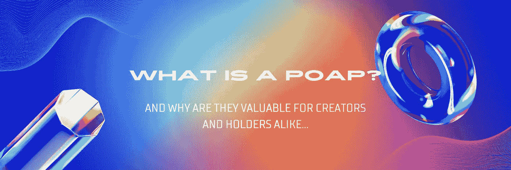
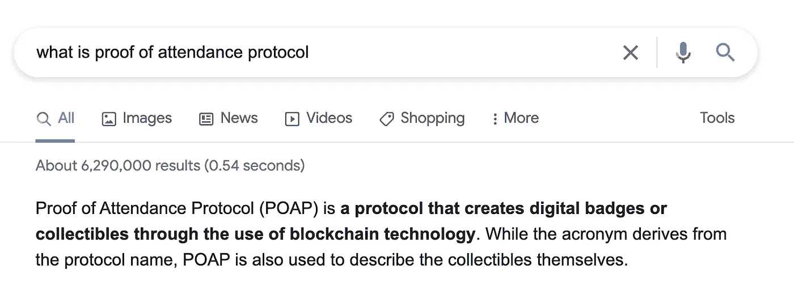

# 什么是 POAP，为什么它们对创作者和持有者都有价值？

> 原文：<https://medium.com/coinmonks/what-is-a-poap-and-why-are-they-valuable-for-creators-and-holders-alike-7b02410313a?source=collection_archive---------8----------------------->

随着 NFTs 世界得到越来越多的关注，人们越来越有兴趣与 web 3.0 工具、平台和项目进行交互。普遍的共识是，通过将消费者从现实世界环境带入 web3，这种新的虚拟机会世界的采用将会加快，这就是为什么 POAPs 可能成为最早的*(也是最广泛采用的)*进入世界加密的入口之一。

**那么，什么是******？****

**根据我刚才提问时谷歌返回的 6，290，000 个结果，POAP 是“出席协议的证明”。该协议通过使用区块链技术创建数字徽章或收藏品。虽然首字母缩略词源自协议名称，但 POAP 也用于描述收藏品本身。”**

****

**本质上，POAP 基本上是一个 NFT。但是，从持有者的角度来看，它是 NFT 的简单版本。**

**对于大多数消费者来说，围绕不可替代的令牌世界有很多困惑，对于创作者来说，非替代令牌很难制作——就目前的情况而言。你基本上必须有一个计算机科学的学位才能解决这些问题，或者你必须至少对智能合同开发有相当程度的理解。**

**然而，POAPs】由于上面提到的两个原因()——朝着让非功能性测试更容易获得迈出了一大步。除了技术的复杂性使得很多人不想创造 NFT，另一个障碍是创造一个真正有价值的 NFT 的成本。**

**当然，制作一些随机图像并将其铸造到区块链并不昂贵，但智能合同的后端开发和成功项目的必要部分的创建需要预算到位。但是，再一次，POAPs 通过降低创建 NFT 的交易成本来解决这个问题。它在某种程度上消除了一个进入壁垒。一个 POAP，正确使用，有效地让您-在几个点击-上传一张图片，并创建一个 NFT 作为一个徽章，这是一个你参加活动的收藏品。这些收藏品将会在现实世界中发挥作用，而在此之前，你不得不千方百计地制造它们，POAPs 正在改变游戏规则。**

**如果你想知道为什么会有人想要一个 POAP…好吧，想象一下几周前参加了第一次[VeeCon](https://veecon.co/)的人，然后让未来预测到一个世界，在那里[加里·维纳查克](https://medium.com/u/c4ec9163657c?source=post_page-----7b02410313a--------------------------------)已经实现了他的宏伟愿景，并把[vee friends](https://medium.com/u/39d5e25a6bf7?source=post_page-----7b02410313a--------------------------------)变成了现代的迪士尼；有一个 [POAP](https://medium.com/u/6267d2edc9d5?source=post_page-----7b02410313a--------------------------------) 说你是创造愿景的第一天在场的 OG 之一，这可能是一件非常酷的事情……而且*潜在地*，也非常有价值。*(这当然不是理财建议！)***

> **交易新手？尝试[加密交易机器人](/coinmonks/crypto-trading-bot-c2ffce8acb2a)或[复制交易](/coinmonks/top-10-crypto-copy-trading-platforms-for-beginners-d0c37c7d698c)**

****POAP 作为一个创作者平台****

**因此，正如上文所强调的，POAP 对消费者来说是有价值的，但是创造者呢？从市场的角度来看，这些出席证明协议有着巨大的价值。想想看，一旦有人把他们的钱包和你的项目联系起来，你就和他们的世界有了直接的联系，他们现在也和你有了直接的联系。一旦钱包连接上，你就可以把有未来价值的物品空投到他们的钱包里。你可以通过钱包随时有效地与他们沟通——当然，这需要以一种巧妙的方式来完成，而不是仅仅空投图像，这将被视为等同于垃圾邮件！**

**为了便于说明，我们在这里使用一个真实的品牌示例；我去牛津街的耐克专卖店参加耐克运动鞋新系列的发布会。我可以在活动上扫描二维码，然后在 POAP 发布活动，届时品牌将发布该系列的延伸产品(连帽衫、运动服、帽子等)。)，他们可以空投给我一个 NFT，这可以给我某种形式的效用——也许可以在其他人之前提前购买该系列的其余产品等。关键是品牌和项目要把 POAPs 当作特洛伊木马。任何空投的使用都需要真正的重视，而不仅仅是一个拙劣的伪装推销。**

**举个更进一步的例子，想象一下，如果耐克可以通过 POAP 从他们与我钱包的链接中空投给我一个 NFT，那么他们可以让我提前接触到其他现实世界的物品(增加他们的销售)，甚至可能以元宇宙中这些物品的数字所有权的形式提供效用…现在，这就是多层次的酷！在这种情况下，他们成功地向我销售了另一款产品，让我更加喜欢他们，因为他们让我觉得自己是一个早期采用者，加上我现在将成为该品牌的一个更积极的倡导者，因为我会在任何地方将我的头像改为我的 NFT，所以我也是他们的数字广告！**

**像这样使用联合思维的品牌将会在 Web 3.0 中赢得**大**，在我看来是*。***

**实际的 POAP 平台甚至让这变得更容易，因为它消除了创建钱包的需要——你可以在活动中分发一个二维码，让人们可以扫描。该代码将他们带到 POAP 生态系统，他们可以在那里存储这些数字徽章，直到*(希望如此)*他们决定将自己的数字钱包连接到 POAP 本身。当它们按计划工作时*(正如我最近在古德伍德速度节上试图扫描 POAP 时发现的那样，情况并不总是如此)*这种成为某物一部分的数字证明可能是朝着让更多人进入加密及其各种用途的更无痛、更简单的道路迈出的一步。**

**通过将实用程序链接在一起，您还可以基于 POAP 提供令牌门控访问。许多“开箱即用”的门控系统现在可以识别 POAPs，因此这可以增加另一种方式，让消费者访问您有价值的内容、平台、信息和社区。二级市场也认可 POAP，所以你也可以在那里列出你的 POAP。**

****变革的浪潮****

**POAP 是一个聪明的发展，虽然它不会让你成为百万富翁，因为 NFT 发射可以*(不是财务建议！)*，它激活了社区的某些元素，并为某些人打开了“下一个层次的东西”，让他们步入 Web 3.0 世界。**

**我们已经说了一段时间了，但是可用性——就像 POAP——进一步证实了我们的观点，即你将看到的许多大的变革浪潮将来自 Web 2.0 和 Web 3.0 的混合，以最简单的形式使用区块链，以便让人们体验他们正在进入的东西。**