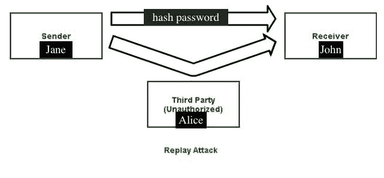

# 什么是重放攻击，如何防范？

> 原文：<https://medium.com/coinmonks/what-is-a-replay-attack-and-how-to-prevent-it-947c83931d0?source=collection_archive---------20----------------------->

互联网和数据泄露非常普遍，许多公司现在面临高级别的网络威胁。

随着世界走向数字化，现实世界的罪犯也变成了“数字”罪犯。

被称为重放攻击的最新形式的网络威胁给公共和私人网络带来了许多风险。重放攻击的受害者被剥夺了数据机密性、凭证，并且在大多数情况下，被剥夺了巨额资金。

虽然在线存储数据非常有用，但缺乏数字安全使其风险极高。

通读本文，了解重放攻击的含义、工作原理以及如何保护您的网络免受重放攻击。但在此之前，我们先来看看重放攻击是什么意思。

# 什么是重放攻击？

重放攻击，也称为重复攻击，是指攻击者窥探、拦截和“重放”加密的数据传输，使攻击者能够与接收者互动，就好像他们是原始发送者一样。

攻击者从网络上捕获消息后，不需要高级技能就可以解密消息。一旦他们可以复制并重新发送整个数据，攻击就成功了。重放攻击是最常见和最简单的网络攻击形式之一。

# 重放攻击的图示

1.  重放攻击的一个相关例子是:

当有邪恶意图的人不知何故嗅探到你的“备份代码”时，在他们的浏览器上输入该代码和你的用户名，并能够访问你在社交媒体、电子邮件或银行账户资料上的账户详细信息。他们可以冒充你，甚至从你的账户中取走成千上万的现金。

2.对于密码行业，重放攻击是这样进行的；

在 Jane 和 John 之间的有效交易中，假设 Jane 是发送方，而 John 是接收方。假设 Jane 希望 John 从他的账户转账 150 美元到她的账户，Jane 向 John 发送了一条可信的消息来发出这个请求。由于约翰信任(散列密码)简，他立即把钱寄给她。

但是在这里，作弊来自重放攻击。

当 Jane 通过网络将她的散列密码发送给 John 时，Alice(攻击者)窃听了交易，复制了散列，并试图复制它。约翰看到一条信息；他认为是简寄来的，所以他转了所需的钱。然而，这一次钱被转移到攻击者(爱丽丝)而不是简。重放攻击完成。

恶意黑客通过重放攻击来窃取资金和破坏网络。攻击者不需要知道密码；他只需要在网络上复制整个散列消息而无需解密。

# 如何防止重放攻击？

**1。时间戳**

通过在服务器上创建时间戳，并将其设置为拒绝任何超过指定时间范围的请求，服务器可以识别哪些消息不符合时间范围要求，然后丢弃它们。时间戳是阻止网络罪犯发起重放攻击的有效方法。

**2。一次性密码(OTP)或随机会话密钥**

一次性密码或会话密钥一旦被使用或在短时间内未被使用就会失效。实施 OTP 或随机会话密钥策略可以确保，即使攻击者复制并重新发送了消息，加密密钥也会显示为过期，不能再被重用。

**3。使用安全网络**

通过确保互联网活动仅在使用 HTTPS 协议的网站上进行，并避免公共或免费 Wi-Fi，可以保护数据免受重放攻击。此外，由于重放攻击需要攻击者获得对您的网络的访问权，使用 VPN 对第三方隐藏了您的互联网活动，这阻止了黑客的入侵。

**4。数字签名**

数字签名是一个复杂的过程，涉及算法和“密钥”每台计算机都有一个唯一的私钥，只有计算机知道。数字签名的使用使得收件人很容易验证发件人是真实的，以及他们是谁。

# 结果

重放攻击一旦成功，就会给网络安全带来真正的危险。由于攻击者不需要任何额外的工具或能力来实施这种攻击，这似乎是网络犯罪分子的一个简单的变通办法。然而，通过本文中的一种或多种方法来保护您的访问点可以帮助您防止重放攻击。

[插图-图像来源](https://www.geeksforgeeks.org/replay-attack/)

[封面-图像来源](https://www.google.com/url?sa=i&url=https%3A%2F%2Fwww.cyberghostvpn.com%2Fen_US%2Fprivacyhub%2Fstop-replay-attacks%2F&psig=AOvVaw2bhIL_yUqrUsUYkmG0a5t1&ust=1664622939896000&source=images&cd=vfe&ved=0CA4Q3YkBahcKEwj489j0sbz6AhUAAAAAHQAAAAAQCA)

*原发布于*[*https://gloriaokeke . hashnode . dev*](https://gloriaokeke.hashnode.dev/what-is-a-replay-attack-and-how-to-prevent-it)*。*

> 交易新手？试试[加密交易机器人](/coinmonks/crypto-trading-bot-c2ffce8acb2a)或者[复制交易](/coinmonks/top-10-crypto-copy-trading-platforms-for-beginners-d0c37c7d698c)