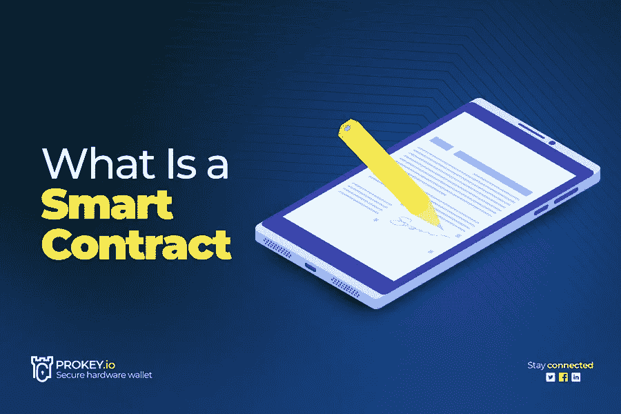

# 什么是智能合同，它是如何工作的？

> 原文：<https://medium.com/coinmonks/what-is-a-smart-contract-and-how-does-it-work-669a032edbf7?source=collection_archive---------11----------------------->

智能合同是您在讨论区块链技术时经常遇到的一个术语。但这是少数几个能够理解的人之一。然而，智能合同的整个概念比你想象的要简单。它在确保交易安全进行方面发挥着重要作用。本指南将教你智能合约的基本概念，比如它们的工作原理、重要性以及适用范围。如果你读了这个指南，你将再也不用谷歌什么是智能合同了。但是在我们进入技术内容之前，我们必须简要地讨论一下它的历史。

# 什么是智能合同？

密码学家和计算机科学家 Nick Szabo 在 1994 年提出了智能合同的概念。他的目标是消除第三方进行交易的需要。有了智能合约，交易可以通过计算机在可信的网络上自动执行。
智能合同是存储在自动区块链上的协议或计算机程序，有助于在满足特定条款时自动执行协议。crypto 中的智能合约通常运行在分散的网络上。尽管他们的名字，他们没有法律约束力，但功能是执行各种业务逻辑。此外，请注意，智能合约的开发、部署和分发有多种架构。

# 智能合约是如何工作的？

智能合约的工作原理非常简单。然而，建立智能合约始于业务团队与开发人员一起描述智能合约应该如何响应特定事件或情况。该事件可以是确认订单发货、公用事业仪表读数或支付授权等任何事件。
然后，开发人员使用逻辑在一个平台上创建智能合约，并对其进行测试，以确保其按预期运行。然后，一组安全专家审查书面申请，以确保没有漏洞。

# 为什么智能合约更好？

智能合同在许多方面都优于管理企业和当事人之间交易的传统方法。有了智能合同，企业和用户可以享受到传统流程所不具备的优势。最棒的是，随着技术的进步，使用智能合约的好处可能会很快增加。
以下是智能合同的一些优势:

使用智能合同的一个重要好处是它的过程是自动化的。在满足必要的条件后，您不需要经纪人或中介来确认或验证特定的交易。此外，由于没有第三方或中介，它比传统方法更有利。

由于智能合约是数字化和自动化的程序，它们倾向于只做程序应该做的事情。因此，这使得智能合约尽可能准确。换句话说，智能合同减轻了手工填写表格的缺陷。因此，没有文书工作的麻烦，也没有不必要的时间花在协调错误上。如果满足交易条件，合同将立即执行。

智能合约的另一个主要目标是它们的高交易速度处理能力，许多企业都从中受益。快速处理交易的能力是任何企业脱颖而出的一个重要特征。智能合同流程是自动化的，不需要人工干预来验证，因此速度很快。

有了智能合约，就不需要第三方中介。这减少了因有中间人而产生的[处理费和](https://prokey.io/blog/decentralized-currency-is-future)运营成本。换句话说，你可以用智能合同省钱，因为交易和流程是自动化的。

另一个让智能合同更好的地方是他们对细节的关注。程序员设计智能合约，使其成为加密的密码术(T4)，不给不完美留下任何空间。使用智能合约完成的任何交易都不会被渗透。
此外，智能合同上的所有文件都存储在区块链上，并多次复制，以确保您在数据丢失时可以恢复原始副本。

有了智能合约，你就不用担心信息会因为个人利益而被篡改。交易被自动化、加密，甚至被记录，因此不可能有篡改的可能。交易的加密记录在参与者之间共享，消除了信息是否被篡改的所有疑问。

# 使用智能合同的挑战？

如上所述，使用智能合约有几个好处。然而，一份聪明的合同绝不是完全完美的。开发人员有望在不久的将来解决一些与使用智能合约相关的挑战。但是现在，当使用智能合同时，这里有一些预期的挑战。

智能合约之所以安全且如此有效，是因为它们的配置方式很难或不可能改变。智能合同的实施和管理非常复杂。更改智能合同流程或纠正代码中的错误非常耗时，有时甚至非常昂贵。因此，开发人员必须在设计阶段小心谨慎，并在部署之前经历几个测试阶段，以确保一切正常。

虽然智能合同旨在消除对第三方的需求，但它不能完全消除真正意义上的第三方。与传统合同不同，智能合同中的第三方承担不同的角色。例如，一个团队可以负责编写代码；另一个团队可以确保满足所有的安全措施，另一个团队可以负责部署程序。负责设计智能合同的团队将始终参与其中。

有了智能合同，您可以加快跨越多方的执行过程。无论过程是否符合其他方的意图或理解，智能合同都会加速这一过程。可悲的是，如果事情失去控制，这可能会造成重大损失，特别是当几乎没有办法停止或解除这种意外行为时。

智能合约的安全性很高，但由于它们相对较新，黑客们不断开发新的方法来破坏它们。例如，黑客可以伪造事件，触发智能合约在不该执行的时候执行。

# 智能合同的使用

智能合约在多个领域都很有用。例如，开发人员可以将智能合同集成到验证交易中，而不一定是金融交易。这使得智能合约的可能性无穷无尽。让我们来看看智能合同让一些行业受益的一些方式。

智能合同非常适用于金融行业，尤其是保险公司。这些流程有助于保险公司更好地处理索赔。例如，一家集成了智能合同的保险公司将能够自动化其保单和服务，从而降低管理和处理成本。保险公司的智能合同也可以显著减少欺诈。

医疗行业因确保患者信息隐私而广为人知。智能合同允许安全地传输数据，从而防止任何第三方的访问。
智能合同在医疗行业记录和安全传输数据方面也很有用。因此，如果研究人员想要使用患者的数据，他们必须付费，不仅如此，患者还可以选择是否出售数据。

智能合同非常有用的另一个领域是政府。尽管许多政府对加密货币的整体想法并不那么友好，但智能合约可以在几个政府部门发挥作用。例如，智能合同可以帮助确保投票系统中的结果可信。使用智能合同投票保护选票免受欺诈。当投票事务被编写时，开发者不能改变它。

# 钱包

投资加密货币时，拥有最好的钱包至关重要。虽然有几种钱包可供您使用，但没有人能与冷存储硬件钱包[pro key 钱包](https://prokey.io)竞争。尽管智能合约钱包是一个东西，并提供了几个功能，如恢复没有种子短语，自动阻止转移，等等，Prokey 钱包仍然表现出色。

# 结论

从本文中可以看出，智能合约的整个工作原理非常简单。由于在几笔交易中没有中介参与，许多行业受益匪浅。交易之间没有中间人的最大好处是你会节省很多钱。
尽管智能合约的潜在负面影响是，如果被全球一体化，许多人将会失业。但是当然，没有人知道未来会怎样。

*原发布于*[*https://pro key . io*](https://prokey.io/blog/what-is-a-smart-contract-and-how-does-it-work)*。*

> 交易新手？尝试[加密交易机器人](/coinmonks/crypto-trading-bot-c2ffce8acb2a)或[复制交易](/coinmonks/top-10-crypto-copy-trading-platforms-for-beginners-d0c37c7d698c)