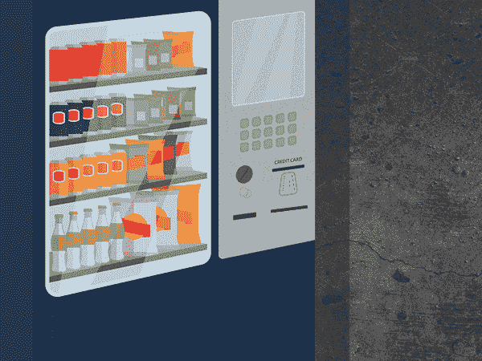

# 什么是智能合同？IBM 的一些具体例子

> 原文：<https://medium.com/coinmonks/what-is-a-smart-contract-some-concrete-examples-from-ibm-5c54fbcb2707?source=collection_archive---------20----------------------->

智能合同一词是由著名的密码学家 Nick Szabo 在 20 世纪 90 年代早期创造的。这个名字，虽然不是最不言自明的，但它经常被使用，尤其是在区块链行业，以了解智能合同的好处。

Nick Szabo

智能合同是存储在区块链上的数字合同，在满足预定的条款和条件时自动执行。

它们的工作原理并不复杂。他们使用最流行的编程功能之一“如果/当…然后”。这些函数不是非常复杂的函数。甚至在 Excel 等微软 Office 程序中也有可能看到类似的功能。简单地说，当预定的条件得到满足和验证时，计算机执行动作。由于人为因素容易出错，SCs 旨在消除决策中的人为因素。

A simple Smart Contract code

为了更好地理解 SCs，我们可以举一个自动售货机的例子。典型的自动售货机被编程为允许基于输入的特定动作和状态转换。它也以完全确定的方式工作。例如，如果你想买一罐两美元的可乐，但无论你尝试多少次，你都只有一美元，你将无法得到饮料。另一方面，如果你插入三美元，机器会给你一罐可乐，一个适当的零钱，甚至是以预先定义和编程的方式选择的零钱，这是基于哪些硬币可用以及机器想首先处理哪些硬币。

Vending Machine

执行不需要真实世界信息的智能合约很容易，就像自动售货机一样工作，但是如果你要创建一个需要标准普尔 500 数据的智能合约，在这一点上你需要 oracles。

# 神谕是什么？

Blockchain oracles connect blockchains to inputs and outputs in the real world

> 区块链甲骨文是将区块链与外部系统连接起来的实体，从而使智能合约能够基于现实世界的输入和输出来执行。

Blockchains cannot connect to real-world data and events on their own

例如，让我们假设爱丽丝和鲍勃想赌一场体育比赛的结果。Alice 在 A 队下注 20 美元，Bob 在 B 队下注 20 美元，总共 40 美元由智能合同托管。当游戏结束时，智能合约如何知道是将资金释放给爱丽丝还是鲍勃？答案是，它需要一种 oracle 机制来离线获取准确的比赛结果，并以安全可靠的方式将其传递给区块链。

在 Oracle 项目中，Chainlink 是这一类别中的佼佼者。Chainlink 是一个分散式 oracle 网络，为 SCs 提供防篡改数据馈送。在这里你可以找到更多关于它的信息。

Chainlink

# 智能合同和传统合同

为了比较智能合约和传统合约，我们可以举一个例子，

如果爱丽丝发送 X 个令牌 A，而鲍勃发送相同数量的令牌 B，则令牌将被交换，爱丽丝将收到鲍勃的令牌，鲍勃将收到爱丽丝的令牌。在一个非智能契约世界中，实现这一点的一种方法是与第三方创建一个托管契约，而不必让爱丽丝信任鲍勃，也不必让鲍勃信任爱丽丝。第三方将从阿利奇收集令牌 A，并等待来自鲍勃的相同数量的令牌 B，并将各自交换的令牌发送给爱丽丝和鲍勃。这种方法已经显示了 Alice 和 Bob 在信任中介时可能面临的一些问题。不能保证第三方在收到 Alice 和 Bob 的资金后不会跑掉代币。我们必须依靠中介的声誉和潜在的保险。这种方法是不确定的，如果出现问题，它可能会有不同的输出，这取决于多种因素，包括潜在案件将在哪里解决的管辖权。另一方面，智能合同将以完全自动化和确定性的方式工作，确保双方在满足存款硬币的初始标准时收到资金。

SCs 的另一个优点是，他们可以在自己体内持有资金，这在传统世界是不可能实现的。

# SCs 有什么优势？

## 速度、效率和准确性

一旦条件满足，合同立即执行。因为它们是数字化和自动化的，所以不需要处理任何文书工作，也不需要花费时间来纠正通常由手动填写文档导致的错误。

## 信任和透明度

因为不涉及第三方，而且交易的加密记录在参与者之间共享，所以没有必要质疑信息是否为了个人利益而被篡改。

## 安全性

区块链交易记录是加密的，这使得它们非常难以被黑客攻击。此外，由于每条记录都与分布式分类账中的前一条和后一条记录相关联，黑客必须改变整个链条才能改变一条记录。

## 储蓄

智能合约消除了中介机构处理交易的需要，进而消除了相关的时间延迟和费用。

## 复用性

负责交换 Alice 和 Bob 的代币的同一个 SC 可以被任何想要交换代币的人使用。在传统世界中，他们都必须签署单独的合同，并向中介支付各自的费用。

## 欺骗

欺诈在传统金融领域非常普遍，大多数公司都有庞大的团队专门致力于防范欺诈。有了 SC，代币可以在区块链上验证，有了数字签名，Alice 和 Bob 是否有资格使用代币就一目了然了。

## 用例

Defi(分散金融)是智能合约最受欢迎的用例之一。除此之外，还有很多 SCs 的使用案例，例如游戏行业、法律行业、房地产等等。在本文中，我们将重点介绍 IBM 的一些项目。

# 保护药物的疗效

索诺科和 IBM 正在努力通过增加供应链透明度来减少救生药物运输中的问题。Pharma Portal 由 IBM Blockchain Transparent Supply 提供支持，是一个位于区块链的平台，通过供应链跟踪温控药品，提供可信、可靠和准确的多方数据。

Safeguarding the efficacy of medications

# 增加对零售商-供应商关系的信任

家得宝利用区块链的智能合同快速解决与供应商的纠纷。通过实时沟通和增加对供应链的了解，他们正在与供应商建立更牢固的关系，从而有更多时间进行关键工作和创新。

Increasing trust in retailer-supplier relationships

# 提高国际贸易的速度和效率

通过加入由 IBM 区块链召集的贸易金融网络 we.trade，企业正在为全球贸易创造一个信任的生态系统。作为一个总部位于区块链的平台，we.trade 使用标准化的规则和简化的交易选项来减少摩擦和风险，同时简化交易流程，为参与公司和银行扩大贸易机会。

we.trade

# 风险

自问世以来，智能合同已经提升了区块链技术的功能，并开启了新的机遇，以至于我们已经开始看到区块链应用程序在最保守的行业中的实施。然而，就像每一个新概念一样，人们担心智能合约容易受到网络攻击和其他内在风险的影响。

DeFi 领域最引人注目的安全事件往往是由智能合同中的漏洞导致的，而不是由黑客非凡的编程技能导致的。根据 CipherTrace 的数据，仅在 2020 年，就有超过 1 亿美元的代币从 DeFi 部门被盗。客观地说，这些黑客攻击占了整个行业所有安全事故的 50%。它还强调了智能合同协议越来越多地被坏人挑出来作为潜在的入侵者。

对于开发人员来说，要降低智能合约风险，最好的方法是在部署协议之前进行广泛的智能合约审核。开发团队必须不惜任何代价来确保他们的智能合约没有错误。

对于用户来说，建议在对资金进行智能合约驱动的协议之前进行尽职调查。确保该项目已通过声誉良好的审计公司的认证。

# 结论

智能契约中可能会出现各种各样的缺陷，正如我们首先在 Dao hack 中看到的，然后在其他 hack 中看到的。 [Dao](/@sametkaymaz.25/what-were-the-consequences-of-the-dao-attack-how-were-these-issues-handled-6da0c60827a2) Hack 告诉我们，我们需要在这方面采取预防措施，自 2016 年以来，我们已经采取了非常重要的措施来确保智能合约的安全。这导致了许多项目的出现，我们在上面已经看到了这些项目的例子。更重要的是，我们应该通过从所犯的错误中学习来增加智能合约的使用范围。

> 产生好的智能合约的唯一方法是尝试几十个，然后得到最好的。在这个过程中，我们必须采取尽可能强的安全措施来防范可能的错误和攻击。

## 资源:

*   [coin market cap . com/Alexandria/article/what-is-smart-contract-risk](https://coinmarketcap.com/alexandria/article/what-is-smart-contract-risk)
*   [Gemini . com/cryptopedia/smart-contract-examples-smart-contract-use-cases # section-smart-contract-uses-in-corporate-structures-building-da-OS](https://www.gemini.com/cryptopedia/smart-contract-examples-smart-contract-use-cases#section-smart-contracts-uses-in-corporate-structures-building-da-os)
*   [ethereum.org/en/defi/](https://ethereum.org/en/defi/)
*   [research blog . duke . edu/2021/12/13/decentralized-finance-and-the-power of-smart-contracts/](https://researchblog.duke.edu/2021/12/13/decentralized-finance-and-the-power-of-smart-contracts/)
*   [webberwentzel . com/News/Pages/smart-contracts-vs-traditional-contracts-same-but-different . aspx](https://www.webberwentzel.com/News/Pages/smart-contracts-vs-traditional-contracts-same-but-different.aspx)
*   [mondaq . com/Cyprus/contracts-and-commercial-law/1176008/smart-contracts-vs . traditional-contracts-](https://www.mondaq.com/cyprus/contracts-and-commercial-law/1176008/smart-contracts-vs-traditional-contracts-)
*   [chain.link/education/blockchain-oracles](https://chain.link/education/blockchain-oracles)
*   [ibm.com/topics/smart-contracts](https://www.ibm.com/topics/smart-contracts)
*   [youtu.be/pWGLtjG-F5c](https://youtu.be/pWGLtjG-F5c)

[*更多关于区块链的内容，可以查看我的帖子*](/@sametkaymaz.25)

> 交易新手？试试[加密交易机器人](/coinmonks/crypto-trading-bot-c2ffce8acb2a)或者[复制交易](/coinmonks/top-10-crypto-copy-trading-platforms-for-beginners-d0c37c7d698c)