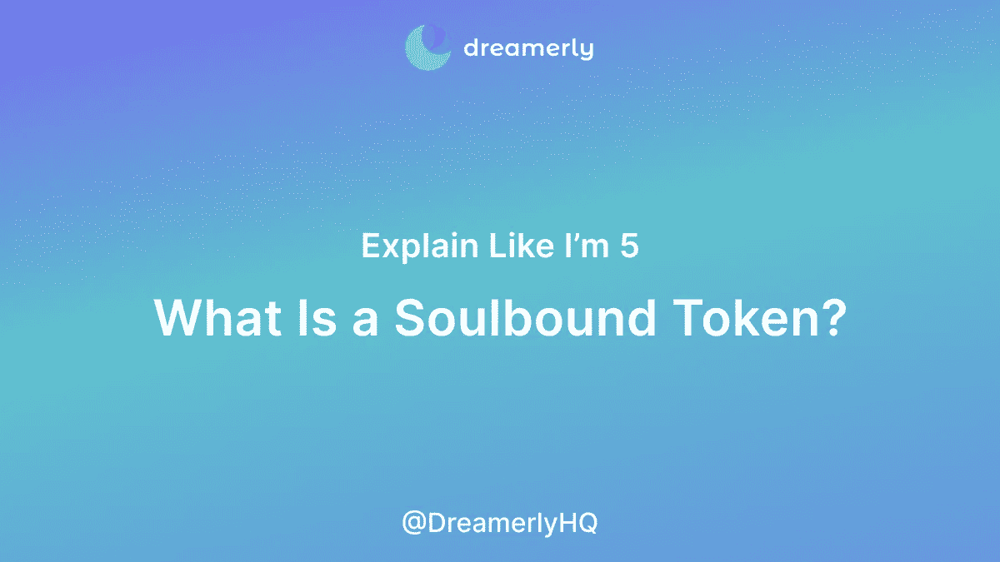
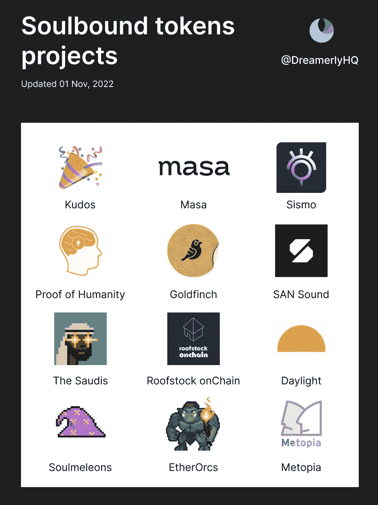
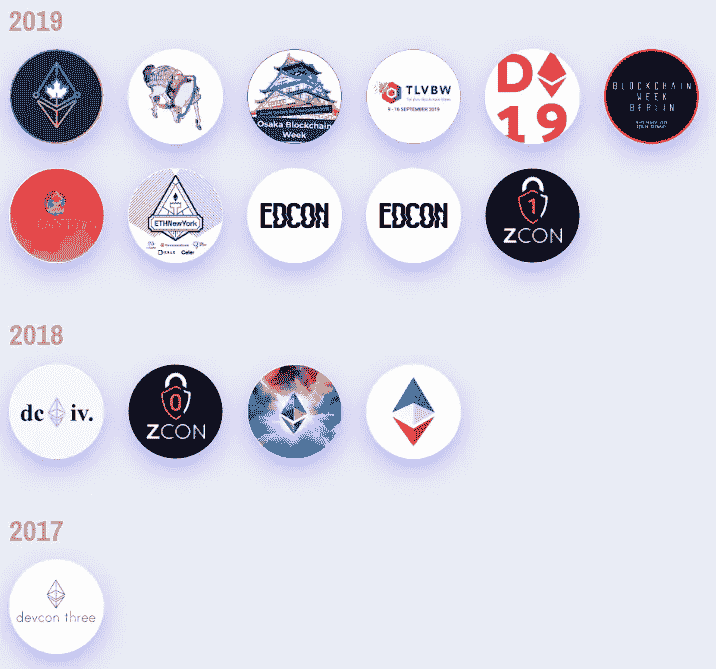
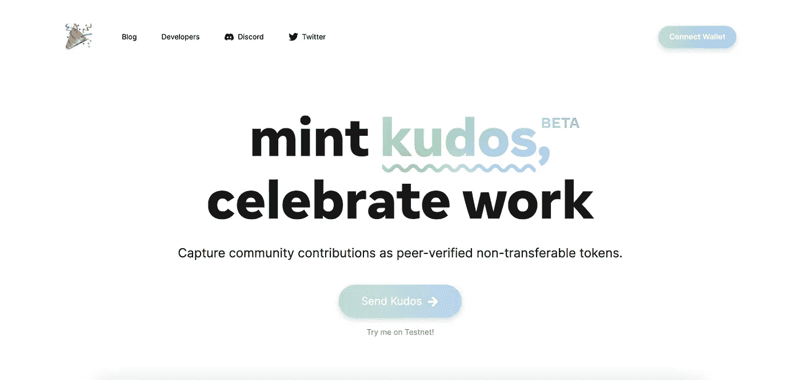
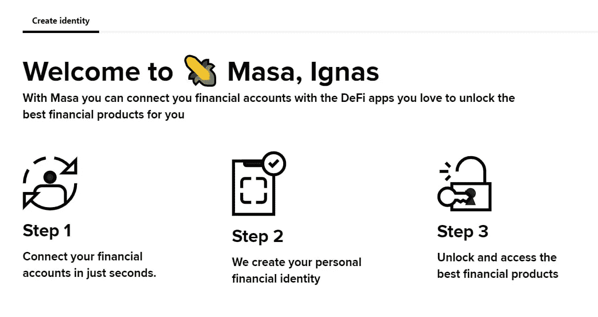
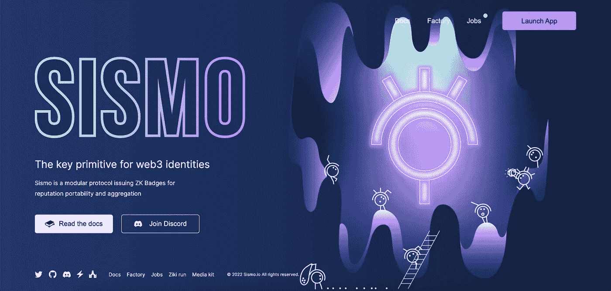

# 什么是灵魂绑定令牌？灵魂绑定令牌是如何工作的？你需要知道的一切

> 原文：<https://medium.com/coinmonks/what-is-a-soulbound-token-and-how-does-soulbound-token-work-everything-you-need-to-know-42e3705d264b?source=collection_archive---------47----------------------->

Vitalik Buterin 今年早些时候推出的 Soulbound token 被认为是继 NFT 之后的下一件大事。以下是 Soulbound token (SBT)的工作方式以及最新的构建或使用 SBT 的项目列表

但首先，让我自我介绍一下:

**大家好，我是 Linh，Dreamerly(Twitter:**[**@ DreamerlyHQ**](https://twitter.com/DreamerlyHQ)**)的业务拓展。关注我们的 Twitter，了解关于 crypto 最新故事的有趣见解。**

或者，你可以在我们的 Twitter 上阅读这篇文章:

# 什么是灵魂绑定令牌(SBT)？

SBT 是一种不可转让的象征(与 NFT 不同，它可以转让)。SBT 用于代表一个人的身份，从而实现了一些有趣的应用，例如:

—信用评分

证明成就

—针对 Dao 的基于声誉的投票

SBT 可以自我认证，就像我们放在简历上的信息一样。但是 SBT 的真正力量是让其他人证明某人的资格、成就或参与。例如，一所大学可以给毕业生颁发 SBT 作为她已经毕业的证明。

# **SBT 的发展**

—2022 年 1 月，维塔利克在他的博客上首次介绍了 SBT。

链接:[https://vitalik.ca/general/2022/01/26/soulbound.html](https://vitalik.ca/general/2022/01/26/soulbound.html)

—2022 年 5 月，Vitalik 和同事发表了一份 37 页的关于 SBT 和去中心化社会的研究

链接:[https://papers.ssrn.com/sol3/papers.cfm?abstract_id=4105763](https://papers.ssrn.com/sol3/papers.cfm?abstract_id=4105763)

—截至目前，有几个项目正在构建 SBT。以下是最新列表:

# 致力于 Soulbound Token 的著名项目

**1/** [**出勤证明(POAP)**](https://twitter.com/poapxyz)

出席证明(POAP)是 Soulbound Token 开发中的一个重要项目，从技术上讲，POAP 是 NFT，不是 SBT。然而，POAP 是第一个表明代币可以帮助持有者建立身份而不仅仅是交易和投机的项目。这也是 SBT 的目的

Part of Vitalik Buterin’s POAP collection

**2/** [**薄荷 Kudos**](https://twitter.com/mintkudosXYZ)

Mint Kudos 帮助社区认可并以 SBT 的形式奖励他们忠诚的成员。为什么荣誉是伟大的:

—向贡献者表达谢意的最佳方式

—无缝体验(10 英尺安装)

—与 Mazury 和 Alchemy 等其他项目的大量集成

**3/**[马萨 ](https://twitter.com/getmasafi)

Masa Finance 利用 SBT 来解决 web3 最困难的问题之一:连锁信贷。

Masa 将用户的传统金融账户与加密账户联系起来，以 SBT 的形式创建一个分散的信用报告。

Masa 在 5 月份推出后不久就有 36000 名注册用户。

**4/**[**Sismo**](https://twitter.com/Sismo_eth)

西斯莫提供 ZK SBT 徽章。ZK 代表零知识证明，这保证没有人可以追溯到用于证明你的徽章资格的来源帐户。除了证明之外，西斯莫就像托纳多·卡什。

**在 Twitter 上关注我们**[**@ DreamerlyHQ**](https://twitter.com/DreamerlyHQ)**了解更多！**

> 交易新手？试试[加密交易机器人](/coinmonks/crypto-trading-bot-c2ffce8acb2a)或者[复制交易](/coinmonks/top-10-crypto-copy-trading-platforms-for-beginners-d0c37c7d698c)