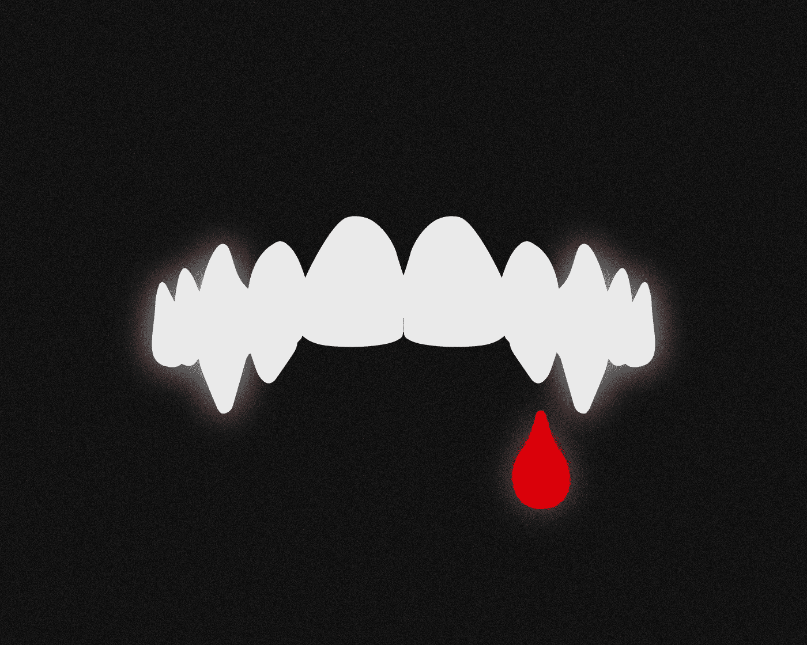
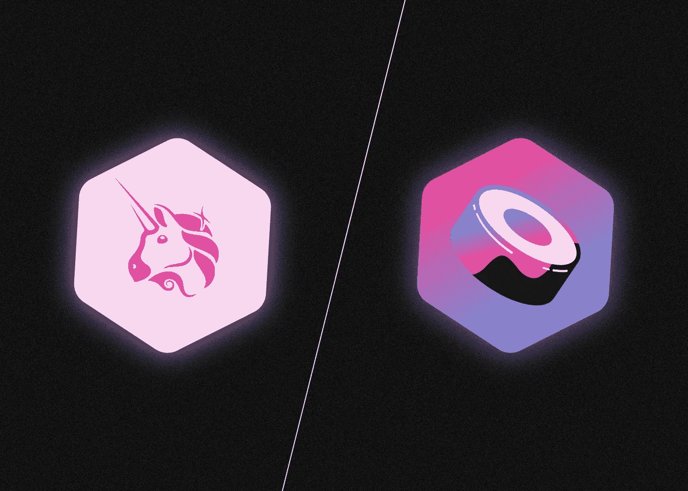
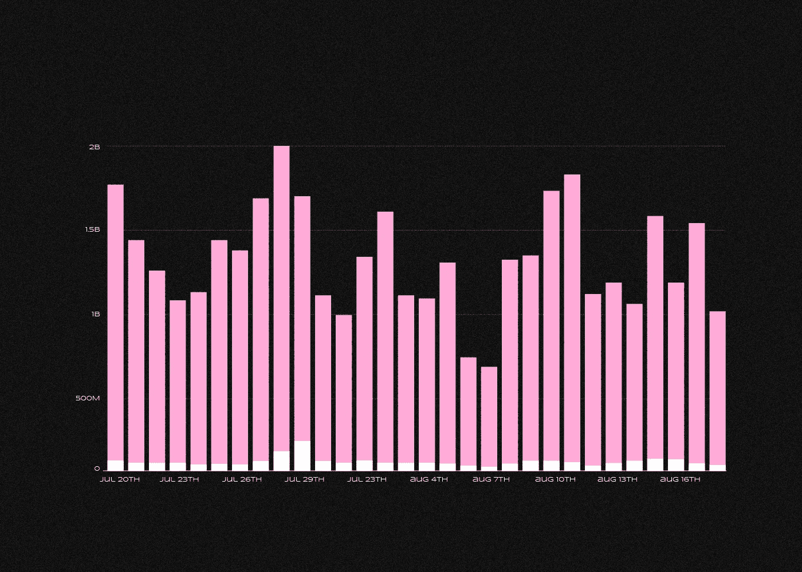
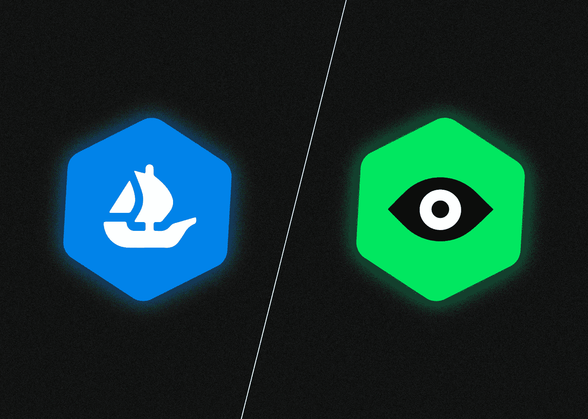
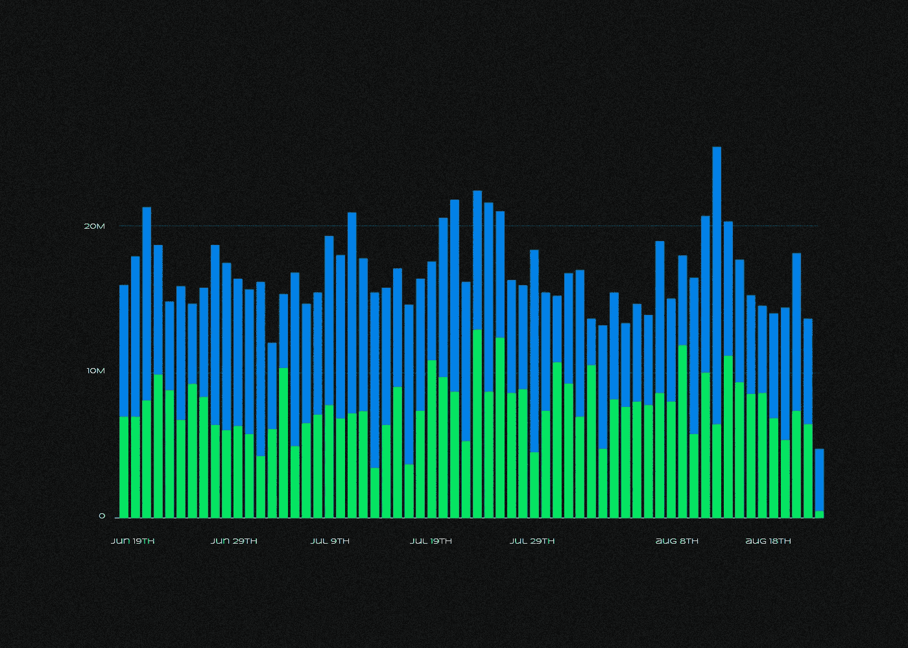

# 什么是吸血鬼袭击？

> 原文：<https://medium.com/coinmonks/what-is-a-vampire-attack-8c12ad43d9e2?source=collection_archive---------30----------------------->

***“吸血鬼攻击”是区块链一个新项目使用的一种策略，用来从一个更受欢迎的竞争对手应用程序中快速吸引用户和资金。它是如何工作的？Uniswap 怎么了？让我们一起来看看吧！***

通常，一个新应用的创造者会展示一个与“原版”功能相似的产品，但会通过奖励用户自己的令牌来提供更有利可图的激励。

在 **2020 年**的秋天，去中心化的交易所 Uniswap 成为了吸血鬼攻击的目标，在【2022 年 1 月，NFT 市场 OpenSea 也成为了攻击的目标。

# 吸血鬼攻击的本质是什么？

典型的吸血鬼攻击有三个组成部分:

*   找到一个领导项目。
*   使用原始的业务模型、架构或代码创建一个副本。
*   让多余的经济激励成为与热门竞争对手的主要区别。

这种策略应该导致新项目从目标中“吸走”用户和他们的资本，这是一种流行的协议。

吸血鬼攻击策略起源于分散金融(DeFi)。DeFi 应用程序的源代码或其主要部分通常是开源的。因此，一个类似的应用程序很容易复制和运行，只需要很小的改动。

此外,“副本”的开发者可以很容易地生产他们自己的控制令牌，并使用它来膨胀流动性养殖的盈利能力，这是用户的标准盈利方式。

# Uniswap 怎么会成为吸血鬼袭击的受害者？

在 2020 年，DeFi space，分散式交换 Uniswap 开始迅速流行起来。截至 2020 年 9 月初，该协议的日交易量已达到 18 亿美元，与领先的集中式加密货币交易平台相当。

SushiSwap 就是在这种背景下出现的。新协议是 Uniswap 的一个分支，这一事实由其匿名创建者清楚地表明了。另一方面，SushiSwap 有一个显著的不同之处:它有自己的象征性寿司，用户可以获得这种寿司作为在水池中养殖的奖励。

尽管现在几乎每个分散的交换都有一个管理令牌，但这在当时并不常见。另一方面，DeFi 已经有了作为一种经济激励手段的例子。

SushiSwap 团队为流动性提供者提供了有吸引力的条款:由于寿司奖励，参与交换池每年带来数百甚至数千%的收益。由于吸血鬼攻击，Uniswap 用户在短短几周内将超过 10 亿美元的资金转移到 SushiSwap，将“原始”的冻结流动性(TVL)减少了 70%。

然而，这种情况没有持续多久:寿司的高养殖率导致其价格急剧上涨，导致寿司池的产量同样迅速下降。就 TVL 而言，到 9 月中旬，Uniswap 已经回到了 DeFi 领导人的身边。不久之后，UNI 管理令牌出现了，有效地否定了 SushiSwap 的优势。

Trading volume on Uniswap (pink) and SushiSwap (white) from July 20 to August 18, 2022\. Data: Dune Analytics

# **2022 年吸血鬼袭击 OpenSea 是怎么发生的？**

“吸血鬼”的另一个受害者是 NFT 市场 OpenSea，它处理大部分不可交换代币交易。

另一个 NFT 交易平台 LooksRare 于 2022 年初上线。虽然与 SushiSwap 不同，它的创建者没有复制 OpenSea 智能合约，而是编写自己的合约，但他们攻击的主要部分也是一个名为 LOOKS 的平台令牌。

在 LooksRare 上交易 NFT 的用户会因为他们的表情活动而获得奖励。只有那些在 2021 年**6 月到 12 月**之间在 OpenSea 上交易 3 个或更多 ETH 的人才有资格参加赠品活动。

在 LooksRare 上交易 NFT 的用户会因为他们在 LOOK 上的活跃而获得奖励。但是有一个条件:只有那些从 2021 年 6 月**到 12 月**在 OpenSea 上交易了 3 个或更多 ETH 的人才能参与赠品。

除了这种“推广”，新平台的用户可能能够以每年约 500%的收益率通过下注获得关注。此外，LooksRare 上的交易费用更低。吸血鬼袭击导致 LooksRare 上的交易量迅速增加，OpenSea 上的交易量减少。

与此同时，LooksRare 在活跃用户方面落后于其竞争对手。鉴于可比的交易量，研究人员认为，新市场的少数用户积极参与清洗交易，这是为了外表奖励而进行大量虚构交易的做法。根据 CryptoSlam 的一份报告，到 4 月初，虚假交易占 LooksRare 总交易量的比例已经达到 95%。

该网站随后改变了激励措施，并开始打击不道德的行为，这导致了活动的减少。根据 [**区块**](https://www.theblock.co/data/nft-non-fungible-tokens/marketplaces/looksrare-filtered-volume-daily) 的数据，交易额从 2022 年**5 月 1 日**的 6900 万美元下降到 8 月 15 日**的仅 100 万美元，而同期虚假交易的份额从 98%下降到 13%。与此同时，OpenSea 重新获得了在 NFT 市场的领导地位。**

Daily trading volume on OpenSea (blue) and LooksRare (green) from June 19 to August 18, 2022\. Data: Dune Analytics

值得注意的是，市场已经在 2021 年被 Infinity 平台攻击。

> 你有什么想法？如果你对吸血鬼攻击话题有什么补充，请在下面留下你的评论！
> 
> 在[媒体](/@SunflowerCorpAdmin)或[推特](https://mobile.twitter.com/sunflower_corp)上关注[向日葵公司](https://sunflowercorp.com/)，定期更新热门的秘密新闻。

[*向日葵公司*](https://sunflowercorp.com/) *—专注于最佳交易体验和卓越技术的新型加密货币衍生交易所。*

*我们提供杠杆高达 x100 的 BTC/USDT 永久期货，以及最具趋势性的工具。当您与我们交易时，您将获得一个可定制的交易终端、各种图表、技术分析工具、多种订单类型以及“止损”和“止盈”订单选项。*

> 交易新手？尝试[加密交易机器人](/coinmonks/crypto-trading-bot-c2ffce8acb2a)或[复制交易](/coinmonks/top-10-crypto-copy-trading-platforms-for-beginners-d0c37c7d698c)
> 
> 多样化的密码持有，了解币安的选择
> 
> 加入 Coinmonks [电报频道](https://t.me/coincodecap)和 [Youtube 频道](https://www.youtube.com/c/coinmonks/videos)获取每日[加密新闻](http://coincodecap.com/)

## 另外，阅读

*   [复制交易](/coinmonks/top-10-crypto-copy-trading-platforms-for-beginners-d0c37c7d698c) | [加密税务软件](/coinmonks/crypto-tax-software-ed4b4810e338)
*   [网格交易](https://coincodecap.com/grid-trading) | [加密硬件钱包](/coinmonks/the-best-cryptocurrency-hardware-wallets-of-2020-e28b1c124069)
*   [密码电报信号](/coinmonks/top-3-telegram-channels-for-crypto-traders-in-2021-8385f4411ff4) | [密码交易机器人](/coinmonks/crypto-trading-bot-c2ffce8acb2a)
*   [最佳加密交易所](/coinmonks/crypto-exchange-dd2f9d6f3769) | [印度最佳加密交易所](/coinmonks/bitcoin-exchange-in-india-7f1fe79715c9)
*   [开发者最佳加密 API](/coinmonks/best-crypto-apis-for-developers-5efe3a597a9f)
*   最佳[密码借贷平台](/coinmonks/top-5-crypto-lending-platforms-in-2020-that-you-need-to-know-a1b675cec3fa)
*   [免费加密信号](/coinmonks/free-crypto-signals-48b25e61a8da) | [加密交易机器人](/coinmonks/crypto-trading-bot-c2ffce8acb2a)
*   杠杆代币的终极指南