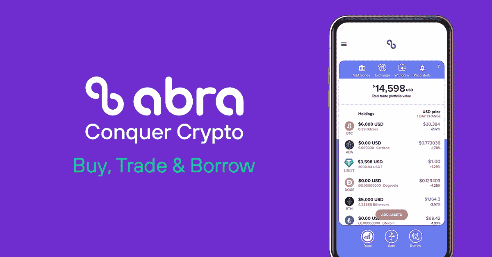

# 什么是 AbraUSD？这场竞赛中的新星，还是仅仅是炒作？

> 原文：<https://medium.com/coinmonks/what-is-abrausd-the-new-star-in-the-race-or-it-is-just-hype-5abaf3b863?source=collection_archive---------44----------------------->

阿布拉乌德重要吗？

抱歉各位。看了标题，如果你已经开始 googling AbraUSD，那就没多大帮助了。因为没有稳定的硬币。那么什么是 AbraUSD 呢？先从[凯西](https://www.abra.com/ref/?deep_link_sub1=RCFBRVMM5)说起吧。

## 什么是[凯西](https://www.abra.com/ref/?deep_link_sub1=RCFBRVMM5)？

从名字来看，它听起来像某种神奇的东西。但这与胡言乱语无关；)

> [凯西](https://www.abra.com/ref/?deep_link_sub1=RCFBRVMM5)是一家金融服务和技术公司，经营加密货币钱包服务，包括买卖加密货币的交易服务，赚取加密货币和稳定货币利息的服务，以及以加密货币抵押借款的借贷服务。

长话短说，[凯西](https://www.abra.com/ref/?deep_link_sub1=RCFBRVMM5)提供了一个移动专用的应用程序，用于交易密码和赚取密码利息。是什么让凯西与众不同？稍后我会带着另一篇文章回来。但是让我们来看看什么是 AbraUSD？

## 什么是 AbraUSD？

与任何其他稳定硬币不同，它不是稳定硬币。AbrasUSD 是凯西[美元存款的新名称。它将由几个稳定的硬币支持，包括美元硬币(USDC)，币安美元(BUSD)，Paxos (USDP)，以及真正的美元(TUSD)。这是一种创新的方法来提供跨资产的最佳流动性。](https://www.abra.com/ref/?deep_link_sub1=RCFBRVMM5)

根据[凯西](https://www.abra.com/ref/?deep_link_sub1=RCFBRVMM5):

> 例如，如果您的贸易账户中持有 180 美元的凯西美元，您可以在 USDC、TUSD 或 USDP 的任何一个国家提取 180 美元，或者提取这三种资产的任意组合，最高限额为 180 美元。在上面的场景中，如果你只存了 50 美元的 TUSD，你仍然可以提取 180 美元的 TUSD。这使您可以在 USDC、TUSD 和 USDP 进行一对一的交易，从您的综合 AbraUSD 头寸中提款。

## 关于 AbraUSD 的思考

据我所知，这是凯西非常创新的一步(如果你知道其他人，请在评论中告诉我。)与币安不同，它试图通过将三个竞争对手的稳定币——USDC、USDP 和 TUSD——摘牌，并将其转换为公司自己的稳定币——BUSD 来锁定其竞争对手。凯西决定尝试最优雅的方式。但问题依然存在:

*   如果有人试图提取更高的金额，其流动性会发生什么变化？
*   如果任何一种稳定的货币失去与美元的平价，将会发生什么？
*   为什么没有提到系绳(USDT)？

资源:

*   [https://www . Forbes . com/sites/mariagrasiantillanarinares/2022/09/22/abra-joins-1520 亿元稳定币市场即将成为银行/？sh=1376c9f5c3ae](https://www.forbes.com/sites/mariagraciasantillanalinares/2022/09/22/abra-joins-152-billion-stablecoin-market-on-its-way-to-becoming-a-bank/?sh=1376c9f5c3ae)
*   【https://support.abra.com/hc/en-us/articles/9435756974875 

> 交易新手？尝试[加密交易机器人](/coinmonks/crypto-trading-bot-c2ffce8acb2a)或[复制交易](/coinmonks/top-10-crypto-copy-trading-platforms-for-beginners-d0c37c7d698c)