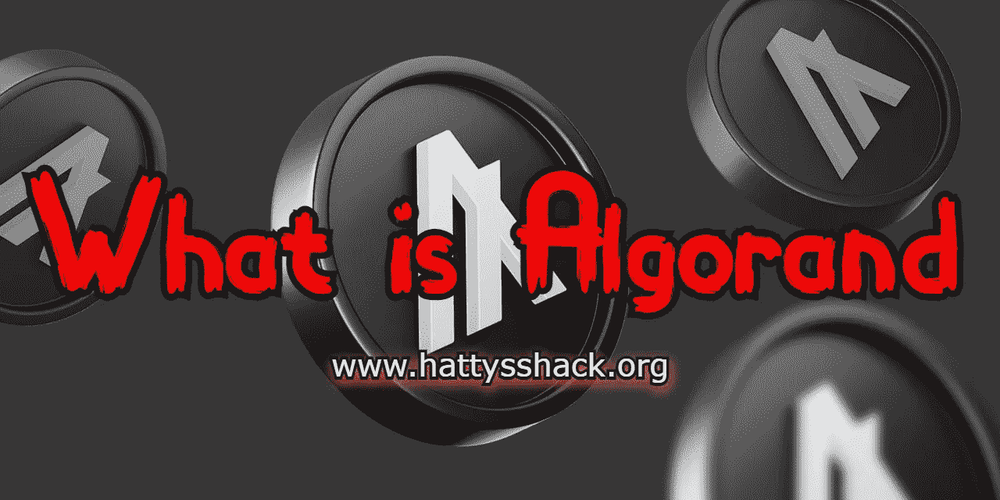

# 什么是阿尔格兰德？

> 原文：<https://medium.com/coinmonks/what-is-algorand-56cdd1a56ee9?source=collection_archive---------20----------------------->

**什么是算法**

[algrand](https://www.algorand.com/)于 2019 年推出。它是无权限和开源的，允许任何人在它的区块链上构建。阿尔格兰德是由希尔维奥·米卡利创立的。

Algorand 不仅快速、安全、开源，而且是无国界的。这意味着它可以很容易地进化和成长。他们的无边界经济允许任何有价值的东西在两方或多方之间进行交易，不管他们在哪里，没有当前金融网络的摩擦。

阿尔格兰德是第一个也是唯一一个在环境可持续发展的同时，不折不扣地实现去中心化、可扩展性和安全性的区块链项目。

[algrand](https://www.algorand.com/)是开源的，这意味着任何人[都可以在区块链上构建](https://developer.algorand.org/)。它不仅是开源的，而且是迄今为止最环保的区块链。

超过 2000 家全球组织使用 Algorand。

**阿尔格兰德值多少钱**

在写这篇文章的时候，Algorand 值 0.2995 美元**。**阿尔戈兰德(ATH)历史最高价为 3.1536 美元。在撰写本文时，Algorand 拥有超过 28，787，692 个地址。Algorand 可以执行 6,000 TPS(每秒事务数)。这与只能做 7 TPS 的比特币和只能处理 20 TPS 的以太坊相比速度极快。以太坊应该在以后的升级生效时解决他们的 TPS 问题。据说以太坊在分片生效后将可以达到 10 万 TPS。

阿尔格兰德不是最快的，但它有一个了不起的团队，可以更新和升级。比如 Polygon 可以执行 7,200 TPS，Solano 可以执行 50,000 TPS，Fantom (FTM)可以达到 25,000 TPS。这些项目可能会更快，但阿尔格兰德有一个伟大的团队，一个令人敬畏的社区，以及越来越多的项目。

在投资不同的加密项目时，做必要的研究是非常重要的。从我收集的信息来看，阿尔格兰德有着光明的未来。

**运行在 Algorand 区块链上的项目**

[钱包](https://perawallet.app/)

[清高](https://www.lofty.ai/refer?utm_source=growsurf&utm_medium=referrals&utm_campaign=referral-program&grsf=0143ph)

[民间金融](https://ecosystem.algorand.com/project/folks-finance)

阿尔戈菲

[石灰线](https://limewire.com/)

[棱形](https://www.prismatic.fi/)

这些只是运行在 Algorand 区块链上的几个项目。点击这里查看完整列表。

**支持 Algorand 的交易所和钱包**

阿尔格兰德是一个众所周知的区块链项目。阿尔格兰德的汽油费几乎没有。每笔交易的价格约为 0.001 ALGO，约合 0.0004 美元。

**交易所**

[比特币基地](https://coinbase.com/join/dandri_q?src=ios-link)

[库币](https://www.kucoin.com/r/rf/1vdKPvg)

[币安](https://www.binance.us/buy-sell-crypto/?utm_term=binance&utm_campaign=brand+e+p&utm_source=google-ads&utm_medium=cpc&utm_network=g&gclid=CjwKCAiAvK2bBhB8EiwAZUbP1M-8g7t25bN7CQTFHAZlc6EyxH1TxvsIBBK3BrraLelR93yVU1daTBoCz_oQAvD_BwE)

[维护](https://wallet.uphold.com/signup?referral=86b3f53908)

阿尔格兰德还有很多交易所，但这些是我认为最好的。

**钱包**

[佩拉钱包](https://perawallet.app/)

[Coinomi](https://www.coinomi.com/en/)

[信任](https://trustwallet.com/)

有更多支持 Algorand 的钱包，但我认为这些是最好的。在我看来，钱包是第一位的。

**结论**

阿尔格兰一直是我的首选投资。阿尔格兰德的费用几乎没有，而且速度比闪电还快。阿尔格兰德正以极快的速度增长，我可以预见它将在未来几年内进入前 10 名。

Algorand 仍然年轻，还有很长的路要走，但是从我收集的信息和我使用的项目来看，它远远超过了大多数其他的加密项目。

我相信在不久的将来，我们会看到很多加密项目失败，但 Algorand 不在其中。事实上，它可以随着我们的经济和人口的发展而发展壮大。不仅如此，这也是目前最环保的项目之一。就像我之前说的，这是一个气候友好的区块链项目，实际上已经变成了负碳项目。阿尔格兰德并不是唯一一个气候友好的区块链，但它名列榜首。以太坊的升级也让它变得对气候友好。

Algorand 是迄今为止我最喜欢的区块链项目之一。这取决于你自己做研究，找出你认为什么项目会成功。我只是向你提供事实和信息，帮助你一路走来。

请在评论中告诉我你对 Algorand 艾格兰特的看法。你认为它会在未来几年内进入前 10 名吗？

查看我的网站，了解更多赚取、学习和投资 Crypto 的方法！

[哈蒂小屋](https://www.hattysshack.org/)

[上的原创文章 read.cash](https://read.cash/@HattyHats/what-is-algorand-66963c06)

> 交易新手？试试[密码交易机器人](/coinmonks/crypto-trading-bot-c2ffce8acb2a)或[复制交易](/coinmonks/top-10-crypto-copy-trading-platforms-for-beginners-d0c37c7d698c)