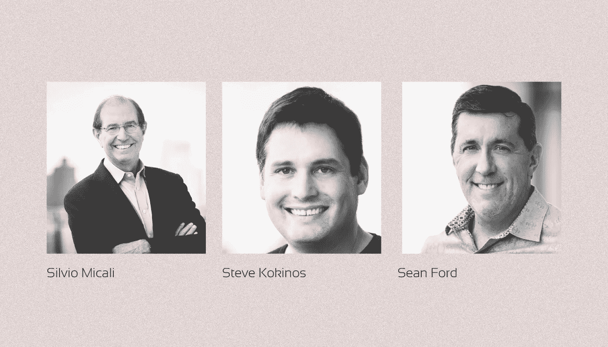

# 什么是阿尔格兰德(ALGO)？

> 原文：<https://medium.com/coinmonks/what-is-algorand-algo-73113c41a111?source=collection_archive---------36----------------------->

***algrand 是一个高性能的区块链平台，交易快速便宜，运行在自己的纯利害关系证明(PPOs)共识算法上。它支持智能合同、分散应用程序和数字资产的发布。它是如何工作的？我们来看看吧！***

一个由许多 Delphi，NET 和 Web 3 服务组成的生态系统正在阿尔格兰德区块链上开发，同时还有数百个传统经济的解决方案。

阿尔格兰德被定位为[“碳负”区块链](https://www.algorand.com/resources/blog/how-algorand-offsets-carbon-footprint)——部分交易费用于森林恢复项目和其他二氧化碳补偿项目。

# 谁在何时创造了 Algorand？

阿尔格兰德公司于 **2017** 年由**麻省理工学院教授**图灵奖获得者【希尔维奥·米卡利】在波斯顿创立。

这家初创公司吸引了风险投资公司 Pillar Ventures 和 Union Square Ventures 的 400 万美元种子投资。

连续创业者**创办了 Fuz、BladeLogic 和 WebYes 的 Steve Kokinos** 受邀担任 CEO，**uPromise 联合创始人、LogMeIn 前营销总监 Sean Ford** 出任首席运营官。

在 **2018** 的夏天，一个封闭的测试网络 Algorand 启动，它向潜在投资者展示了新区块链的所有优势。

在 **2018** 的秋天，这家初创公司组织了另一轮融资，并从一批风险基金中筹集了 6200 万美元。

**2019 年 4 月**testnet 公开，**6 月**主网上线。与此同时，举行了一次公开的荷兰拍卖，出售 2 500 万枚本地阿尔格兰德代币(ALGO)，筹集了 6 000 多万美元。

**2019 年 11 月**，Algorand 2.0 版本进行了首次重大网络升级，引入了对智能合约、数字资产发行和原子转移的支持。

# **algo rand 是如何工作的？**

该项目的创造者认为，他们已经通过纯粹的利益相关共识机制和许多其他创新，同时实现了高性能、可扩展性和安全性，从而成功解决了[“区块链三难困境】](/@SunflowerCorpAdmin/what-is-the-blockchain-trilemma-38a3b495a72f)。

运行在委托利益证明(DPoS)共识算法及其变体上的区块链平台为了高性能，将验证器的数量限制在几百个甚至几十个，这降低了去中心化的水平，增加了滥用的可能性。

在 Algorand，由于下一个区块的验证器是从存储至少一个 ALGO 硬币的所有钱包中秘密随机选择的，所以保持了高度的分散性和安全性。

根据拜占庭协议，每个区块分三个阶段获得批准:

*   **优惠** 随机抽取一个领导钱包，该钱包提供一个区块供审批；
*   **软投票**
    随机选择钱包委员会从被提议的区块中选择唯一一个将被接受认证的区块；
*   投票确认另一个随机挑选的委员会检查新街区是否超支、重复支出或其他问题，并认证其是否被列入区块链。

在每个阶段，一个可验证的随机函数(VRF)被用来选择钱包，这就像加权彩票一样:钱包中的 ALGO 代币越多，被选中的机会就越大。

阿尔格兰德网络也有超过 120 个中继节点，这些节点已有整整 10 年的历史，包含区块链的最新副本。

由于这种架构，网络吞吐量达到每秒 1000 个事务，阻塞时间为 4.5 秒。一笔交易的成本是 0.001 ALGO(截至 2022 年 7 月约为 0.0003 美元)。

另一个重要的结果是，不仅与 PoW 加密货币相比，而且与大多数 dpo 加密货币相比，Algorand 区块链每次交易都具有高能效和高成本效益。

区块链使用自己的 Algorand 虚拟机(AVM)。不兼容以太坊虚拟机和 Solidity 写的智能合约。

AVM 的母语是蓝绿色。然而，智能合约和分散式应用程序也可以用 Python 编写，Python 在密码行业之外被广泛使用。

# **algrand token omics 如何工作？**

**ALGO** 是阿尔格兰德区块链的本地加密货币。它用于堆叠、支付交易费用、启动中继节点和作为管理令牌。

硬币在最大的交易所交易(币安、比特币基地、霍比、北海巨妖、FTX 等)。)并按市值排名前 50(截至 2022 年 7 月)。

整个 ALGO 提供的 100 亿硬币被释放，作为前地雷的一部分。大部分资金由团队、早期投资者和非营利组织阿尔格兰德基金会(Algorand Foundation)分享。

自发布以来，ALGO 发布时间表已被认真修订。作为支持早期用户、中继节点持有者和 Algorand Accelerated Vesting 开发商的计划的一部分，2020-21 年分发了 31 亿 ALGO。2021 年，流通中的 ALGO 数量从 31.1 亿增加到 69.7 亿。

根据目前的计划，剩余的封锁币将在 2030 年前作为赠款、赌注奖励、中继节点的管理和维护进行分配。

在每一个新的积木被创造出来后，堆叠奖励会被送到 ALGO 持有者的钱包里。赌注的利润大约是每年 6%。

# 谁在管理 Algorand？

在项目开始时，管理和技术开发由私人公司 Algorand Inc .进行。在 **2019** ，algrand 基金会在新加坡成立，其职能是融资和开发网络，以及培训和支持开发人员。

阿尔格兰德基金会是 ALGO 的主要所有者。该组织通过加速器计划使用加密货币资助其在阿尔格兰德区块链的活动和项目。

【2021 年 9 月，阿尔格兰德基金会从自有资金中出资 3 亿美元成立了 Viridis DeFi 基金。该结构向开发钱包、网络间桥梁和其他生态系统服务的团队分配资金。

**2021 年第四季度**，阿尔格兰德区块链开始向分散管理模式过渡，允许所有 ALGO 车主参与关键决策。

为此，加密货币持有者必须注册为管理者(管理者或“管理参与者”)，并在整个三个月的投票期内阻止选定数量的令牌。除了通常的累积奖励外，投票参与者还可以获得控制权。

# **什么是阿尔格兰德生态系统？**

Algorand 的开发人员最初将区块链平台的重点放在开发实体经济各个领域的分散解决方案上。该网络最早用于房地产、政府管理、版权、金融和令牌化股票的发行等领域。

这一时期最大的合作是创造了马绍尔群岛的国家数字货币阿尔格兰德。这是参与该项目的 SFB 科技公司于 2020 年 3 月 12 日宣布的。

【2021 年 8 月，[一家专门从事资产令牌化的公司 Koibanx 与萨尔瓦多政府签署了一份协议](https://www.algorand.com/resources/ecosystem-announcements/el-salvador-signs-agreement-with-koibanx-to-develop-its-blockchain-infrastructure-on-algorand)，使用 Algorand 开发信息基础设施。

随着德尔福、NFT 和 Web3 细分市场在 2020–21 年的发展，阿尔格兰德基金会开始为私人用户导向领域的发展分配资金。Algofi、Yieldly 和民间金融作为 DeFi 项目推出，NFT 市场如 Abris.io、AB2 画廊和 ZestBloom 也是如此。

此外，十几个 NFT 和 P2E 的游戏已经在阿尔格兰德区块链，阿尔戈 realm，埃吉尔战术，SK8，阿尔奇蒙，Cosmis Champs 和其他游戏上推出。Algo 游戏公会已经展现了自己。

DeFi 生态系统的发展得到了大量资金的支持，以支持 2021 年启动的阿尔格兰德项目:无国界 ALGO 基金 II，该基金获得了无国界资本的 5 亿美元和阿灵顿资本的 1 亿美元。

# **阿尔格兰德是如何发展的？**

如今，超过 700 家组织在区块链算法上使用分散式解决方案。

【2022 年 5 月，国际足联指定阿尔格兰德为 2023 年卡塔尔世界杯和澳新女足世界杯的地区赞助商和区块链官方平台。在该网络的基础上，官方锦标赛加密钱包将被开发，NFT 将被释放。

Napster 数字音乐服务在同一个月被 Algorand 和 Hivemind 收购。在 6 月 8 日，双方宣布他们打算利用区块链的技术推出 NAPSTER token，并建立一个音乐流媒体生态系统。

阿尔格兰德基金会高度重视保持“绿色”形象:阿尔格兰德被宣传为世界上第一个“碳负”区块链。

一个特殊的智能合同会自动分配一部分交易费来资助森林恢复和替代能源开发项目。这就是该项目抵消碳足迹的方式。

Algorithond 还与气候贸易公司合作，该公司利用区块链创建了一个全球碳信用市场。

> 如果您对 Algorand 主题有任何补充，欢迎发表评论！
> 在跟踪更新方面，订阅我们的 [Medium Feed。](/@SunflowerCorpAdmin)
> 
> 您也可以在我们的平台[向日葵公司](https://sunflowercorp.com)上尝试使用加密货币。
> 敬请期待！

> 交易新手？试试[加密交易机器人](/coinmonks/crypto-trading-bot-c2ffce8acb2a)或者[复制交易](/coinmonks/top-10-crypto-copy-trading-platforms-for-beginners-d0c37c7d698c)