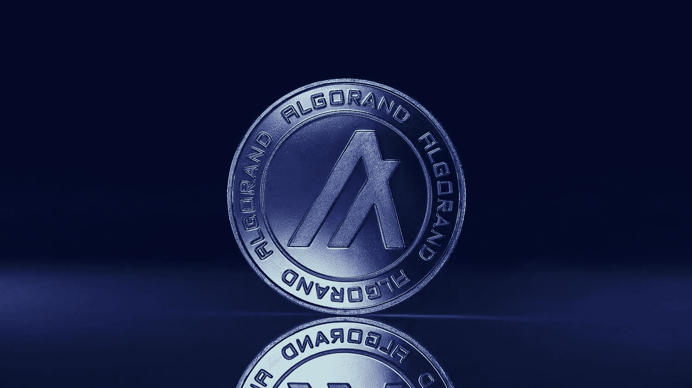
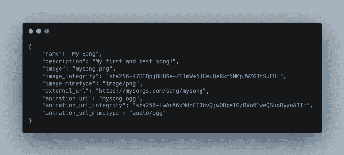

# 什么是 Algorand，为什么您应该选择它用于 NFTs

> 原文：<https://medium.com/coinmonks/what-is-algorand-and-why-you-should-choose-it-for-nfts-7c5f472bc239?source=collection_archive---------11----------------------->

随着非功能性测试的成熟，对技术和工具的需求越来越大，以方便大规模采用。目前最紧迫的问题是以太坊高昂的燃气费，这为创作者和收藏者进入 NFTs 设置了很高的门槛。

因此，许多人寻求替代区块链来补救这种情况。阿尔格兰德区块链是这些新兴解决方案之一，在本文中，您将了解 NFTs 如何在阿尔格兰德上工作。

本指南将帮助您了解 NFTs 如何在阿尔格兰德区块链上工作。我们将讨论:

*   NFT 代币
*   阿尔格兰德的 NFT 标准:类似于以太坊的 ERC-1155 或 ERC-721
*   存储:存储媒体(图像、音频、视频)和元数据的位置
*   在阿尔格兰德铸造 NFT
*   阿尔格兰的 NFT 市场/工具

# 为什么是阿尔格兰德？

Algorand 将自己定位为一个*环保的*区块链，允许简单地创建和启动 NFT。然而，与 EVM 兼容的区块链不同，比如*以太坊*和*多边形*，在阿尔格兰德有多种方法可以创建一个 NFT。我们将在本文中讨论其中的一些，包括您可以采用的一些最佳实践。

# 了解 Algorand 上的 NFTs

在 algrand 上，你使用 algrand 标准资产(ASA)创建一个 NFT—*你不需要一个简单 NFT 的智能合约*，但是像版税和其他定制行为将保证一个。ASA 的特点是:

*   *ID*
*   *创建者(必填)*
*   *资产名称(可选，但推荐)*
*   *UnitName(可选，但推荐)*
*   *合计(必填)*
*   *小数(必填)*
*   *默认冻结(必需)*
*   *资产 URL(可选)*
*   *元数据哈希(可选)*

这是您在创建 ASA 时提供的信息(为您生成的 ID 除外)，并且在创建后不能更改。

考虑到这一点，纯 NFT 被设计为 ASA 或资产，单位总数设置为 1，小数设置为 0。当创造这种独特的 ASA 时，你就是在铸造一个 NFT。

# 阿尔格兰德 NFT 标准:ARC03 和 ARC69

非功能性测试对 Algorand 来说相对较新，并且在不断改进中。Algorand 支持两种创建 NFT 的框架，ARC03、和 ARC69。请将这些视为允许您的 NFT 在市场上兼容查看和交易的指导原则。

> 交易新手？尝试[加密交易机器人](/coinmonks/crypto-trading-bot-c2ffce8acb2a)或[复制交易](/coinmonks/top-10-crypto-copy-trading-platforms-for-beginners-d0c37c7d698c)

ARC03 是第一个 NFT 标准，允许 NFT 元数据(名称、描述、链接、特征)存储在阿尔格兰德区块链之外。这是通过将元数据 JSON 文件上传到服务器(集中存储)或 IPFS(分散存储)来实现的，然后在创建 NFT 时，将这个链接放入**资产 URL** 字段。

Sample ARC03 NFT metadata

这样，任何显示 NFT 的网站都知道从元数据的**外部 url** 字段获取媒体链接。

然而，Algorand 上 NFTs 的第一次实现看起来不是这样的。这是因为 Algorand 允许一种简单的方法来创建 NFT，即在创建 NFT 时，将 NFT 媒体链接(例如 jpg)直接放入**资产 Url** 字段。可以想象，这种方法有一些缺点——例如，无法添加属性或任何元数据。

这是 ARC69 的最大动机之一。ARC69 补充了 ARC03 的不足，它允许资产在 Algorand 区块链上存储元数据。你脑海中的一个问题是——我使用什么标准？我的简短回答是你两者都用。请记住，这两个标准并不相互排斥。然而，ARC69 越来越受欢迎，是许多创作者的首选。

# NFT 存储

使用 NFTs 时，理解在哪里存储什么是很重要的。但在此之前，让我们先讨论一下什么需要存储。正如我已经提到的，NFT 是一个阿尔格兰德资产(有时有一个聪明的合同)，因此生活在阿尔格兰德区块链。借助 NFT 元数据和媒体，存储更加灵活。

描述 NFT 特征的元数据可以在链上(例如，使用 ARC69)、在中央服务器上或在分散存储上，如 **IPFS** 。对于他们来说，像图像、音频或视频这样的媒体文件对于区块链来说有点重，通常放在服务器或 IPFS 上。

*注意:IPFS 是最流行的元数据和媒体存储选项，因为它是分散的。*

# 在阿尔格兰德铸造 NFT

现在，让我们来谈谈铸造。铸造 NFT 的方法有很多。不管怎么样，基本都是一样的，这将是我的重点。在了解这些之后，你将有足够的信心在 Algorand 上铸造你的 NFT。

假设你的朋友奥迈尔是一位数字艺术家，他向你求助，希望你能帮助他建立一个 NFT。自然，您会很乐意帮助他，并决定按照以下步骤在 Algorand 生态系统上设置他的 NFT。

*   你为奥迈尔准备了一个 Algorand 钱包——出于安全考虑，理想情况下，他会自己动手。
*   然后，你得到关于艺术的信息并准备一个 ARC69 元数据 JSON 文档。
*   接下来，你把图像上传到 IPFS。
*   最后，你在市场**上铸造奥迈尔的 NFT** 。

考虑到我们所讨论的一切，这应该是完全有意义的。我知道如果还有一些差距，但这将不再是一个问题后，检查这些资源。

*   与 AB2 画廊一起铸造你的第一个 NFT(非技术性方法)
*   以编程方式在 Algorand 上生成 NFT(技术方法)

# 没有市场的 NFT 是什么？

由于与以太坊相比，NFT 在 Algorand 上相对较新， **NFT 市场/工具**也是新的。尽管如此，看着这些项目在这个领域成长和成熟是令人难以置信的。这里有几个值得一试。

*   https://www.nftexplorer.app/的 NFT 探险家—
*   https://ab2.gallery/ AB2 画廊—
*   algo mart—[https://github.com/deptagency/algomart](https://github.com/deptagency/algomart)
*   兰德画廊—[https://www.randgallery.com/algo-collection/](https://www.randgallery.com/algo-collection/)

了解了 **NFT 标准、储存、铸造和工具之后，**你就拥有了开始在阿尔格兰德号上航行所需的所有知识。本指南中还有很多我没有涉及到的内容，但是一旦你接受了我们在这里讨论的所有内容，理解这些就不是什么大问题了。