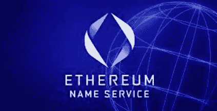

# 什么是 ENS，它是如何工作的？

> 原文：<https://medium.com/coinmonks/what-is-an-ens-and-how-does-it-work-2bae39fc0dc1?source=collection_archive---------30----------------------->

它是以太坊网络的一项服务，与 web3 直接相关，缩写代表以太坊网络服务，其主要目的是将机器可读的标识符转换为人类可读的名称。

除了使加密交易更加方便、快捷和灵活。

ENS 在使区块链互动更容易实现方面向前迈进了一步。然而，由于它的使用和日益普及，我们可能会看到 ENS 名称的增加，就像我们不再使用 IP 地址访问网络一样。

以太坊名称服务是一个 Web3 区块链系统，允许用户设置他们自己的唯一且容易记忆的用户名。

因此，ENS 打算通过使用以太坊智能合同来管理域名注册和解析，从而为 DNS 提供一个补充解决方案。有了这项服务，你可以为你所有的钱包地址和分散的网站提供一个唯一的名字。例如，“cryptolyzerblog.eth”允许您在分布式环境中快速识别和定位钱包地址。

ENS 域的所有者也可以建立子域，他可以向这些子域分配其他数据。然而，它不必总是钱包地址。相反，它可以用于指向智能合同、元数据或事务。

由于 Web3 托管，企业将变得更加透明和以用户为中心。它打开了区块链的大门，在未来，个人、应用程序和网站将使用基于区块链的域名，允许用户访问分散的网络。

## 服务的功能由三个智能合约控制。

**1。注册表**

单个智能合同运行 ENS 注册表并跟踪所有域和子域。这个系统被有意地保持为基本的，它唯一的目的是将一个名字与负责它的解析者联系起来。它还存储以下三条重要信息:

*   域所有者:外部帐户或智能合同可以是域所有者。域所有者可以更新域的分辨率和 TTL，将域的所有权转移到另一个地址，以及修改子域的权利。
*   域名解析器:域名到地址的转换过程由解析器处理。如果遵循特定的指导原则，任何合同都可以成为解决方案。
*   ENS Namehash: ENS 将名称存储为哈希，哈希是使用“Namehash”方法生成的。namehash 的计算方法是将 ENS 域名顶级部分的 hash(称为“labelhash”)与其他部分的 namehash 相结合，然后对其执行另一个 hash。

**2。注册服务商**

注册商是一个智能合同，持有域名，并可以根据规则(如支付)向用户授予子域名称。ENS 团队使用 Vickrey 的拍卖注册商和永久注册商。eth 名称注册。

2017 年 5 月 4 日，ENS 团队推出了一项智能合同，为注册长度超过 6 个字符的名称实施维克瑞拍卖。维克瑞拍卖是一种密封投标拍卖，买家在不知道有多少其他投标人出价的情况下出价，拍卖的获胜者是出价最高的投标人，他只需支付第二高的金额。

2019 年 5 月 4 日，ENS 团队引入了“永久注册商”来取代拍卖“注册商”，以注册长度超过 6 个字符的名称。永久注册服务商被设计为无限期运行，直到注册服务商合同因严重故障而被替换。的计费方法。eth 域名已改为年租金支付模式，每个域名每年收费 5 美元。

与永久注册服务商一起，注册服务商管理人的理念也应运而生，以允许域名所有者授权域名管理。结果，由注册控制器注册的名称可以建立名称和解析记录作为注册事务的一部分，这简化了过程。

2019 年 9 月，针对剩余的长度为 3 到 6 的短名，开始了另一场名为短名拍卖的拍卖。ENS 团队使用著名的加密资产市场 OpenSea 作为拍卖平台，采用英式拍卖作为拍卖方式。

在英国拍卖中，出价对公众开放，投标者可以多次出价。出价最高者将获得该名称，押金数额将是第一年的注册费，这与维克瑞拍卖时期有很大不同。

**3。解析器**

名称到注册的分配存储在解析器中。ENS 团队实现的“公共解析器”预设了八个注册表类别，但是 ENS 可以包含任何注册表。

记录类别:地址、名称、内容、哈希、文本、公钥、合同交互和授权的 ABI。

ENS 名称解析程序包括两个步骤。首先，希望解析域名的用户必须在注册表中搜索相关的解析器，然后检索解析器解析的结果。

> 交易新手？试试[密码交易机器人](/coinmonks/crypto-trading-bot-c2ffce8acb2a)或者[复制交易](/coinmonks/top-10-crypto-copy-trading-platforms-for-beginners-d0c37c7d698c)