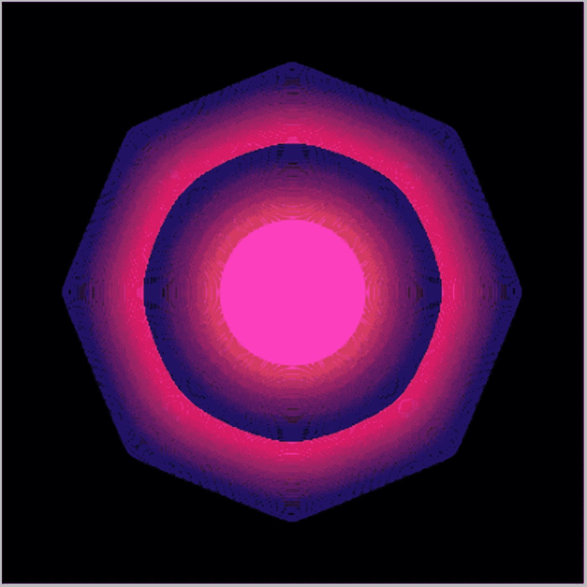
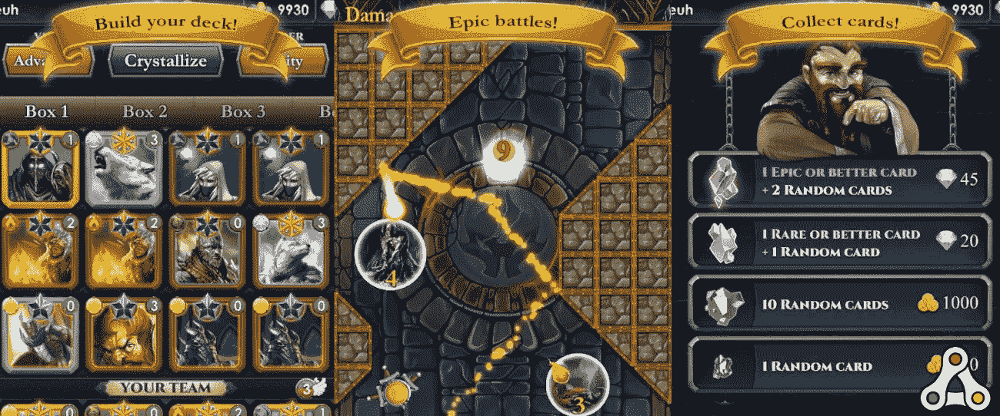
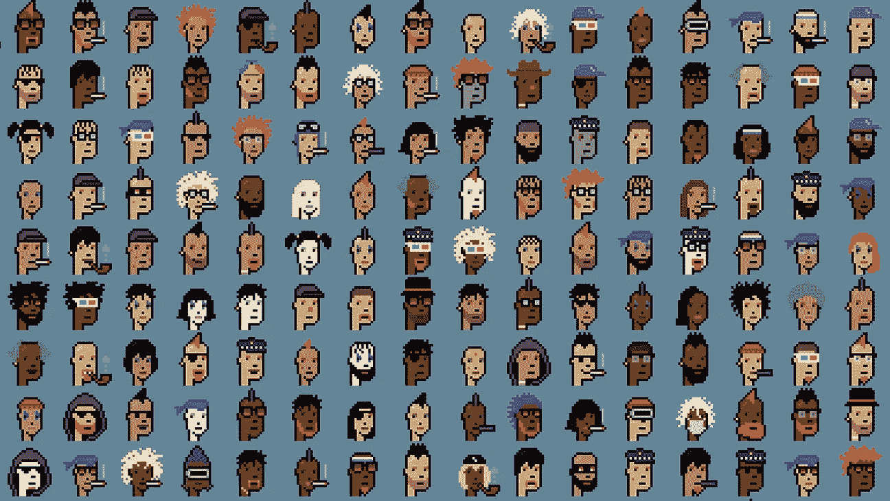
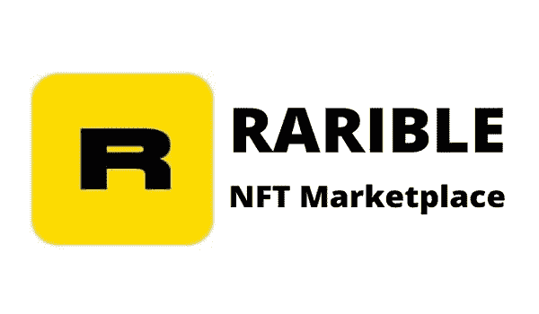
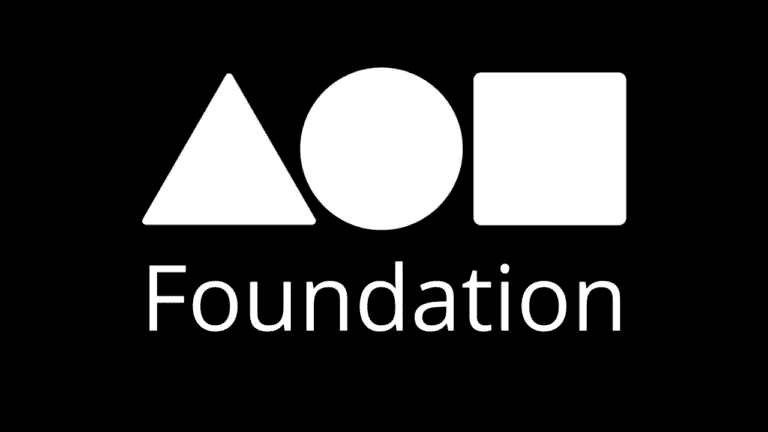

# 什么是 NFT？2022 绝对初学者 NFT 终极指南

> 原文：<https://medium.com/coinmonks/what-is-an-nft-2022-ultimate-nft-guide-for-absolute-beginners-8cb38eb7b539?source=collection_archive---------28----------------------->

[根据一项调查，从 2021 年 4 月 15 日到 2022 年 11 月 15 日，艺术品细分市场中涉及不可替代代币(NFT)的销售总值波动较大。截至 2021 年 4 月 15 日，之前 30 天在以太坊、浪人和区块链流量上记录的 NFT 销售额产生了约 7800 万美元的总价值。截至 2022 年 11 月 15 日，30 天的累计销售额约为 3610 万美元。](https://www.statista.com/statistics/1235263/nft-art-monthly-sales-value/)现在让我们深入了解一下 NFTs。

**什么是 NFT？**

NFT 也被称为不可替代的代币，被视为收藏品的数字等价物，就像比特币被视为货币的数字等价物一样。

由于其独特的性质，非功能性测试是不可替代的，这使得它们不能被替代或交换。NFTs 的目标是以建立所有权和稀缺性的方式帮助保护数字数据。

> 从顶级交易者那里复制交易机器人。免费试用。

就像实物艺术一样，NFT 也可以出售

但是…

艺术家可以选择保留版权，将其交给购买者，或者决定所有者有权获得多少二次收入。

每个 NFT 拥有的唯一标识号和元数据便于区分它们。

**NFTs 简史**

您知道吗，最初的 NFT 是比特币的一小部分，称为彩色硬币，意在表示对各种现实世界资产的所有权，如政府债券、数字收藏品、其他加密货币等。

虽然彩色硬币是比特币区块链的一个新颖组成部分，也是非功能性比特币的开端，但当时它们存在许多严重问题。

彩色硬币有多种用途。然而，尽管有这些缺点，彩色硬币为 NFT 工业的发展铺平了道路。

**第一届 NFT**

2014 年，凯文·麦考伊在名为“量子”的硬币上推出了第一个 NFT。在随后的几年里，在以太坊出现之前，一些额外的 NFT 被引入了区块链。

第一款基于区块链的游戏《创世纪之咒》于 2015 年发布。随着 2016 年《稀有佩佩》的上映，第一个密码艺术品市场正式成立。

KEVIN McCOY QUANTUM NFT

**交易对手**

加密和 NFT 生命周期的下一个阶段——交易对手，是由它的创造者 ROBERT DERMODY、ADAM KRELLENSTEIN 和 EVAN WAGNER 在 2014 年推出的。

加密爱好者纷纷涌向对手，在这个数字世界中立足，因为它很快成为数字创作和交易的首选平台。

总之，交易对手平台已经实现了几个显著的里程碑，如下所列:

《创世纪之咒》于 2015 年发行，并迅速走红。

2016 年，意志力开始销售交易卡。

2016 年,《罕见的 Pepes》这个迷因在区块链上获得了巨大的关注。

SPELL OF GENESIS

交易对手打开了艺术进入 NFTs 的大门。

**隐朋克**

很难夸大西普特朋克对 NFT 社区的影响——并将继续下去。

现在价值数百万美元的 NFT 收藏最初是一套免费赠送的随机生成的 10，000 个字符。

当 John Watkinson 和 Matt Hall 在 2017 年发布这些 NFT 时，人们不得不怀疑他们是否意识到他们制作了如此具有革命性的东西。

无论如何，他们在向大众发布这组 NFT 后很快就卖光了。只有在二级市场上，它们才开始获得如今众所周知的高价。

[cyrtop 朋克#5822，一个戴着大手帕的蓝脸，以惊人的 2370 万美元购买](https://cryptopunks.app/cryptopunks/details/5822)，作为这些 NFT 的重要性和当前需求的鲜明提醒。

这些像素化的角色有助于推动十亿美元的 NFT 狂潮，同时为未来的开发者、创造者、鳍状肢动物和艺术家铺平道路。

Crypto Punk NFTs

**NFTs 的主要特点**

以下是 NFT 的主要特点:

**数字资产** — NFT 是一项数字资产，多亏了区块链的技术，

-为加密货币提供能量，

-代表具有真实证书的在线收藏品，如音乐、游戏和艺术品。

**独特的** —不能以任何方式改变，包括伪造。

**交易所**——在专业网站上，NFT 交易是使用以太坊或比特币等加密货币进行的。

**NFTs 是如何工作的？**

大多数 NFT 保存在以太坊网络上，这是一个记录交易的分布式公共分类账。NFT 是保存无价数据的独特标记。

由于市场和需求主要决定了它们的价值，它们可以像其他真正的艺术品一样被买卖。

NFTs 的独特数据使得验证令牌的所有权以及所有者之间的所有权转移变得简单。

即使其他区块链已经采用了他们自己的 NFT 实现，以太坊区块链仍然托管着绝大多数的非功能性桌面。

就像比特币一样，以太坊也是一种加密货币，但它会跟踪谁在区块链上持有和出售 NFT。

**NFT 有什么用途？**

本质上，NFT 可以描绘

-任何类型的数字文件，

-包括艺术作品和视频的 jpegs 图片。

通过被转换成“令牌”并在区块链上受到保护，这些文件可以被最佳地购买、出售和交易。

这也降低了欺诈的风险。

NFT 为艺术家和内容制作人提供了独特的机会，将他们的作品货币化。

例如，通过展览或拍卖行出售艺术品不再是艺术家的要求。

相反，艺术家可以把它作为 NFT 卖给消费者，让他们保留更大一块的销售收入。

此外，

每当一件艺术品被卖给新主人时，艺术家们都可以在版税上编程，这样他们就可以从销售中获得分成。

由于艺术家在第一次出售后不会得到更多的钱，这是一个可取的功能。

**NFT 的例子**

Crypto Kitties 是最著名的 NFT 应用程序。

加密小猫类似于 2017 年 11 月首次发布的以太坊区块链上具有独特身份的猫的扫描副本。

每只猫都是独一无二的。

他们相互繁殖，生出新的后代，他们的特征和理想与他们的父母不同。

在它们发布的几周内，Crypto Kitties 的粉丝群迅速扩大，投资了价值 2000 万美元的乙醚来购买、喂养和护理它们。

一些粉丝甚至为该项目捐款超过 10 万美元。

CryptoPunks 是价值数百万美元的 NFT 系列的另一个例子，它最初是一套免费赠送的 10，000 个随机生成的字符。

**NFT 是独一无二的吗？**

NFT 是唯一的加密令牌，只存在于区块链上，不可复制。这可以通过“不可替代”这个词来区分

可替换指的是“替换”，与加密货币不同，NFT 只能兑换成同等价值的其他物品。

一个 NFT 连接到一个区块链，后者保存了关于 NFT 历史所有权和唯一性的所有信息。与加密货币不同，NFT 是存储在区块链中的完整数据包。

**NFT 骗局**

非功能性测试是最近的发展。因此，这个市场很容易受到诈骗艺术家的攻击，他们会对粗心的收藏者下手。NFT 市场上有一些骗局和问题需要你注意。其中大多数是:

**地毯拉手**

**洗盘交易**

**网络钓鱼诈骗**

**地毯拉手**

在拿走资金并消失之前抽取一个项目的令牌，给投资者留下一笔毫无价值的资产，这种做法在加密货币世界中被称为拉地毯。

拉地毯是一种逃跑路线骗局和分散融资(Defi)利用。值得注意的是，这些拉地毯的行为通常是合法的。

他们不道德吗？当然可以。

但是，如果一个项目说它会捐款，但后来又决定保留它，那么任何人都无能为力。拉地毯可能偶尔会被认为是欺诈，但情况并非总是如此。

如果 NFT 开发商不再允许投资者出售他们的代币，也可能会出现摩擦。这些拉地毯的行为是违法的，你也许可以拿回你的钱。

但是，

你很可能要支付一场漫长的诉讼。此外，要找到 NFT 的创建者可能很困难(甚至不可能),因为他们中的许多人不使用他们的合法全名。

**洗盘交易**

洗盘交易是一种市场欺骗，交易者在同一时间买入和卖出相同的金融产品，以在市场上制造虚假、虚幻的活动。

通过人为提高拍卖价格，直到一个不知情的买家加入进来，许多潜在买家可以通过合作提高 NFT 的价格。

资产在出售后会贬值，留给买家的是一文不值的 NFT。清洗交易是最流行的方法之一。

当一个人处理 NFT 交易的两个部分，从一个钱包卖出 NFT，从另一个钱包买入，这就是所谓的清洗交易。

随着更多此类交易的进行，交易量也会增加。其结果似乎是对资产价值的需求很高。相关 NFT 的价值(价格)因此上涨。

为了试图刺激需求，一些 NFT 洗盘商实际上已经通过自控钱包进行了数百笔交易。

**网络钓鱼诈骗**

网络钓鱼是一种在线欺诈，它通过向消费者发送看似来自信誉良好的公司(如银行、抵押贷款机构或互联网服务提供商)的电子邮件来欺骗消费者。

骗子可能会通过虚假广告、NFT 赠品或其他形式的胁迫，要求您提供个人钱包密钥和/或其他机密材料，如种子短语。

然后，骗子可以访问您的钱包，删除其中存储的任何密码或 NFT，或者在未经您允许的情况下签署交易，这取决于他们可以访问哪些信息。

如果发生这种情况，通常没有办法追回你的财产，因为区块链是分散的，而且经常是匿名的。

这些骗局有各种形式，就像 pin 码钓鱼电子邮件，如果你不寻找它们，它们很难被发现。

为了避免让任何人访问你的资金，永远不要与他们分享你的私钥或种子短语。此外，只点击来自可信网站和帐户的链接。

**热门的 NFT 商场**

在建立和投资你的钱包后，有一大堆 NFT 网站可供你选择购物。目前最大的 NFT 市场是:

**OpenSea.io**

**稀有**

**基础**

**OPENSEA。IO**

2021 年，公众对 NFTs 的关注激增，NFT 市场在投资者和收藏家中变得相当受欢迎。例如，最大的 NFT 市场 OpenSea 有超过 100 万用户通过他们的平台买卖数字艺术和收藏品(来自 https://dune.xyz/rchen8/opensea,的数据于 2021 年 12 月 22 日获得)。

早在 2017 年推出时，

OpenSea 成为世界上第一个也是最大的 NFT 市场。这是浏览、购买和出售非功能性物品的最佳场所，如音乐、收藏品、艺术品和电子游戏物品。

OpenSea 致力于通过彻底改变人们对数字所有权的看法来增强创作者和企业所有者的能力，并帮助创建未来的开放数字经济。

在这个点对点的平台上，自诩为“独一无二的数码物品和收藏品的化身”。你只需要创建一个帐户就可以开始浏览 NFT 收藏。为了找到新的艺术家，你也可以按照有多少人购买来排序。

**稀有**

Rarible 是一个民主、开放的市场，允许艺术家和开发者发行和销售 NFT，就像 OpenSea 一样。在该平台上发行的 RARI 代币的持有者可以对费用和社区规则等方面发表评论。

使用 Rarible 软件，数字艺术家和创作者可以创建独特的加密资产，表明他们的数字作品的所有权，并发行和销售它们。

值得注意的是，Rarible 既是这些资产的平台，也是基于以太坊的分布式网络，有助于各方之间的直接交易。

Rarible 的主要目标是将卖家——通常是数字艺术家、模型制作者或模因制作者等内容制作者——与可以选择他们想要购买的商品的客户联系起来。

创作者必须首先使用 Rarible 的软件“铸造”一个令牌，将他们的作品转换成 NFT。

他们通过在网站上填写表格，包括他们的图像和其他信息，如标价，来展示他们的工作。

Rarible 使用以太坊区块链将 NFT 的完整所有权和交易历史合并到其代码中。应当注意，当交易完成时，Rarible network 从买方和卖方收取交易费用。

**基金会**

2021 年 2 月，Kayvon Tehranian 和 Matthew Vernon 创建了基金会应用程序。

该平台旨在为艺术家和创作者提供一种分散的、不可替代的方式来制作无价的艺术品，并通过与平台上的收藏家分享来出售。

它是在以太坊区块链发展起来的。首先，基金会邀请了 50 位艺术家来到这个平台。

然后，它给每个艺术家两个额外的邀请，以扩展到其他用户，允许该平台完全由社区管理。

该平台的社区团队选择了一些艺术作品在网站、电子邮件活动和社交媒体上突出展示。

该平台的目标是为艺术家提供一个家园，这些艺术家正在重新定义数字艺术的边界，尝试新颖的创作方法，并提高弱势群体的声音。

为什么 NFT 变得流行？

尽管 NFT 自 2015 年以来就已经存在，但由于多种原因，其受欢迎程度目前正在增加。

首先，也可能是最明显的，是围绕加密货币和支撑加密货币的区块链框架的标准化和兴奋。

粉丝群体、版税经济学和稀缺定律之间的关联超越了技术本身。

每个消费者都想利用拥有独特数字内容的机会，并可能将其作为一种投资。

内容被转移到一个不可替代的代币的购买者，但是它继续在网上流通。

NFT 可以通过这种方式变得更加知名，因为它的价值随着网络知名度的提高而上升。

当资产出售时

-平台留存一小部分收益

-当前所有者接收剩余部分

-原创者得到 10%的分成。

因此，随着时间的推移，流行的数字资产在被购买和出售时，有可能产生持续的收入。很好的方法，你说呢？

**NFTs 的未来**

NFT 目前仍处于早期阶段。目前还不清楚 NFTs 将何去何从，因为这项技术似乎有无穷无尽的可能用途。

据众多密码行业专家称，大约 40%的新密码用户将开始使用 NFTs。

由于越来越受欢迎，有一天 NFT 可能会在数字经济中占据更大的份额。他们被认为在未来的元宇宙有一些潜力，

主要是，

作为你所拥有的有形财产的数字表示。

你的电脑化身可能会经历同样的事情。根据一些怀疑论者的观点，非功能性测试实际上没有未来。

相反，他们声称这只是一个短暂的趋势，最终可能会缩小为更大市场的一小部分，就像交易纸牌游戏和其他古董收藏品的轨迹一样。

哪个未来预测是真的？真的，不好说。唯一确定的方法是等等看，考虑到现在 NFT 有多新。在很短的一段时间内，NFTs 的当前状态可能会非常不同。

**结论**

到目前为止，我们已经涵盖了您需要了解的关于 NFT 的一切，包括它们在市场上的工作方式、它们的优势和弱点，以及如何开始使用它们。然而，NFT 适合你吗？

但是…

回答这个问题很难。为什么？

因为到最后，这只是简单地归结为个人偏好和最初参与的动机。对于 NFTs 来说，无论怎样强调社区的重要性都不为过。NFT 可以成为一个不同社区和生活方式的入口，从无聊的 Ape 游艇俱乐部和 CryptoPunks 到从你最喜欢的品牌或艺术家那里购买 NFT。

尽管近年来我们目睹了 NFT 的迅速普及，但它仍处于早期阶段，而且开始也不晚。毫无疑问，你没有错失良机。

如果你决定加入 NFT 生态系统，我们希望你能享受这次经历。

> 加入 Coinmonks [电报频道](https://t.me/coincodecap)和 [Youtube 频道](https://www.youtube.com/c/coinmonks/videos)了解加密交易和投资

# 另外，阅读

*   [加拿大最佳加密交易机器人](https://coincodecap.com/5-best-crypto-trading-bots-in-canada) | [库币评论](https://coincodecap.com/kucoin-review)
*   [用于 Huobi 的加密交易信号](https://coincodecap.com/huobi-crypto-trading-signals) | [HitBTC 审查](/coinmonks/hitbtc-review-c5143c5d53c2)
*   [TraderWagon 回顾](https://coincodecap.com/traderwagon-review) | [北海巨妖 vs 双子 vs 比特亚德](https://coincodecap.com/kraken-vs-gemini-vs-bityard)
*   [如何在 FTX 交易所交易期货](https://coincodecap.com/ftx-futures-trading)
*   [OKEx vs KuCoin](https://coincodecap.com/okex-kucoin) | [摄氏替代品](https://coincodecap.com/celsius-alternatives) | [如何购买 VeChain](https://coincodecap.com/buy-vechain)