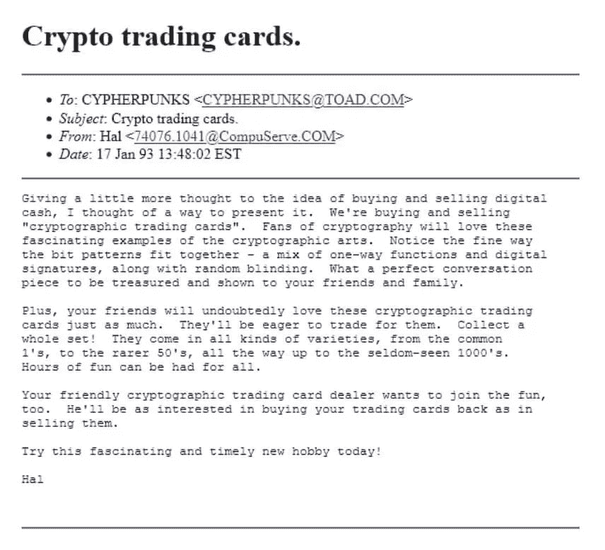

# 什么是 NFT——更好的是，他们为世界提供了什么？

> 原文：<https://medium.com/coinmonks/what-is-an-nft-better-yet-what-do-they-offer-the-world-6ecac7c7ac21?source=collection_archive---------9----------------------->

你还记得 Napster 吗？

也许不是，但作为一个初露头角的互联网历史学家，你应该听过这个故事。如果你年纪够大还记得，希望你的背仍然比我的好。

Napster 是第一个流行的基于网络的非法音乐发行商，可以免费下载。当然，这侵犯了数字音乐权利。基本上，贾斯汀·汀布莱克在电影《T2》和《社交网络》中扮演的一个家伙在网上放了一堆流行音乐供人们下载。有些人，尤其是那些在婚礼之外穿西装的人，不太喜欢这样。

他们说得有道理。艺术家为了他们的激情，通过汗水和泪水非常努力地工作。他们创作的艺术作品拨动了粉丝的心弦。为什么人们可以免费欣赏这种音乐？

音乐家的工作应该得到报酬。他们当然应该！但与生产商合作进行物流是当时唯一的选择之一。我不是音乐行业的专家，虽然我可以带着节奏跑一两趟，但从那以后它已经走了很长的路。

最近，这一进展部分归功于区块链激励机制，特别是通过非功能性金融交易。

> NFTs 提供的核心是连接。

生产者和消费者直接联系。这有助于最小化信任，同时最大化艺术家和创作者的收入。

# 什么是 NFT？

让我们把这部分去掉，好吗？

什么是 NFT？它们是*令牌*。很好，但这意味着什么，尤其是在这种情况下，这对我们有什么好处？

我发现从检查目的开始理解事情是有帮助的。让我们看看我们得到了什么。NFT 通过提供一些基本的东西来提供帮助:

1.个人财产的唯一标识符

2.对拥有相关权利选择权的财产的无可争议的所有权主张

3.不可改变的和有时间标记的出生和所有权年表

4.最终转让所有权和相关权利的能力

## 1.个人财产的唯一标识符

NFT 是令牌。

令牌产生于智能合约。它作为标识令牌和声明相关关联的数据存在于链上。

就像公共图书馆的那些旧书单(这里显示我的年龄)。每张纸条都告诉你这本书的唯一 ID、一些相关信息以及在哪里可以找到它。那是 NFT。

您可以将令牌数量和所有者等详细信息写入智能合约。每个令牌都有一个唯一的号码。因此，如果智能合约规定从该合约中产生 10k 个 NFT，则 id 可以是 1–10000，例如。

以太坊有许多不同类型的代币。每个都由各自的以太坊协议标准管理。非功能性测试由 ERC-721 管理。这些类型的令牌最重要的特点是每一个都是完全唯一的。如果你用一张 1 美元的钞票换另一张 1 美元的钞票，它们是完全一样的；它们是“可替代的”。非功能性测试不是这样的。每个都有一个唯一的 ID，这使得它不同于其他 NFT。“可替代性”与替代有关，而非功能性测试是“不可替代的”。

好的，很好，知道了；这就像图书馆的借书单，但是什么是被拥有的呢？“NFT 代表什么，”

## 2.对拥有相关权利选择权的财产的无可争议的所有权主张

让我们看一个例子。

如果您拥有 ape #3574，您的 EOA(外部拥有的地址)/钱包帐户地址将映射到该令牌 ID。EOA 和令牌 ID 之间的关联通过智能合约保存。映射是在类似于对象的数据结构中完成的。

还存储了关于您的 NFT 的元数据。元数据是参考数据。该参考数据包括 NFT 代表的属性。元数据定义了 EOA 拥有的令牌 ID 所拥有和附加的内容。

通常，在图像的情况下，参考数据是到存储在别处的图像文件的链接。M **任何 NFT 都不代表对相关数据**(在这种情况下，是数字图片)的权利。仍然可以以其他方式授予对所表示的图像的权利。我不是律师，也没有看过任何相关的案例法(如果有的话)。

**重点是数据关联的流程**以及数据所在的位置。如果元数据发生变化，令牌 ID 将代表新的元数据链接。可以存储不止一个链接作为 NFT 的关联数据。

一家总部位于瑞士的公司率先在链上创建了一个再生音轨。不是链接到一个文件， [Euler Beats](https://eulerbeats.com/genesis/21575894274) 保存了链上赛道的数字信息。

在这种情况下，NFT 拥有数字信息(轨道)。他们更进一步，设计了一个版税系统。每首歌都有一位大师 NFT，他创造了许多复制品。每当有人买了一张唱片的拷贝，唱片的主人就会收到一笔版税。

真实的、有形的、实际的、富有成效的进步。区块链和 Web3 的事情看起来并没有那么糟糕。叫我乐观主义者吧，但我想专注于好的方面。我喜欢看着世界前进。

这就引出了我们的下一个 NFT 激励计划。

## 3.不可改变的和有时间标记的出生和所有权年表

当智能合约诞生 NFT 时，其起源的数据是链上的(区块链)。

块包含时间戳。包含 NFT 创建事务的块代表了 NFTs 的起源。当 NFT 从一个地址转移到另一个地址时，也会发生同样的事情。该事务被包含在具有相关时间戳的块中。

如果区块链完成了它的工作，这些时间应该是按时间顺序排列的。短期内可能存在一些区块的重组潜力。这与我们的目的无关。

总而言之，我们有一个带有 ID 的令牌。该令牌在链上映射到一些数据。这些数据代表某种形式的具有不可变年表的属性。我现在明白了。

你可以想象其中的重要含义。

例如，您可以构建一个表示有形财产的地契的 NFT。房地产就是一个明显的例子。有项目在搞那个。你也可以细分一个 NFT。相关联的数据分割成多个 NFT。现在，您的令牌 ID 代表了属性的一部分。例如，它适用于分时度假。

NFT 的好处延伸到其他领域，比如合同、遗嘱和保险等等。

**就个人而言，最令人兴奋的应用之一是游戏**。游戏不一定需要 NFTs 或者区块链(虽然有好处)。但是游戏很有趣，而且很受欢迎。

假设你玩一个你觉得有趣的免费游戏。有皮肤作为 NFT 出售。你买了一张皮，一个表面的附加物。它不应该提供任何有形的优势。这有助于保护游戏的完整性。付费赢不是一个可持续的模式。

我记得在一家大型游戏公司从事游戏平衡和设计工作时，与高管们的通话。对我们中的一些人来说，结论是显而易见的。从长远来看，这种模式是不可持续的。不管怎样，玩家买皮肤的时候大家都是赢家。游戏创作者在那天可以吃饭，玩家可以展示他们崭新闪亮的装备。

> 当一个更复杂的系统的一部分时，支付赢可以存在于一个中等水平。

例如，你拥有一张 NFT 的皮肤，可以生产和销售 500 张。就像之前强调的数字音轨例子一样。皮肤复制品的购买者支付较低的价格来看起来和你一样好。你赚回了购买 NFT 大师的部分费用。例如，这些收入可以作为游戏中的积分。让我们继续这个思路。如果他们在游戏中使用你的 NFT 皮肤副本的成功提高了你的角色的属性呢？他们在游戏中的失败会损害你角色的属性？在这种情况下，出售皮肤的决定增加了复杂性和混乱性。

新的游戏决策就是从上面诞生的。你制作并出售拷贝吗？如果是，卖给谁？你如何筛选潜在的购买者？你一定要创建一个社区，一个行会吗？对手公会可以通过购买他们的皮肤来渗透竞争吗？像这样一个模型的含义是广泛而令人兴奋的。

在决策中加入能产生真实结果的加权因素，会让游戏变得更加有趣和刺激。当后果扩展到游戏之外的经济领域时，更是如此。这种增加乐趣的复杂程度是游戏平衡和设计的梦想。特别是当添加功能之间的相互作用激励社区建设时，NFT 有助于实现这一点。

人们这么早就看到了 NFT 世界的现状，并失去了兴趣。可以理解。这个社区充斥着自动生成的图像和骗局。这种情况正在改变。游戏内外有许多令人兴奋的发展。我将在以后的文章中介绍其中的一些。

大多数人一开始会把新想法推到一边。我第一次听说比特币是在 2009 年，我至今没有一只宠物恐龙。我们的思想并不像我们通常认为的那样开放。我们学习，然后寻找和吸收尽可能多的有用信息，以确保我们的世界镜头是清晰的。外面可能会有很多雾，即使是无意的。

> 就像需要定期清除雾气的护目镜一样，当你窥视未来的深处时，不断寻找能提高清晰度的细节。

## 4.最终转让所有权和相关权利的能力

你知道夏羽·布赖特韦泽的故事吗？他是世界上最伟大的“右击拯救者”之一。

抱歉，我是说真正的盗窃实物艺术品。1995 年至 2001 年间，夏羽从 172 家博物馆偷走了 239 件艺术品和其他收藏品。他是在作为一名服务员周游欧洲时完成这一任务的。你认为你有动力。

这个例子突出了物理的、可移动的部分。任何人都可以在电脑上“右键点击保存”一张照片，现在就可以“拥有”这张数字作品了。这一事实增强了 NFT 给所有权带来的价值。当夏羽偷了值钱的东西时，很容易就能确定真正的主人。事实上，在只有一件原创作品的情况下，人们往往会注意到它不见了。

有了用数据表示的数字片段，任何人都可以复制这些数据并拥有作品。然而，只有一个地址拥有作品的数字版权，假设 NFT 与它相关联。任何人都可以声称对该作品拥有所有权，但只有能够用相关地址签署交易的人才是合法所有者。

这确实为一些复杂情况打开了大门。如果有人能以某种方式接管一个账户，他们现在就拥有了 NFT 的物理所有权。他们可以把 NFT 转移到另一个地址。撤销交易是不可能的。盗窃需要以某种方式攻击签名实体。

> 通过网络钓鱼或黑客窃取 NFT 的骗局并不少见。盗窃的成功更多地说明了 UX 和太空参与者的教育**。**

该行业正采取措施，为新进入者创造一个更好的 UX。*社会回收钱包*就是一个例子。这种类型的钱包允许钱包的多重签名保护。钱包主人声明“监护人”。如果钱包受损，监护人可以签署交易取回钱包。这也允许延时事务。如果监护人介入，在设定的时间内撤销交易，交易就会撤销。

# 最后

看看时间；我已经在这里闲扯了一会儿了。

非专利技术有可能在保护产权的同时增强创造者和消费者的能力。目前的景观大多是愚蠢的，空的图片不是游戏的结束。这仅仅是开始。

[哈尔·芬尼](https://en.wikipedia.org/wiki/Hal_Finney_%28computer_scientist%29)是一位杰出的计算机科学家和数学家。他是第一笔比特币交易的收款人。有人认为他可能是 Satoshi。我们选择不在乎任何一种方式，以尊重产品的完整性。

这是 Hal Finney 在 1993 年对数字加密表示(如 NFTs)的看法。以太坊之前，比特币之前，网络泡沫之前。

email about Crypto trading cards sent by Hal Finney

这差不多是 30 年前的事了。那么接下来的 30 年呢？你看到了什么？

我希望这篇文章对你有所帮助。我每天花 16 个小时走遍 Crypto / Web3 世界的各个角落。亲爱的读者，在把发现带给你之前。我的目标是在未来几年和更长的时间里建立一个领先的见解出版物。

确保跟随，并表示你的支持。

**1。** [**在 Twitter 上关注我**](https://twitter.com/TheCryptoClimax)

**2。跟我来这里上媒**

****3。** [**订阅我的免费简讯，独家免费内容。**](https://www.getrevue.co/profile/thecryptoclimax?element=subscribe-through-revue)**

**问题，评论？和我一起参与评论，让我们继续前进。**

**朋友们，下一集见。**

> **交易新手？尝试[加密交易机器人](/coinmonks/crypto-trading-bot-c2ffce8acb2a)或[复制交易](/coinmonks/top-10-crypto-copy-trading-platforms-for-beginners-d0c37c7d698c)**