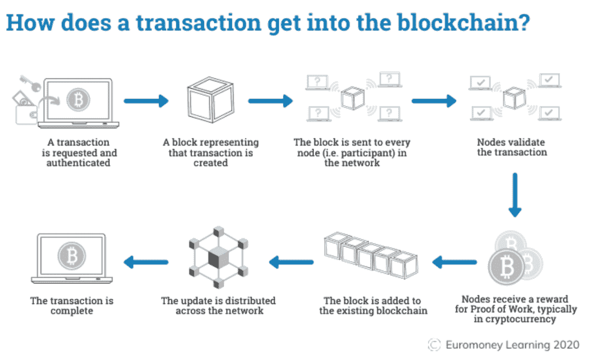

# 什么是 NFT？

> 原文：<https://medium.com/coinmonks/what-is-an-nft-da13fa0ba1ce?source=collection_archive---------40----------------------->

我昨天收到了一些来自我的第一个帖子的回复(我的妈妈，哈哈),问题是 NFT 实际上是什么，它们代表什么，所以我决定写一篇简化的文章，介绍它们是什么，为什么它们在我们生活的数字世界中如此重要。

这是写给所有想更多了解 NFTs 和区块链的父母和人们的。

让我们开始吧！

首先，如果我们想了解 NFTs 是如何工作的，我们必须先了解一下区块链是如何工作的。

区块链是一个数据库，用于按时间顺序存储各种数字信息。这些碎片被称为块。

区块链也是分散的，这意味着他们的控制权分散在几个不同的机构、办公室或实体，而不是一个。

区块链的分散性使得买卖双方可以直接交易，而不需要通过中间人或其他权威机构。

因此，区块链技术是一个去中心化的分布式账本，存储数字资产的所有权记录。存储在区块链上的任何数据都无法修改，这使得该技术成为支付、网络安全和医疗保健等行业的合法颠覆者。

为什么区块链很重要？

“区块链是一项特别有前途的革命性技术，因为它有助于降低安全风险，杜绝欺诈，并以可扩展的方式带来透明度。”

“区块链技术因其与加密货币和 NFTs 的关联而广受欢迎，并已发展成为各种全球行业的管理解决方案。今天，你可以发现区块链技术为食品供应链提供了透明度，保护了医疗保健数据，创新了游戏，并全面改变了我们大规模处理数据和所有权的方式。”

下面是一段 6 分钟的视频，演示了区块链的工作原理:

让我们简单回顾一下:

*   区块链是一个数字分类账或数据库，其中存储了加密的数字资产数据块并将其链接在一起，形成了数据的时间顺序单一来源。
*   数字资产是分发的，而不是复制或转移的。
*   数字资产是分散的，允许多方之间的实时访问、透明和治理。
*   区块链分类账是透明的——所做的任何更改都会被记录下来，从而保持完整性和信任。
*   区块链分类账是公开的，并采用固有的安全措施构建，这使其成为几乎每个行业的主要技术。

现在，当你有点困惑，并且知道一些关于区块链的事情，它是如何工作的，为什么它是重要的，让我们再让你困惑一点！

**NFT**

NFT 是不可替换令牌的首字母缩写。NFTs 可以是一种形式的音乐文件、合同、音乐会门票、病人的医疗记录、艺术品，甚至这篇文章也可以是 NFT。由区块链担保的所有权证明，任何人都可以从公共账本中验证所有权。

NFT 是唯一的基于区块链的令牌，可以存储任何类型的数字数据。每个 NFT 有能力验证真实性，过去的历史和唯一的所有权。

每个 NFT 都是不可替代的，这意味着什么呢？

不可替代指的是独一无二的东西，不能被同类的其他东西所取代，例如，蒙娜丽莎的画是不可替代的，因为它是一件独特的艺术品，世界上没有其他的。

与可替代的代币或货币不同，非交易货币不可交易。例如，一美元与另一美元价值相同，或者一欧元与另一欧元价值相同。

为什么非功能性测试很重要？

非功能性数字技术非常重要，因为我们生活在一个数字世界中，我们必须拥有能够保护我们的隐私、数字所有权甚至数字身份的技术！

这是一篇非常好的文章的快照，它以数字身份和所有权的形式深入探讨了 NFTs 的重要性。

**Covid 世界中的数字身份**

“社交媒体一直是我们生活中很重要的一部分。我甚至无法想象我们这一代人(和 Zoomers)花了多少集体时间来考虑在我们的 Instagrams 上放哪些照片，在我们的 Twitter 个人资料上放哪些词，或者在我们的铰链个人资料上回答哪些问题。

每一个平台都有我们自己的细微变化。海滩照片在 LinkedIn 上是不允许的，但在 Insta 上是受欢迎的。你不能在 Insta 上发布你喝酒的故事，但是在 Snapchat 上就可以了。在 Linkedin 上穿西装打领带没问题，但在 Hinge 上就失礼了。

每个平台都展示了我们的一面。我们将整个人格的不同部分打包成与环境相关的互动——无论是约会、社交、炫耀等等。Covid 只是加剧了我们对数字平台的依赖——从增强我们的 IRL 身份到完全替代我们的社交生活甚至工作生活。

我们关心我们在网上的形象，因为在 Covid 期间，这已经成为我们与家庭以外的世界互动的唯一方式。

换句话说，我们的数字身份就是我们的身份——至少在外表上是这样。这就是为什么我们有变焦过滤器。这就是为什么有几十个应用程序会在你发布新照片之前预览你的 Instagram 个人资料。影响者确保他们的订阅源在与世界分享之前看起来绝对完美。这就是为什么人们在堡垒之夜的人物皮肤上花费数十亿美元。这就是为什么人们花费数百个小时为 Clubhouse、Twitter 和 Substack(有罪)创建内容——希望为自己建立一个品牌，并希望向世界其他地方展示他们是谁的某种形象。"

下一部分是 NFTs 将如何彻底改变我们处理数字身份的方式。

**NFT 是数字身份的下一次进化**

“如果我告诉你，你花在精心构建数字图像上的所有时间都可能在一眨眼的时间里消失——完全是因为少数人的突发奇想，你会怎么想？你可能会再三考虑在这个平台上投入时间。但这种情况发生的几率有多大，对吗？这每天都在发生——成千上万的账户打破了抖音和推特等平台建立的社区准则。

这并不是说公司没有权利——他们最终拥有在他们的平台上发布什么和不发布什么的最终发言权。当我们加入该平台时，我们同意 T&C 的这些条件。但是，所有的照片、视频、文章和关注者都随着它一起消失了——你投入的所有时间也随着它们一起消失了，这确实是一个该死的耻辱。这就像创作者为这些公司创造了所有这些价值(从用户采用和广告收入的角度来看)，而他们充其量只能获得微薄的血汗和眼泪。

好吧——但是如果我们可以准确地保留为每个平台制作的所有内容，会怎么样呢？如果我们可以将我们的内容从一个平台转移到另一个平台，根据平台的上下文来管理每一个提要，会怎么样？这些平台看起来不太像围墙花园，而更像是将内容包装在令人愉快的用户体验中的开放平台——可能会在核心体验之上提供服务，以此作为一种赚钱的方式。然后，这些平台将不得不为最佳体验和最佳服务而竞争，就像银行如何区分其服务、产品和客户体验来争夺我们的资金一样。

为了实现这一点，我们需要对我们的数字内容拥有真正的所有权，从而拥有我们的数字身份。

我们需要非功能性测试。我们 instas 的 NFT，我们 tweets 的 NFT，堡垒之夜皮肤的 NFT。最终，随着我们的世界变得更加数字化，首先是在人与人的互动方面，我们也需要拥有自己的数字空间。我们的数字土地，我们的数字家庭，我们的数字家具。因为就像我的 IRL 身份一样，我想真正拥有我的数字身份，而不是像脸书那样出租给房东。我们的头像实际上就是我们在数字世界中的面孔。NFT 基金 Metapurse 的创始人、价值 6900 万美元的 Beeple 作品的买家梅塔科万(MetaKovan)将虚拟化身比作我们的“宇航服”。他们是我们想成为的人，也是我们想被人看到的人。所以投资一个虚拟形象，并实际拥有它，难道不是有意义的吗？

此外，就像拥有实物一样，我希望能够出售或货币化我的数字财产。我希望能够转售我从堡垒之夜或使命召唤购买的物品。这样做，我能够从我的购买中产生资产价值——而不仅仅是重写为没有内在货币价值的购买。拥抱的是一个由用户创造的数字商品的双边经济。以剑换皮。汽车家具。或者只是卖些好东西。数字所有权的民主化——在这个曾经是一面倒的市场中，游戏创作者带着财富走了。"

我会把这篇文章和我用过的其他资料放在文章的最后。因此，如果你想获得更多的理解和知识，你可以深入了解 NFTs 和区块链本身。

让我们简单回顾一下 NFTs:

*   NFT 代表不可替代的令牌，这意味着它既不能被替代，也不能互换，因为它具有独特的属性。
*   数字资产——NFT 是一种数字资产，代表艺术、音乐和游戏等互联网收藏品，拥有由区块链科技公司创建的真实证书。
*   独一无二——不能伪造或以其他方式操纵。
*   NFT 是存储有价值信息的单个令牌。
*   NFTs 的独特数据使得验证其所有权和所有者之间的令牌转移变得容易。

作家遗言:

首先感谢你能走到这一步。

我希望你从这篇文章中有所收获！我承认这真的很难解释 NFTs，cryptos 和整个行业。就像给没听过的人解释互联网是怎么运作的，哈哈。

我可以连续几周解释区块链等等。你可以阅读多年的文章、新闻，看 youtube 视频，听播客，也许仍然不能得到一切，这很好！

对我来说，我认为这适用于每个人，当你独自尝试空间时，你会有“啊哈”的时刻。

我们现在还很早，我认为四到六年后一切都会变得有意义。

我在这篇文章中使用的所有资料来源:

[https://www . simpli learn . com/tutorials/区块链-tutorial/what-is-nft](https://www.simplilearn.com/tutorials/blockchain-tutorial/what-is-nft)

[https://hacker noon . com/nfts-for-dummies-a-complete-guide-to-the-world-large-trend-in-art-business](https://hackernoon.com/nfts-for-dummies-a-complete-guide-to-the-worlds-biggest-trend-in-art-business)

【https://builtin.com/blockchain 

[https://rockcontent.com/blog/nft-for-dummies/](https://rockcontent.com/blog/nft-for-dummies/)

[https://pipeandpiper . co . uk/2021/08/16/what-is-cryptocurrency/](https://pipeandpiper.co.uk/2021/08/16/what-is-cryptocurrency/)

 [## NFTs 开启了一种新形式的数字身份

### 我们越来越依赖社交媒体及其与非功能性测试的关系

medium.com](/geekculture/nfts-unlock-a-new-form-of-digital-identity-7145aa7b48c9) 

> 交易新手？试试[密码交易机器人](/coinmonks/crypto-trading-bot-c2ffce8acb2a)或者[复制交易](/coinmonks/top-10-crypto-copy-trading-platforms-for-beginners-d0c37c7d698c)