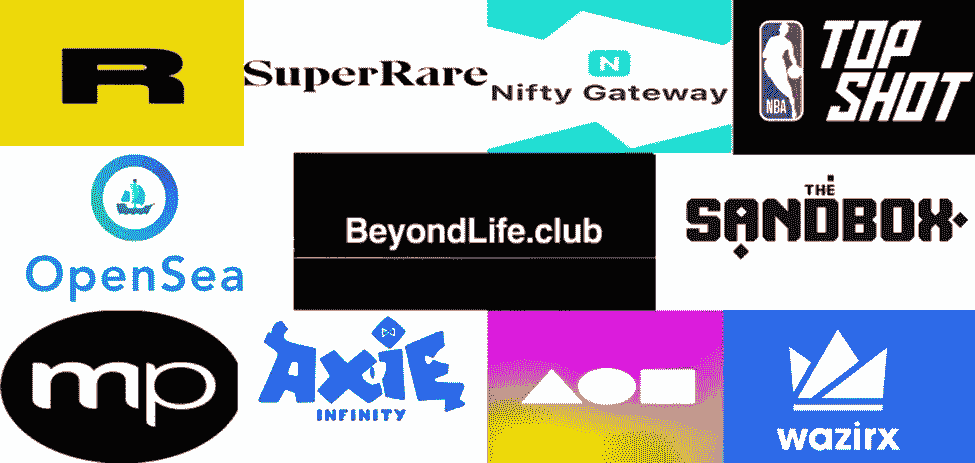

# 什么是 NFT？解释

> 原文：<https://medium.com/coinmonks/what-is-an-nft-explained-c30094ccfa64?source=collection_archive---------34----------------------->

这张电子人猿图片以 150 万美元的价格出售。你能想象有人会买我刚从谷歌上下载的这张照片吗？**是的**，有些人不仅会买，还会以更高的价格出售。

这张图片是由**宇迦实验室创作的数字艺术。宇迦实验室**是一家区块链公司，已经创作了 10，000 件无聊的猿艺术作品，并作为非艺术作品出售。所以，问题是什么是 NFT？

# NFT(不可替换的令牌)

**不可替代令牌**是什么意思？NFT 是一种基于**区块链技术**的加密资产。由于 NFT 的独特属性，它不能被交换或替换。你可以把一美元换成一美元，因为两美元的价值相同，但在非功能性货币交易中，两个非功能性货币交易不可能相同。

NFT 正变得臭名昭著，因为它是买卖数字艺术的一种很好的方式。由于每个 NFT 都是独一无二的，数字艺术工作者发现很容易展示自己的艺术，而没有艺术品被盗的威胁。

**“本质上，NFT 创造了数字稀缺性，”**Arry Yu 说，他是华盛顿技术产业协会卡斯卡迪亚区块链委员会主席，也是黄伞风险投资公司的董事总经理。

# 什么可能是 NFT？

任何可以数字化的东西都可以作为 NFT 出售。例如:

音乐

逻各斯圣语

游戏中的物品

数字海报

独特的数字艺术作品收藏

所以，如果你能提供任何独一无二的数字化的东西，它可能就是 NFT。

最近，Twitter 创始人杰克·多西以 4800 万美元的价格出售了他作为 NFT 的第一条推文。

# 它是如何工作的(NFT 那件事)？

NFT 是由用于加密货币的相同数据编程创建的。但与 NFT 不同，加密货币是不可分的。

> 交易新手？尝试[加密交易机器人](/coinmonks/crypto-trading-bot-c2ffce8acb2a)或[复制交易](/coinmonks/top-10-crypto-copy-trading-platforms-for-beginners-d0c37c7d698c)

从高层次来看，NFT 是**以太坊区块链**的一部分，NFT 的所有权可以被**以太坊区块链**追踪。所以，如果你买了一个 NFT，你唯一的 id 和地址将分配给令牌(NFT)，你可以在区块链网站上查看你的 NFT 所有权。

一个 NFT 一次只能有一个所有者。任何购买或出售 NFT 的人都可以通过他/她的 id 被追踪，这个 id 会显示在网站上，就像这样…

# 以太坊

例如，在我写这篇文章的时候**一个以太币是 1060.70 美元**。

# 什么是区块链？

区块链技术用于保存安全的交易记录。它是为了存储比特币等加密货币的交易历史而开发的。它的工作原理是收集信息并在不同的网络上传播，以防止信息被黑客窃取。

顾名思义，它收集信息以形成块，当块被填充时，将它与先前填充的块链接，形成块链。

# NFTS 的市场

你可能有问题。“在哪里销售和购买 NFT”实际上有很多网站，但最受欢迎的是:

[Opensea](https://opensea.io/)

[稀有](https://rarible.com/)

[基金会](https://foundation.app/)

[俏皮网关](https://niftygateway.com/)

你可以在这些网站上买卖 NFTS。

# NFTs 的兴起

NFT 并不新鲜——它们自 2014 年以来就一直存在——但是，就像一个长期制作视频的 YouTuber，然后他的一个视频变得流行，其订户数量飙升，NFT 在 2021 年疫情期间变得流行，当时其他所有公司都在数字化自己。2021 年前 6 个月的销售额超过 25 亿美元。

# NFT 的未来

关于 NFT 的未来有很多争论。有人说它将彻底改变整个艺术界，然而，其他人认为它将逐渐消失。

最近，比尔盖茨说， **NFTs 和 crypto 是 100%基于大傻瓜理论**。

在一次关于他的最新电影《黑客帝国》的采访中，山谬·里维被问及 NFTs，他只是嘲笑这个想法。

另一方面，一些名人支持 NFTs。

据《傲慢与偏见》报道，贾斯汀比伯花了 130 万美元成为无聊猿游艇俱乐部的会员。他从他们的收藏品中买了一件无聊的猿猴艺术品。

对我来说，NFTs 可以成为数字艺术家的中心市场。由于它在过去几个月里越来越受欢迎，我认为它将成为收藏品和艺术品的未来。

# 结论

这篇文章中的家伙们**什么是 NFT？解释过**你应该能知道*NFT 的事情*。这是我第一篇关于 NFTs 的文章，我将写更多关于*数字世界和技术*的内容。所以，如果你喜欢我的文章，请关注我，如果你有任何问题，欢迎在评论区提问。

谢谢你。