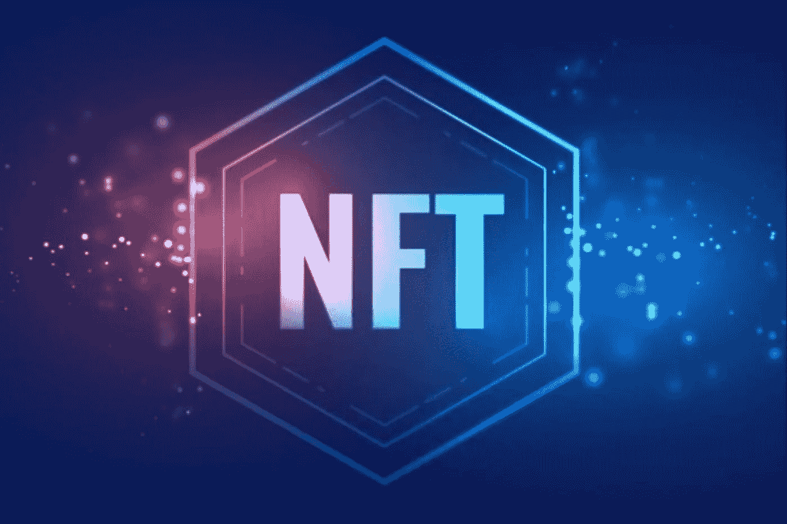
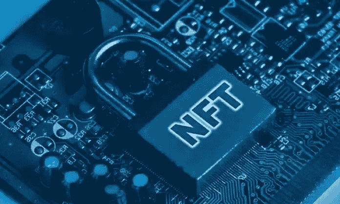

# 什么是 NFT(不可替换的令牌)

> 原文：<https://medium.com/coinmonks/what-is-an-nft-non-fungible-token-8675d4f5f5d2?source=collection_archive---------45----------------------->

## 想象一下，你有一件最喜欢的艺术品、一件名人签名的运动衫，或者一段篮球或足球比赛的视频，都是独特的数字形式。岂不是很牛逼？现在，由于 NFT(不可替代的代币)，这个机会已经存在。

如果您对 NFT 感兴趣，并且想了解更多关于它们是什么以及它们的用例，那么您来对地方了。在本文中，36crypto 将深入探讨什么是 NFT 以及它们是如何工作的。

# 什么是 NFT(不可替代令牌)？

NFT 是一种不可互换的加密资产，它存在于一个[区块链](https://36crypto.com/blockchain/)上，具有唯一的元数据，显示真实世界项目的所有权，如艺术品和房地产、个人身份和财产权。

NFT 是具有唯一识别码的数字资产，可以很容易地被跟踪以验证特定数字资产的真实性和安全性。

与加密货币不同，它们不能被复制、交易或等价交换。这意味着一个 NFT 不能与另一个具有相同的交易量，这与每个代币具有相同交易量的加密货币不同。

NFT 是使用与加密货币相同的编程方式创建的，即区块链技术。

# NFT 是如何工作的？

要理解 NFT 是如何工作的，你需要知道加密货币的主干——区块链技术的工作方式。虽然区块链网络同时支持 NFT 和加密货币，但根本区别在于它们的可替代性。

[加密货币](https://36crypto.com/cryptocurrency/)是[可替代的](https://www.investopedia.com/terms/f/fungibility.asp)资产，可以在不改变价值的情况下在一个类别内换成另一个。例如，一个比特币可以交易，相当于另一个比特币。NFT 是完全不同的，因为每一个都是独一无二的，有其价值，不能等价交易，而术语“不可替代”。

NFT 是通过一种被称为“铸造”的按使用付费的过程制作的，在这种过程中，它们在区块链网络上生成其文件的表示。这些网络记录了每一笔交易。NFTs 最常用的网络是[以太坊](https://36crypto.com/ethereum/)，其他还有 Solana、tezos、Icp 等。

一旦 NFT 被铸造出来，就可以在被称为市场的交易平台上进行买卖或交易。一些受欢迎的市场有 Opensea、Rarible、Magic Eden 等。

# NFT 的例子

非功能性测试以多种形式存在。它们可以是艺术品、数字收藏品、游戏中的物品、文章、运动鞋、音乐、图像和视频。数字艺术品可以在互联网上广泛复制和分享，但原始的实物作品仍归创作者所有。每当 NFT 被买卖时，版税以佣金的形式支付给创作者。

NFTs 最著名的用例是 2017 年 11 月推出的 cryptokitties。Cryptokitties 是在以太坊的区块链上用独特的身份识别猫的数字表示。每只小猫都是独一无二的，都有价格。他们积累了价值 2000 万美元的交易。

NFT 已被用于私募股权交易和房地产交易，在这些交易中，投资者拥有价值不菲的数字房地产。分散土地是 NFT 房地产公司之一，率先将房地产融入数字土地和资产。

# NFT 是用来做什么的？

NFT 有许多用例，这些用例可以归因于它们在现实世界中的普遍可接受性。对秘密交易感兴趣的投资者和艺术品收藏家经常使用 NFTs。NFTs 的一些其他用途包括:

**数字内容** —如今，NFT 被用于数字内容创作。内容创作者看到他们的利润因 NFTs 而增加。

**游戏道具**——在一个网络游戏中，你可以通过 NFTs 的形式购买武器、装备或特殊角色等物品，并通过在游戏内市场出售这些物品来赚钱。

**投资和抵押品**——NFT 让你用他们做抵押借钱。他们也可以用于投资目的。当 NFT 的价值增加时，它们可以被出售来赚钱。

# 如何购买 NFTs？

在购买 NFT 之前，需要有一个数字钱包来存储您的 NFT 和加密货币。购买 NFT 需要加密货币。使用最多的是以太，因为大多数 NFT 都是在以太坊区块链创建的。

像币安、比特币基地、北海巨妖、贝宝等平台。，可用于购买加密货币。一旦你购买了加密货币，你就可以把它从交易所转移到你的钱包里。

市场是 NFT 交易的地方，在你购买 NFT 之前，需要与你的钱包联系起来。市场的例子有 Rarible、Opensea、Magic Eden 等。

# 结论

对你想投资的 NFT 进行彻底的研究是非常重要的。在 NFT 空间有一个巨大有利的市场，有 [NFT 骗局](https://36crypto.com/common-nft-scams-and-8-ways-to-avoid-them/)可能会夺走你的血汗钱。

NFT 交易是一个新兴市场，投机性很强。一些 NFT 的价值可能会飙升，但不能保证。数字艺术和收藏品的价值与实物艺术和收藏品非常相似:价值是主观的，由独特性和艺术家的声誉以及 NFT 项目的社区等因素决定。

最初发布于 [36crypto](https://36crypto.com/nftnon-fungible-token/)

> 加入 Coinmonks [电报频道](https://t.me/coincodecap)和 [Youtube 频道](https://www.youtube.com/c/coinmonks/videos)了解加密交易和投资

# 另外，阅读

*   【Huobi 的加密交易信号 | [Swapzone 审查](/coinmonks/swapzone-review-crypto-exchange-data-aggregator-e0ad78e55ed7)
*   [最佳加密交易机器人](/coinmonks/crypto-trading-bot-c2ffce8acb2a) | [购买索拉纳](https://coincodecap.com/buy-solana) | [矩阵导出评论](https://coincodecap.com/matrixport-review)
*   [Coldcard 评论](https://coincodecap.com/coldcard-review) | [BOXtradEX 评论](https://coincodecap.com/boxtradex-review)|[uni swap 指南](https://coincodecap.com/uniswap)
*   [比特币基地评论](/coinmonks/coinbase-review-6ef4e0f56064) | [德里比特评论](/coinmonks/deribit-review-options-fees-apis-and-testnet-2ca16c4bbdb2) | [FTX 评论](/coinmonks/ftx-crypto-exchange-review-53664ac1198f)
*   [Coinmetro 评论](https://coincodecap.com/coinmetro-review) | [VirgoCX 评论](https://coincodecap.com/virgocx-review)