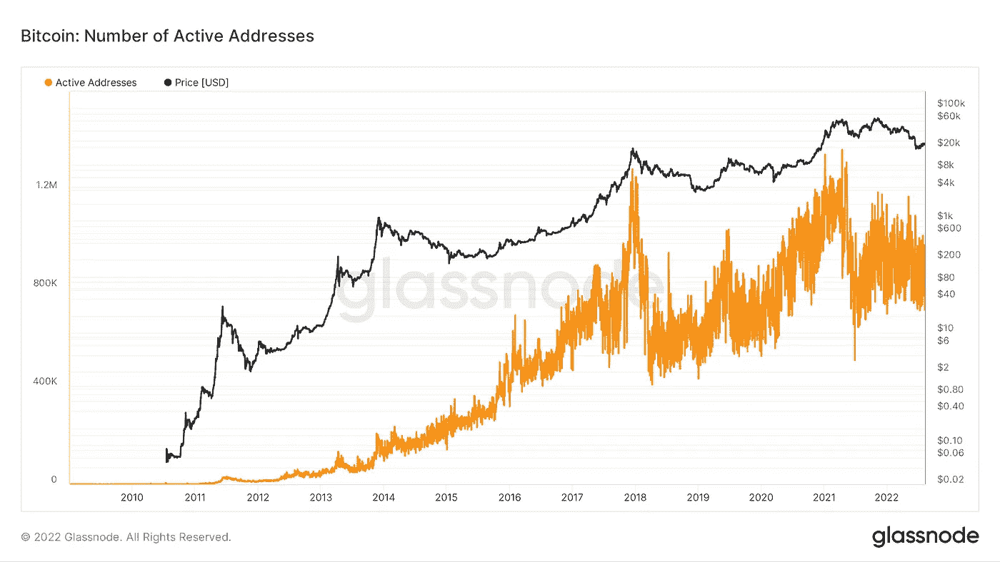
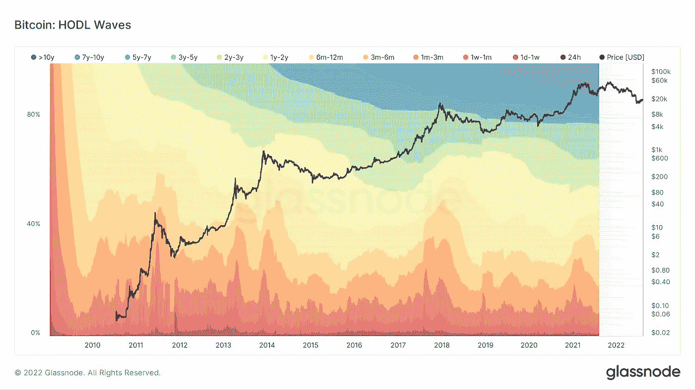
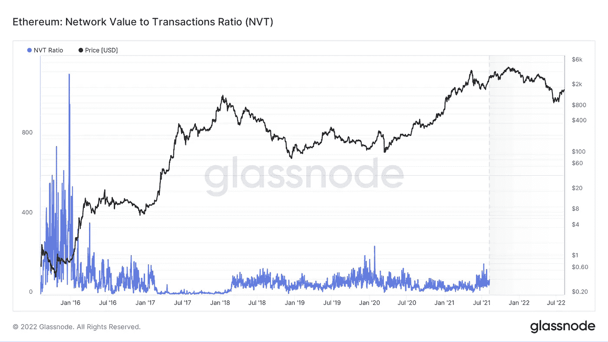
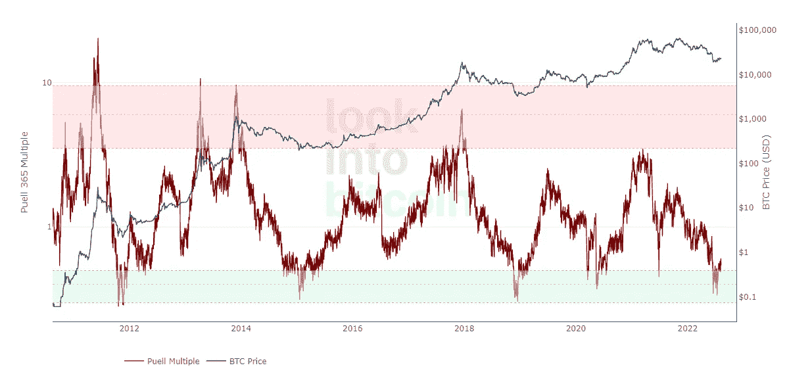

# 什么是链上分析？

> 原文：<https://medium.com/coinmonks/what-is-an-on-chain-analysis-b5e5ea76802c?source=collection_archive---------32----------------------->

***链上分析(On-chain analysis)是一种特定于加密货币的方法，它使用区块链数据来解释投资者行为并预测资产价格的变化。我们能用它做什么？让我们来了解一下！***

链上分析采用了来自加密货币网络的各种指标，如地址的总数和增长率、交易所资产负债表的变化、短期和长期持有人的份额等。

链上分析工具是一组指标，它建立了单个区块链指标的变化与加密资产价格之间的关系。

# 为什么我们需要链上分析？

链上分析是一个相对较新的学科，不同于技术或基本面分析，缺乏悠久的历史和坚实的理论基础，但正在积极发展。

链上分析研究人员使用一组与加密货币地址和持有者、交易和网络费用相关的基本指标。

活跃用户的数量，或在一定时间内至少进行过一次转账的用户数量，是最受欢迎的指标之一。如果加密货币的活跃地址和交易数量增加，可能表明其价格将很快开始上涨。

The number of active addresses in the bitcoin network and its price. Source: [Glassnode](https://glassnode.com)

区块链可能会显示出这一趋势的其他迹象。例如，在所有硬币持有者中，长期投资者(即那些很长时间没有转移资金的人)的比例增加，表明了一种“看涨”情绪。

# 我们在哪里使用链上分析，如何使用？

在链上分析的帮助下，交易者或投资者不仅可以改进自己的交易策略，还可以更好地了解在不久的将来可能发生的市场运动。

所谓的 HODL 波是基本的链上指标之一:加密货币网络中的地址根据其活动分为几个组，并代表时间轴上每个组的份额变化。Hodl 波可以告诉你交易者预期硬币的价格是上涨还是下跌。

HODL-waves of bitcoin and a graph of its value. Source: [Glassnode](https://glassnode.com)

根据专家的说法，仅仅根据链上的度量或指标得出结论是不够的:您还必须了解特定加密资产的上下文。例如，加密货币长期持有者的高比例可能是因为大型投资者的归属条件，而不是投资者的预期。

另一个流行的链上指标是加密货币集中度的份额，它显示了最大地址的硬币总成交量的百分比。用这种方法可以确定“鲸鱼”的优势。

许多分析师监控特定加密货币的大持有人的活动，根据上下文，他们的行为可以作为支持特定市场预测的额外论据。特别是大宗交易，由鲸鱼警报频道跟踪并发布在推特上。

# 链上指标有哪些类型？

**NVT 比率**
以美元表示的市值与交易量的比率。高 NVT 比值表明硬币已经“超买”

NVT Ratio chart for Ethereum. Source: [Glassnode](https://studio.glassnode.com/metrics?a=ETH&m=indicators.Nvt)

**MVRV 比率**
当前资本化与已实现资本化的比率。指明资产价格是低于还是高于“公平”水平。

**活跃地址数量** 它描述了加密货币的需求和使用情况。

**比特币涌入交易所**
这表明了大型投资者的意图。股票交易所资产负债表的积极动态表明了“熊市”的主导地位，即消极的看涨情绪。

**Puell 倍数**
它是每天开采的比特币数量(以美元计)与 365 天移动平均值的比率。它用于确定买卖第一种加密货币的最佳时机。

The Puell Multipler. The green zone indicates periods favorable for buying bitcoin, the red zone indicates for selling it. Source: [LookIntoBitcoin](http://www.lookintobitcoin.com/charts/puell-multiple/)

# 链上分析如何帮助打击金融犯罪？

除了交易和投资，链上分析还用于遵守反洗钱立法(AML)，即检测被盗的加密货币。

接受使用区块链地址支付的公司和应用程序(如加密货币交易所)必须筛选用户交易中是否存在“脏”资产。此类服务由专门的服务提供，如 Chainalysis 或 Crystal。

这些程序会自动检查所有的转账，并且由于区块链数据的开放性，可以发现其中的犯罪行为。客户尽职调查(CDD/EDD)和核查程序(KYC)允许识别罪犯和相关人员。

# 链上分析的服务是什么？

现在有几个流行的平台提供链上分析工具，特别是区块链数据的 API 和可视化:

*   **南森**。重点是对以太坊区块链的分析。发布自己对加密货币市场的研究。
*   **沙丘分析。**一个平台，能够创建定制的仪表盘，可视化各种链上指标。发展一个[社区](https://dune.com/browse/dashboards)，其成员互相分享观察结果。
*   **玻璃节点**。另一项广受欢迎的服务是可以免费查看[标准海图](https://studio.glassnode.com/)。

> *如果你对链上分析有任何补充，欢迎评论！
> 在跟踪更新方面，订阅我们的* [*中型供稿。*](https://medium.com/sunflowercorporation)
> 
> *敬请期待！*

> 交易新手？尝试[加密交易机器人](/coinmonks/crypto-trading-bot-c2ffce8acb2a)或[复制交易](/coinmonks/top-10-crypto-copy-trading-platforms-for-beginners-d0c37c7d698c)