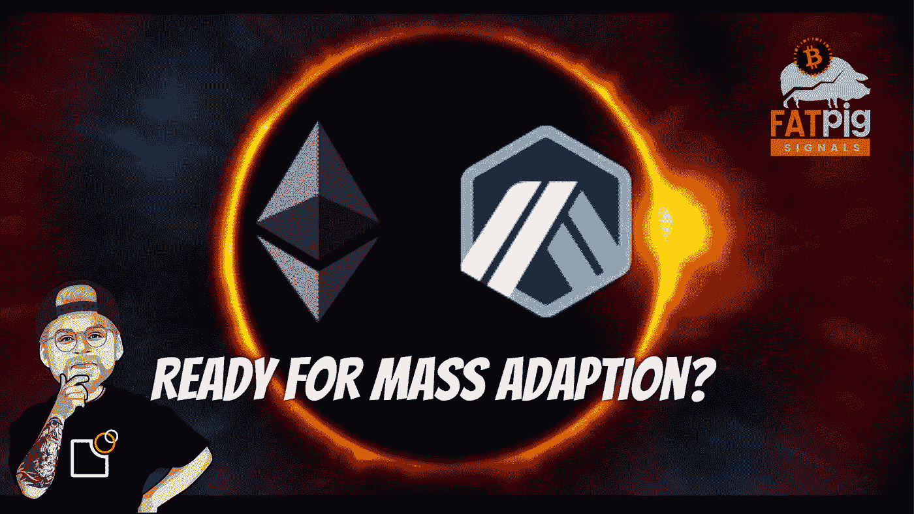

# 什么是 Arbitrum？——以太坊的游戏规则改变者？

> 原文：<https://medium.com/coinmonks/what-is-arbitrum-a-gamechanger-for-ethereum-31ae88e23e8?source=collection_archive---------9----------------------->

像 Solana 或 Cosmos 这样的以太坊“杀手”正在吸引越来越多的 DeFi 用户。可以理解吧？或者你想为以太坊上的交易支付超过夸张的 100 美元？我不这么认为。

但是还是有希望的:

第 2 层解决方案 Arbitrum 大大降低了交易成本，并以光速或接近光速的速度处理您的转账。所以用…