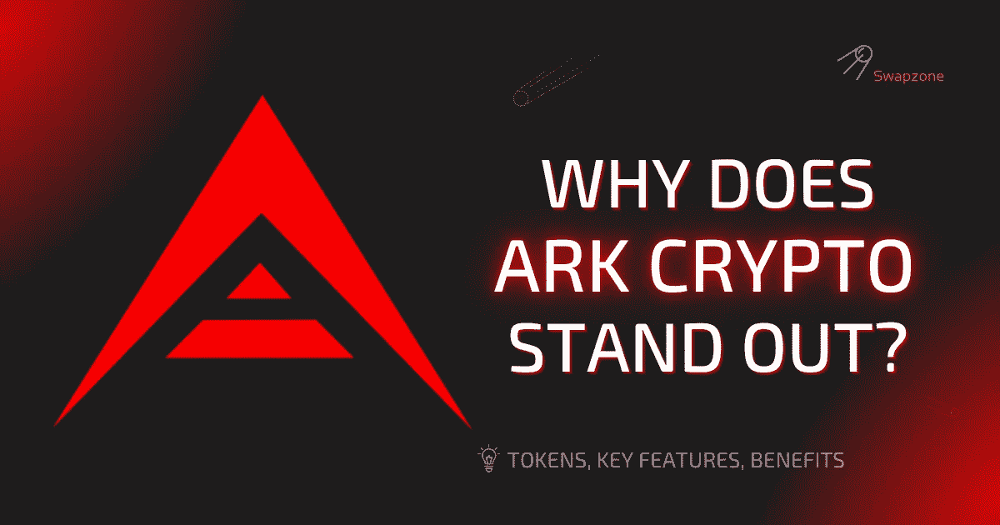

# 方舟想解决什么？方舟加密概述

> 原文：<https://medium.com/coinmonks/what-is-ark-trying-to-solve-ark-crypto-overview-1bec5886f2?source=collection_archive---------22----------------------->

ARK 是一个区块链平台，允许用户从零开始创建独立的可互操作的区块链，而无需事先了解区块链技术。有了 ARK 平台，任何人都可以使用自己熟悉的编程语言开发出完全独特的区块链。该平台集成了十多种编程语言，以简化区块链开发过程。

成立于 2016 年，就在 2017 年 ICO 热潮之前，ARK 的 ICO 成功筹集了令人印象深刻的 80 万美元。从那时起，通过使用行业最佳实践，ARK 平台已经发展成为一个稳定的企业。这个企业被称为 SCIC 方舟生态系统。

方舟公共网络(APN)是由方舟加密技术支持的底层区块链。区块链网络的本地加密资产是 ARK。APN 是主网，于 2017 年 3 月 21 日上线。

APN 是方舟公司区块链技术的一个功能应用。ARK 的公共网络使用委托的利害关系证明共识协议，其中网络的节点运营商充当代理。这些代表由网络用户投票选出。

建立在方舟上的独立的区块链也通过授权的利害关系证明达成共识。然而，代表是由独立的区块链网络的用户选择的。

方舟网络使用智能桥连接不同的区块链，并允许他们共享信息。方舟是区块链之间的中介。方舟上的区块链也内置了智能桥梁。

ARK 是一个开源的区块链网络，拥有活跃的用户社区。方舟科技不依赖智能合约。相反，它使用可定制的事务逻辑，并结合了多种编程语言。APN 支持自定义交易，如多签名交易、各种注册交易和多支付交易。

# 方舟硬币是建立在什么基础上的

方舟币是为方舟生态系统提供动力的原生加密货币。它建在区块链方舟上。2017 年 3 月，创造了 1 亿枚方舟币。撰写本文时，方舟硬币的发行量超过 1.3 亿，但其最大供应量是无限的。方舟硬币，像其他密码一样，多年来经历了几次价格波动。然而，它目前高于其最初的发行价 0.10 美元。

方舟区块链号处理交易的平均速度为 8 秒。这是因为它使用授权的利益证明来验证交易，比使用工作证明或常规利益证明的区块链更快。方舟区块链是世界上最快的区块链之一。这种快速的交易时间意味着每天有超过 10，000 个方舟硬币被创造出来。

# 方舟试图解决什么

区块链技术仍处于早期发展阶段，因此许多人对它并不熟悉。ARK 旨在通过消除与区块链技术相关的困难来增加区块链的采用。该平台简化了区块链开发过程，帮助用户创建具有独特功能的区块链。方舟智能桥支持区块链之间的互操作性。

方舟核心是建立在方舟上的所有区块链网络的基础。它促进和验证点对点交易，并作为所有交易的分散分类账。通用事务接口(GTI)是 ARK 框架的一个组件，它支持自定义事务的使用。

# 你是如何采矿或打桩的？

方舟只能由方舟网络的节点运营商开采。如上所述，这些节点操作符充当代理。网络上有 51 个可用的代表位置。每个当选的代表获得 2 方舟运行网络。代理验证交易并形成组成方舟区块链的块。方舟持有者投票选出代表来运行网络。一枚方舟币等于一票。使用方舟硬币投票的持有者可以随时移除方舟。

此外，一个方舟持有者只能用他们的钱包地址为一个代表投票。投票后，得票最高的 51 个节点成为网络的代表。想要成为代表的节点运营商可以通过向硬币持有者游说来获得选票。硬币持有者可以通过使用 ARK 桌面或移动钱包投票，为他们喜欢的代表赋予投票权重。

*代表对支付给他们的赌注奖励有完全的自主权。

# 如何交换方舟

ARK 可以通过加密货币交易所进行买卖或交换。Swapzone 交易柜上的几个一次性密码交换机。例如，要将 BTC 与 ARK 互换或交换，您可以遵循以下概述的步骤:

*   访问 Swapzone.io。
*   选择 [BTC 到方舟](https://swapzone.io/exchange/btc/ark)的交换对。
*   输入要兑换的 BTC 金额。
*   比较汇率，选择最好的。
*   单击“交换”按钮继续。
*   输入钱包地址接收方舟。
*   将 BTC 发送到生成的 BTC 地址。
*   处理将需要一些时间，然后交换将完成。
*   交易完成后，请为 Swapzone 评分并留下评论。

你可以将你的方舟存放在方舟钱包、多资产钱包、硬件钱包、交换钱包和加密借记卡钱包中。方舟硬币可以在任何时候转换回法定货币。

# 流行双人转换柜

[ARK to BTC](https://swapzone.io/exchange/ark/btc)
[ARK to ETH](https://swapzone.io/exchange/ark/eth) ARK to LTC
[ARK to BNB](https://swapzone.io/exchange/ark/bnb)
[ARK to BCH](https://swapzone.io/exchange/ark/bch)
[ARK to USDT](https://swapzone.io/exchange/ark/usdt)
ARK to THETA
T21【ARK to XMR
ARK to TRX
T27【ARK to BSV
t3t

> 交易新手？试试[密码交易机器人](/coinmonks/crypto-trading-bot-c2ffce8acb2a)或者[拷贝交易](/coinmonks/top-10-crypto-copy-trading-platforms-for-beginners-d0c37c7d698c)