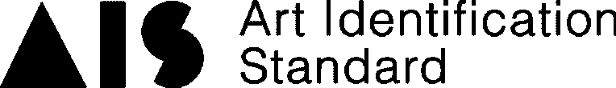
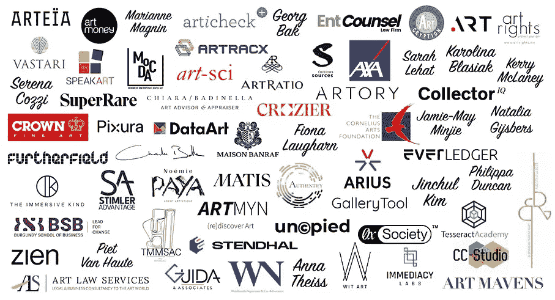
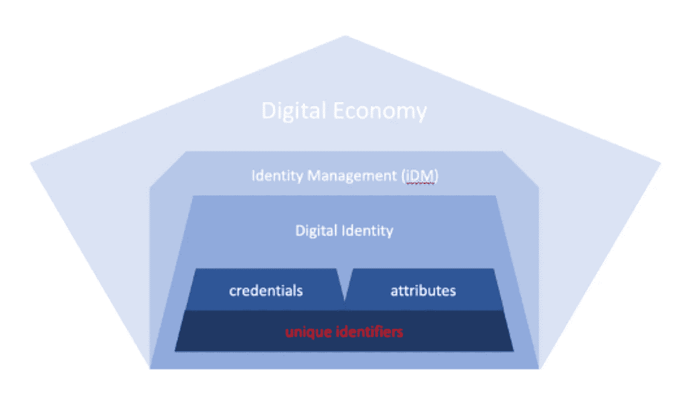

# 什么是艺术鉴定标准协会——为艺术做的

> 原文：<https://medium.com/coinmonks/what-is-art-id-standard-consortium-did-for-art-5b2cf4c55cff?source=collection_archive---------29----------------------->

# 艺术家和美术馆的数字化转型之旅。

由 Daniel Chun
创始人&CEO—ART racx
ART ID 标准联盟成员([链接](https://artidstandard.org)

**什么是艺术 ID 标准？**

Art ID 标准(AIS)联盟的概念是采用分散 ID (DID)。艺术行业缺乏数字化转型曲线，许多定制艺术目录管理系统都是在专有环境下构建的。数据库结构、模式、标签定义通常是在筒仓中开发的，以支持它们自己的操作和客户的需求。几乎没有数据标准化本身，也没有支持这些数据库元数据在扩展的艺术行业中“重用”的数据标准化——从出处、展览历史、交易、估价到保险。

> 交易新手？尝试[加密交易机器人](/coinmonks/crypto-trading-bot-c2ffce8acb2a)或[复制交易](/coinmonks/top-10-crypto-copy-trading-platforms-for-beginners-d0c37c7d698c)

那么，简而言之，什么是艺术品鉴定标准呢(来自 [AIS 网站](https://www.artidstandard.org/standard)

*   为创建和共享唯一标识符制定协议的治理框架
*   分布在区块链上的一种标识符，因此称为 D+ID (DID)
*   带有查找功能的轻量级注册表(DID 创建者、对象)
*   一个开放的(所有人都可以访问的)DID，是其他标识符的父级
*   推荐的可验证凭证(VC)协议，如身份验证和出处
*   参考设计有助于实施

目前，AIS 在世界各地拥有超过 100 名会员，包括艺术顾问、美术馆、经销商、学者、律师、科技公司和保险公司

Credit: AIS Website updated on May 31

AIS 现在正式成立，是一个设在摩洛哥的非政府组织。该组织现在在治理、技术、NFT、资金方面设有委员会，目前的委员会成员是由上述公司组成的协作/特设小组。AIS 董事长玛丽安马格宁(Marianne Magnin)表示:“艺术品市场的参与者在获取信息方面具有高度的选择性，因为内幕消息会赢得尊重、影响力和报酬。”每周都有新成员加入和申请，在 AIS，这是真正的国际协作——“去中心化”的“分销商”

请参考主席 Marianne Magnin 自己撰写的这篇博客文章，内容是关于分配唯一数字标识符的愿景早在 2020 年就已开始。[https://www . artid standard . org/post/assigning-unique-digital-identifiers-to-arts works](https://www.artidstandard.org/post/assigning-unique-digital-identifiers-to-artworks)

Source: AIS Website

Marianne Magnin 的另一篇关于艺术品鉴定艺术的好文章也可以在这里找到——[https://www . artid standard . org/post/the-art-of-identifying-arts-works](https://www.artidstandard.org/post/the-art-of-identifying-artworks)

目前，ARTRACX 是 AIS 的成员，并积极参与治理和技术委员会。

链接:

【https://OpenHeart.hk】https://artracx . io
T5

要看我其他关于数字经济和区块链应用的媒体文章，可以去这个链接
[https://medium.com/@articulatehk](/@articulatehk)