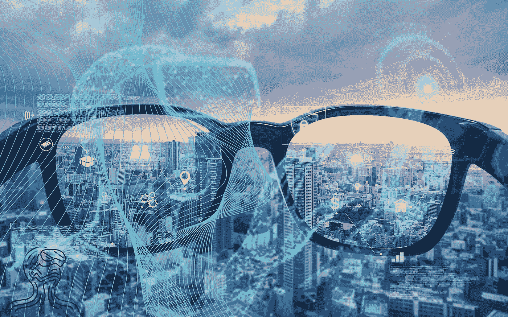

# 什么是增强现实，为什么它在元宇宙很重要？

> 原文：<https://medium.com/coinmonks/what-is-augmented-reality-and-why-is-it-important-in-the-metaverse-834e0e970a2?source=collection_archive---------42----------------------->

随着增强现实应用越来越受欢迎，便携式智能设备变得越来越强大，预计未来几年它将成为各行业宣传和展示产品的常见基地。AR 已经找到了许多新的方法来增强用户与世界和他们周围环境的互动，而这仅仅是个开始。

增强现实理念背后的核心是使用来自相机的输入数据将数字和现实世界融合在一起的能力，并将其与数字资产相结合，将它们与现实环境相关联，应用于包括娱乐、视觉艺术和教育在内的众多领域。这项技术几乎可以在任何地方使用，将可穿戴资产应用于用户或他周围的人，让用户能够拥有任何种类和物种的虚拟宠物，查看甚至拥有地点、纪念碑和艺术装置。想象一下，你可以把你的智能设备指向任何方向，看到一个完全不同的世界，不受现实规则的限制，仍然非常真实，只是被你和其他创作者的无限幻想所增强。

# Web 3.0 中的 AR

[AR 和区块链技术](https://isotopic.io/)都还相对较新，但已经很明显，两者结合背后的潜力是巨大的。总的来说，人工智能和便携式智能设备技术的进步极大地提高了 AR 的质量和可能性，允许处理更复杂的场景和资产，减少了该技术以前的许多限制。

AR NFTs 已经成为区块链社区的一个受欢迎的方面，允许它们的所有者可视化他们的财产，并将它们放在真实的环境中。用户不仅可以拥有自己的资产，还可以拥有放置这些资产的虚拟位置。一些项目已经出现，允许其用户购买与现实世界位置相关联的地块，并可用于在其上放置几乎任何可以想象的东西，从视频和图像到数字资产、动画等等。它为广告和展示地点和产品打开了无限的机会。想象一下，你可以走过一个建筑景点，却看到一个完工的建筑，或者看到原来的样子或废墟，或者放置你自己的纪念碑给别人看。这只是使用 AR 技术和应用区块链和 Web3 提供的[可能性所能实现的最微小的一瞥。](https://isotopic.io/)

区块链技术的一个重要特征是，它与 AR 的结合更具吸引力，其安全级别远远高于当今任何其他技术。智能合约可以确保交易的安全性，并为 AR NFT 资产的交易和交换提供安全的环境。此外，区块链技术的分散性质和链状结构可以提供保持匿名的用户数据的安全性。除了其他优点之外，去中心化能够解决在 AR 技术中极其重要的设备资源有限的问题，允许使用分散在世界各地的设备之间的资源。

文章由 Jenny Lis 撰写，来自[同位素](https://isotopic.io/)

[**同位素**](https://isotopic.io) **是一个支持区块链的软件分发服务，托管整合了 NFTs 和加密货币的游戏和应用。**

> 交易新手？在[最佳加密交易](/coinmonks/crypto-exchange-dd2f9d6f3769)上尝试[加密交易机器人](/coinmonks/crypto-trading-bot-c2ffce8acb2a)或[复制交易](/coinmonks/top-10-crypto-copy-trading-platforms-for-beginners-d0c37c7d698c)