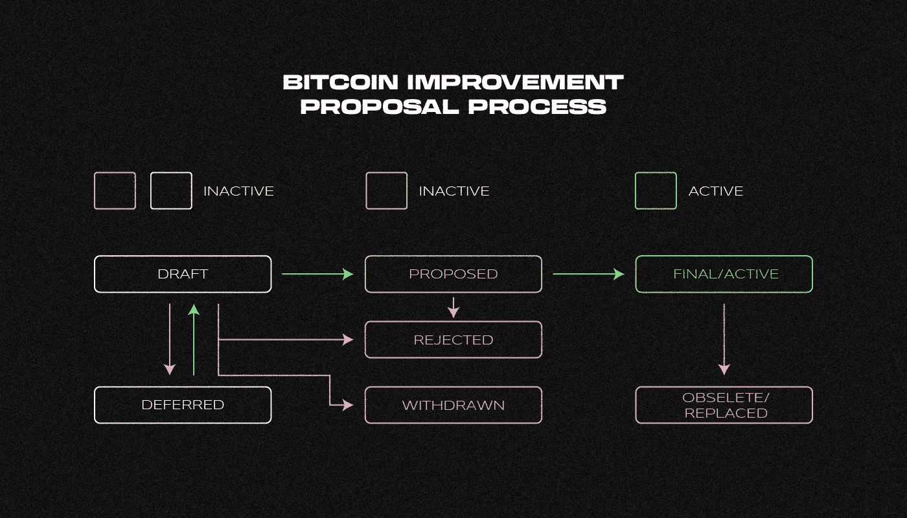

# 什么是 BIP？

> 原文：<https://medium.com/coinmonks/what-is-bip-e0ca6155d2b9?source=collection_archive---------34----------------------->

***比特币改进提案(BIP)是根据官方规则编写的改进比特币代码的提案。到底是什么？它能真正改善比特币代码吗？一起来了解一下吧！***

BIP 框架的目标是标准化对比特币代码进行重大修改的流程。因为报价以文本文件的形式存储在[存储库](https://github.com/bitcoin/bips/blob/master/bip-0001.mediawiki)中，所以所有用户都可以访问它们的内容和历史。

任何用户都可以提出 BIP；但要想在代码中加入第一种加密货币并最终激活，必须得到开发者和矿工的批准。

BIP 通常只包括一个大规模的更新，以简化辩论过程。这些建议不包括微小的变化或错误修复。一些 bip 本质上是程序性的，而另一些是信息性的。

# 我们为什么需要 BIP？

比特币是一种基于数字协议的程序。它通过减少错误、改进算法、简化代码、保持软件兼容性和添加新功能来不断更新。

因为是去中心化的[开源系统](https://github.com/bitcoin/bitcoin)，所以第一种加密货币没有单一的管理机构或组织来开发它。因此，关于更新的决定是由独立开发者社区做出的，bip 用于正式化和开放更新比特币代码的过程。

格式为 BIP 的每个句子都被分配了一个序号。该框架主要用于协议更新和大规模更改。并非每次比特币代码更改都需要此程序，例如用户界面设计的更改或错误修复。

# BIP 比特币的更新是什么时候开始的？

BIP 更新的第一个提议 [BIP1](https://github.com/bitcoin/bips/blob/master/bip-0001.mediawiki) 出现在 **2011** 中，由英裔伊朗程序员 **Amir Taaki** 提出。

他受到了一项开发 PEP 的提议的启发，PEP 用于改进 Python 编程语言。BIP 进程也类似于 RFC，互联网就是通过 RFC 得到改进的。

# **BIP 是如何被求婚和接受的？**

BIP 接受流程分为几个步骤，只有在机构群体达成共识后才会启动。

Life Cycle Diagram of Bitcoin Improvement Proposal (BIP)

BIP 通常从一个群体成员通过各种沟通渠道提出的非正式建议开始。例如， [IRC](https://en.wikipedia.org/wiki/Internet_Relay_Chat) messaging 的应用层协议或者 Slack messenger。然后公开讨论这个概念。任何人，无论资历或名声如何，都可以提出 BIP 的想法。

当提案获得大量社区支持时，作者可以进入下一阶段，即将想法转化为 BIP。提案中必须包括新功能的简要技术规范和理由。

BIP 审计员是一个特殊的编辑，他也负责更新的管理。他们帮助在[将提案正式化，采用 BIP](https://github.com/bitcoin/bips/blob/master/bip-0001.mediawiki#BIP_Formats_and_Templates) 的风格和格式，同时确保提案不会重复现有的想法。

当编辑认为提案完成后，会给草稿分配一个官方编号，如 BIP-0119。为了避免讨论复杂化，BIP 只能关注一个特定的功能。

一旦 BIP 的草案被[发送](https://lists.linuxfoundation.org/mailman/listinfo/bitcoin-dev)到一个特殊的[仓库](https://github.com/bitcoin/bips/blob/master/bip-0001.mediawiki)，这个提议就会被“透明地”处理，任何人都可以监控这个过程的进度和测试结果。社区为每个草案分配了一个状态:已接受、已推迟、已拒绝或已撤回。

# 比特币代码中实现 BIP 需要多长时间？

接受 BIP 是一个漫长的过程，可能需要数年时间。

该提议应该被大约 95%的矿工所接受，并且节点运营商应该使用新的软件版本。

BIP 被接受后，被并入比特币核心代码(主比特币程序)并被激活。所有这些步骤都需要很长时间。这发生在 Taproot 案例中:2020 年 10 月接受要约并加入比特币核心，但直到 2021 年 11 月才被激活。

在大多数情况下，如果在提交提案的三年内没有取得进展，BIP 可能会被拒绝。

# **有多少种 BIP 格式？**

***标准追踪 BIP*** 一项定义软件标准并关注比特币协议变化的提案。

***信息性 BIP***
信息性建议。它包含提交给机构群体的一般性建议草案，不引入新职能，也不要求机构群体达成共识。

***流程 BIP*** 一项旨在改善比特币生态系统相关基本流程的提案。

# **最受欢迎的 BIP 提案是什么？**

[**【BIP-8】**](https://github.com/bitcoin/bips/blob/master/bip-0008.mediawiki)**和**[**【BIP-9】**](https://github.com/bitcoin/bips/blob/master/bip-0009.mediawiki) 两个流程提案代表了如何激活区块链更新软叉的标准结构。****

****BIP-141 (SegWit)
该提案重新组织了数据在块中的存储方式，解决了“事务可塑性”的问题，同时还建立了隔离见证(SegWit)地址的标准格式。****

******直根**
最大的更新之一，同时结合了几个报价: [BIP-340](https://github.com/bitcoin/bips/blob/master/bip-0340.mediawiki) 、 [BIP-341](https://github.com/bitcoin/bips/blob/master/bip-0341.mediawiki) 和 [BIP-342](https://github.com/bitcoin/bips/blob/master/bip-0342.mediawiki) 。这一升级增加了比特币的可扩展性和隐私性。****

> ****如果你对 BIP 有什么要补充的，欢迎评论！
> 在跟踪更新方面，订阅我们的 [Medium feed。](https://medium.com/sunflowercorporation)****
> 
> ****敬请期待！****

> ****交易新手？尝试[加密交易机器人](/coinmonks/crypto-trading-bot-c2ffce8acb2a)或[复制交易](/coinmonks/top-10-crypto-copy-trading-platforms-for-beginners-d0c37c7d698c)****