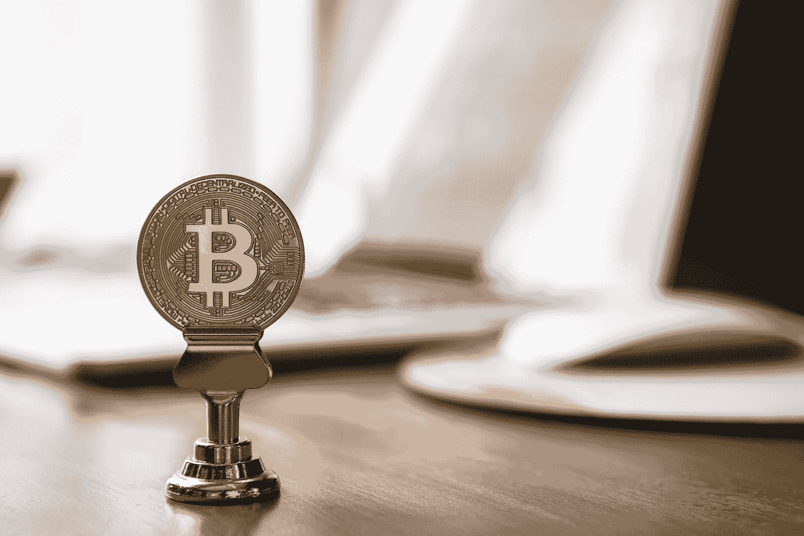
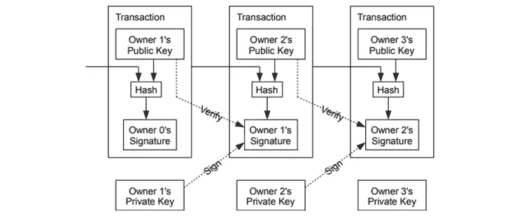
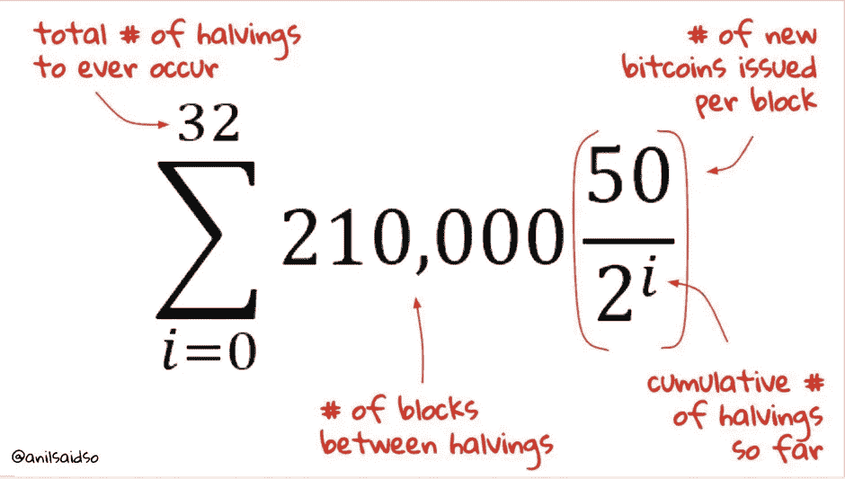

# 什么是比特币:适合初学者的比特币。

> 原文：<https://medium.com/coinmonks/what-is-bitcoin-bitcoin-for-beginners-620c0986b467?source=collection_archive---------57----------------------->

# 揭秘比特币白皮书。

Photo by [André François McKenzie](https://unsplash.com/@silverhousehd?utm_source=medium&utm_medium=referral) on [Unsplash](https://unsplash.com?utm_source=medium&utm_medium=referral)

比特币是一种数字支付系统，旨在让双方能够自由完成彼此之间的金融交易，而无需依赖第三方或中央机构。比特币通过使用点对点(p2p)网络来结算双方之间的金融交易。它使用公钥和来自私钥的数字签名来执行其主要功能。

**简介**

2010 年 5 月，一个名叫“中本聪”的人或一群人创造了世界上第一种加密货币——比特币。这种加密货币的主要目的是能够购买或获得产品，并在不使用第三方、金融机构或中央机构的情况下进行在线支付。

**背景故事**

2007 年末，世界经济开始衰退，许多企业倒闭，不同的公司申请破产，一些初创企业死亡。一些公司通过裁员来维持运营。由于这些事件的发生，许多人失业了。家庭受到了影响，政府也感受到了压力。银行和其他金融机构不得不采取措施保护自己的财务。除了其他许多问题，这些问题一直持续到 2009 年初，使得不同地区、国家或大陆之间的支付变得僵化。为了减轻经济下滑的影响，经济和金融部门的危机影响了人民的生活水平和不同国家之间的资金流动。

创造世界第一大加密货币比特币的想法，是否源于广为人知的 2008 年经济危机？我们能说这次金融危机的结果影响了这个名字下的个人或群体吗？“中本聪”创立了比特币，使得不同地区的支付可以无缝进行，而无需任何金融机构或第三方？我们说的这个比特币到底是什么？

创造世界第一大加密货币比特币的想法，是否源于广为人知的 2008 年经济危机？

**定义**

比特币是一种支付系统，允许双方在没有任何外部方或第三方干预或入侵的情况下结算交易。

它是一种基于密码证明而不是信任的电子支付系统，允许任何两个自愿方直接交易，而不需要可信的第三方

这意味着每笔交易都经过验证、记录、存储，并且永远不会被更改。由于不需要金融机构，支付系统在任何时候都是流动的，不受政府政策的影响。有意愿的各方可以在经济的任何时候或季节获得它，而不受任何政府或金融机构的限制。

使用比特币，交易成本得以节省或降低，因为创造比特币的目的是让双方在没有任何金融机构的情况下进行交易。它也有一些好处；通过允许可逆交易的传统可信经济模式，人们可能会被诈骗或欺骗，尤其是卖家或服务提供商，这是电子商务的弱点。由于电子商务完全依赖金融机构作为可信任的第三方来处理支付和交易，因此除了买方之外，很少或根本没有支付安全留给卖方。由于这个原因，在交易中经常会出现分歧，使得传统的支付系统或负责支付检查的中央机构别无选择，只能进行有利于买方的可逆交易。

这使得卖家即使在完成交易后也要处理检查和监管以保护他们的资金。

有鉴于此，有必要建立一个不可逆的支付模式，以保护买方和卖方，并提供一个平稳和流动的交易流。

**比特币是如何运作的？|时间戳服务器有什么帮助？**

假设你想购买一件产品，支付一些服务，或者只是转让硬币的所有权。你通过发送硬币来启动命令。当你必须把硬币寄到新地址时，一些你正在进行的活动会在后台进行。为了便于理解，下面将列举这些；

1)您启动发送命令

2)导出前一个事务和下一个所有者的公钥，然后进行哈希运算。

注意:公钥可以简单地认为是你的银行账号，但它只是在含义上增加了一些小的技术细节或功能；公钥是从私钥中随机生成的散列地址。

3)你对“前一笔交易和下一个所有者的公钥”的散列进行数字签名。

注意:您的私钥用于对哈希值进行签名。

下面是比特币白皮书中的一张图片，用来说明重点。

Bitcoin transaction illustration. Reference: bitcoin.pdf by Satoshi Nakamoto

一旦伴随交易数据的公钥与接收者的签名细节相匹配，接收者或下一个所有者就使用伴随交易数据的公钥(应该是接收者的公钥)来验证交易。这意味着交易已经完成。

然而，需要采取措施来验证发送的硬币是否被重复花费，因为没有第三方作为中央机构来监控交易记录。中本聪从比特币白皮书中提出了一个解决方案:公开宣布每一笔交易。收到的第一个是运行比特币软件的大多数节点同意的。使用这种方法，如果所有者试图重复消费，则第一笔交易被认为是有效的，其余的被认为是无效的。

为了帮助解决双重花费问题，添加了时间戳服务器，时间戳服务器将时间戳添加到要添加到区块链网络的事务块中。这有助于了解最先到达的事务，以及哪一个事务被认为是有效的或无效的。

时间戳服务器通过广播事务或记录的块以及前一个块的时间戳的散列来工作。这样，散列就被链接起来，从而创建了几个相关记录的链接或链，我们称之为区块链。

除了时间戳服务器，Satoshi 还带来了“工作证明”的概念。

**工作证明**

其概念是创建一种去中心化和分布式的方法，公开宣布每个交易，并通过使用时间戳服务器来决定哪个交易是有效的或无效的。

有了这份工作证明，就有了确定有效交易和防止重复花费的商定方法。

比特币交易是在比特币区块链上完成的，

像大多数分类账一样，比特币(BTC)是一种货币单位，其交易记录在区块链网络上；与众所周知的分类账不同，它是分散的，并且用密码保护。

这些比特币(BTC)单位的供应量很少，最高供应总量为 2100 万。供应量是由创造区块链时使用的数学公式决定的。比特币的流通供应量在 1910 万以上，比特币新单位的挖掘由系统自身控制，不能超过。

开采一块比特币平均需要 10 分钟。而在一个街区内，比特币的单位是递减的，每四年减半。自比特币诞生以来，一个区块中发现的比特币总数为 50 个。四年后，比特币的总单位减半，这意味着前四年后，一个区块中的比特币总数减少到 25 个。

来计算待开采的比特币总数(total max supply)和一个区块内可以找到的当前比特币。计算是这样的:

Bitcoin halving calculation. Reference: [https://images.app.goo.gl/xgeX6bHT4heDwzRn7](https://images.app.goo.gl/xgeX6bHT4heDwzRn7)

目前，在开采的区块中发现的总数为 6.25 比特币。下一次减半后，每块比特币的数量将为 3.125

**比特币是一种好的投资吗？**

除了比特币是第一种被创造的加密货币这一事实之外，它还成功地成为了一种财富保值的形式，并对冲了通货膨胀和经济弊端。

此外，区块链和加密空间已经有许多机构参与比特币生态系统，也有一些机构正在研究比特币投资。例如，全球最大的资产管理公司贝莱德与比特币基地合作，为其客户提供加密交易和投资。另一个例子是弗吉尼亚州的养老基金费尔法克斯县，它正在研究加密农业和贷款。

需要注意的一点是，机构和资产管理公司不会将资金投入到他们认为不可持续的项目中。有了这个，我们相信我们应该能够得出我们的结论，如果比特币是一个好的投资或不是。

本文的主要目的是帮助我们理解什么是比特币，并轻松理解比特币白皮书。

请确保您在媒体和 Twitter 上分享和关注我。

[https://twitter.com/PrinceSamuel_A](https://twitter.com/PrinceSamuel_A)

参考文献:【bitcoin.pdf】**|**作者:中本聪

 [## 什么是区块链技术？

### 区块链科技:区块链技术 101 你需要知道的一切

medium.com](/coinmonks/what-is-blockchain-technology-560db5c3d8cf)  [## 为什么区块链技术对您和您的企业很重要(如果您有)。

### 区块链技术对个人和企业是否至关重要？

medium.com](/codex/why-blockchain-technology-is-important-for-you-and-your-business-if-you-have-one-770ea1b4643f)  [## 什么是加密货币？

### 它是如何工作的？

medium.com](/coinmonks/what-is-cryptocurrency-5255ff3625a5)  [## 加密货币的类型。

### 你听说过 3 号和 8 号吗？

medium.com](/coinmonks/types-of-cryptocurrencies-10014c944d5d) 

> 交易新手？尝试[加密交易机器人](/coinmonks/crypto-trading-bot-c2ffce8acb2a)或[复制交易](/coinmonks/top-10-crypto-copy-trading-platforms-for-beginners-d0c37c7d698c)