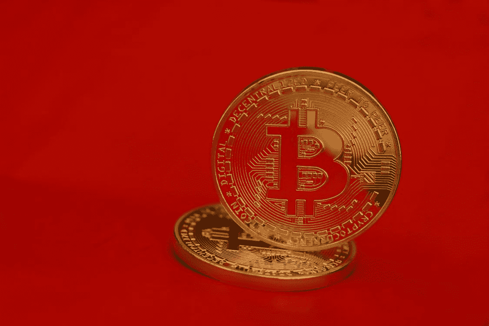

# 什么是比特币挖矿，为什么有必要？

> 原文：<https://medium.com/coinmonks/what-is-bitcoin-mining-and-why-is-it-necessary-29a936087056?source=collection_archive---------45----------------------->

## 为什么比特币会有“矿工？”

[**Bitcoin Mining**](https://www.pexels.com/photo/gold-round-coin-on-red-background-7708813/)

黄金有矿工，因为人们想要黄金，不幸的是，大多数黄金都埋藏在地下深处。比特币有矿工，因为人们想要比特币，但这里有些事情看起来很傻:一堆比特币，一个人发明的令牌，怎么会在需要挖掘的情况下被锁定？什么是…