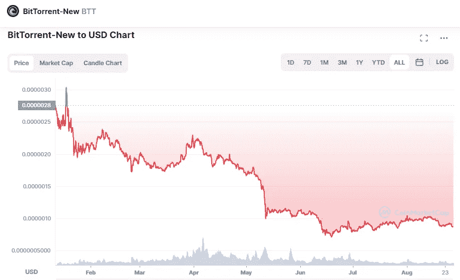

# 什么是 BitTorrent (BTT)和 2022–2025 年的价格预测

> 原文：<https://medium.com/coinmonks/what-is-bittorrent-btt-and-price-prediction-for-2022-2025-e03a475cc907?source=collection_archive---------18----------------------->

Source photo [BitTorrent-New price today, BTT to USD live, marketcap and chart | CoinMarketCap](https://coinmarketcap.com/currencies/bittorrent-new/)

# 什么是 BitTorrent (BTT)？

BitTorrent 是一种日益分散的点对点文件共享协议。布拉姆·科恩于 2001 年 7 月创办的 BitTorrent 于 2018 年 7 月被孙正义控制的信息收购。BitTorrent Token (BTT)是在 BTT 网络更新新功能(BTT)时引入的当地货币。