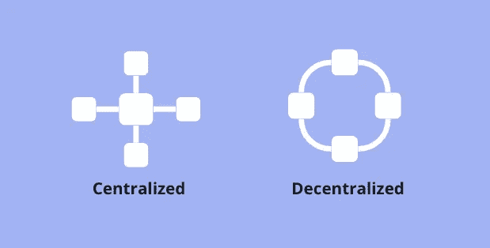
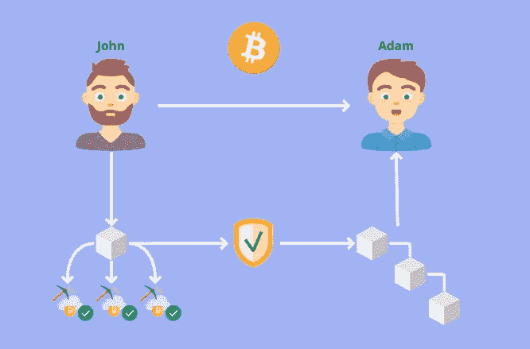

# 什么是区块链？我们如何使用它？

> 原文：<https://medium.com/coinmonks/what-is-blockchain-and-how-can-we-use-it-ef19678dc4e5?source=collection_archive---------42----------------------->

Photo by [Hitesh Choudhary](https://unsplash.com/@hiteshchoudhary) on [Unsplash](https://unsplash.com/)

## 什么是区块链？

区块链是一种分布式数据库或分类帐，在计算机网络的节点之间共享，并以数字格式电子存储信息。无需依靠银行或公司等中间人就能交换信息。这导致不确定性最小化，隐私和更多的信任。

通过区块链，信息被分散存储，这意味着在网络中的每台计算机上，矿工都持有区块链的一份完全相同的副本。

Centralized and Decentralized Networks

为了黑掉一个区块链，某人必须黑掉网络中至少 51%的计算机才能成功攻击。这也被称为 51%攻击。

## 在两个钱包之间发送加密货币

假设我们有两个人，约翰和亚当。约翰想把他钱包里的比特币发给亚当。在 John 点击 send 之后，他的事务被表示为一个块。

该块将被广播给网络上的每一方。如果交易有效，矿商将批准该交易，该区块将被添加到区块链中，从而使该交易永久且不可逆转。

一旦块被添加到链中，亚当就从约翰那里收到了他的比特币，并且现在完全控制了他的钱。

Reference from [CryptoExplorer.pro](https://pro.cryptoexplorer.cc/?affiliate=aYXnaw)

## 区块链中的交易

你和一群朋友坐在一张桌子旁。你决定引入一种新的货币，代币。每个参与者都收到一张纸，他们在上面写下所有发生的交易。

Reference from [CryptoExplorer.pro](https://pro.cryptoexplorer.cc/?affiliate=aYXnaw)

现在你开始用虚拟商品和虚拟代币进行交易。每个交易都被每个玩家记录在纸上。在此期间，每个玩家一遍又一遍地检查对方的笔记是否正确。因此，每个人在任何时候都知道谁拥有多少代币，他们从谁那里收到了一些代币，以及他们向谁发送了一些代币。

Reference from [CryptoExplorer.pro](https://pro.cryptoexplorer.cc/?affiliate=aYXnaw)

过了一段时间，所有的参与者都必须上交笔记。

Reference from [CryptoExplorer.pro](https://pro.cryptoexplorer.cc/?affiliate=aYXnaw)

第一个认为所有的交易都已经正确地写在表上的人会大叫“我做到了！”。

Reference from [CryptoExplorer.pro](https://pro.cryptoexplorer.cc/?affiliate=aYXnaw)

如果是这种情况，所有玩家都会确认这张纸条，然后把它粘在桌子中间的一本书上。

Reference from [CryptoExplorer.pro](https://pro.cryptoexplorer.cc/?affiliate=aYXnaw)

每个玩家都会在桌子中间拿到整本书的副本，并把它放在自己面前。

因此，即使这本书被篡改或者消失了，仍然有足够的副本来继续这个系统。

Reference from [CryptoExplorer.pro](https://pro.cryptoexplorer.cc/?affiliate=aYXnaw)

现在每个玩家都得到一张新纸条，一切又重新开始。

Reference from [CryptoExplorer.pro](https://pro.cryptoexplorer.cc/?affiliate=aYXnaw)

这个系统确保在桌子中间总有一本书，在这本书里，在桌子上进行的所有交易都是完整的、正确的，并由所有参与者确认。所有玩家都认同这本书的正确性。通过这种透明性，所有参与者都对正确的簿记以及货币系统有高度的信任。

Reference from [CryptoExplorer.pro](https://pro.cryptoexplorer.cc/?affiliate=aYXnaw)

区块链让这一切在没有中央实体的情况下成为可能。

> 交易新手？试试[加密交易机器人](/coinmonks/crypto-trading-bot-c2ffce8acb2a)或者[复制交易](/coinmonks/top-10-crypto-copy-trading-platforms-for-beginners-d0c37c7d698c)