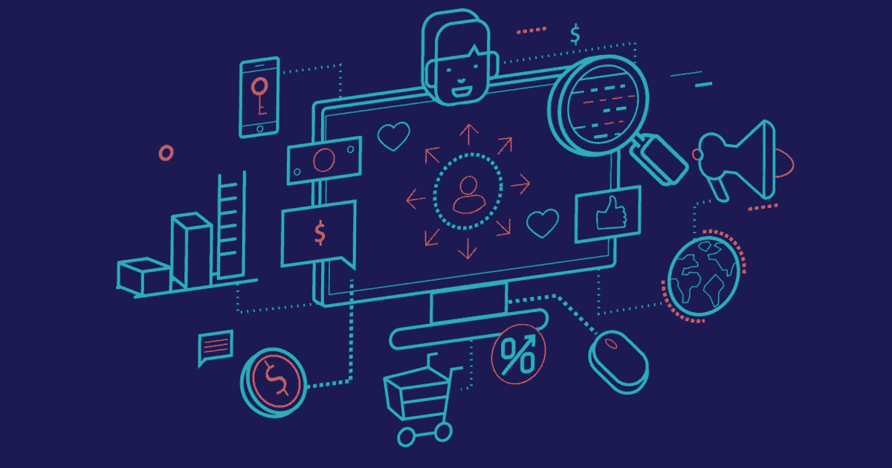
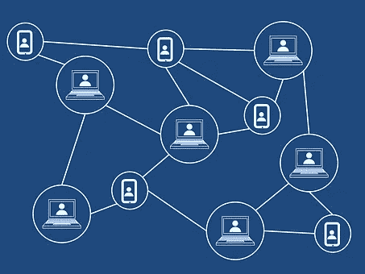

# 什么是区块链？这就是为什么营销人员应该关心…

> 原文：<https://medium.com/coinmonks/what-is-blockchain-here-is-why-marketers-should-care-4c5a7c1dd3ac?source=collection_archive---------15----------------------->

[https://builtin.com/blockchain/blockchain-marketing-advertising-examples](https://builtin.com/blockchain/blockchain-marketing-advertising-examples)

# 什么是区块链，它是如何工作的？

如果你以前听说过区块链，最有可能是因为加密货币，因为金融部门是第一批采用和投资区块链发展的部门之一。因此，该行业继续主导市场。然而，大多数人都不知道区块链技术远远超出了比特币或以太坊，它开启了一个全新的解放时代。

区块链是虚拟数据库或总账。它们由多个计算机网络连接共享，并以数字格式存储数据。区块链与其他数据库的不同之处在于，其核心技术确保了记录的安全。

区块链和其他数据库的另一个区别是分类帐中数据的结构。区块链，顾名思义，将数据分组成块；将它们视为独立的储藏室或隔间。当达到一个块的容量时，它被关闭并链接到前一个块。

这就是区块链是如何形成的；在关闭的块之后添加的任何数据都必须存储在新的块中。当这个新块完成时，它被链接到现有的链，等等。区块链存储除了创建链之外，还创建了数据添加时间的时间表。

基于区块链的数据库与其他数据库之间的一个最显著的区别是，所有用户都集中持有基于区块链的数据，而不是在一个单一的集中组织中。

# 区块链如何适合营销？

早在 2008 年，当全球金融危机爆发，人们对传统银行体系失去信任时，点对点电子现金系统突然出现比特币证明了加密机制在金融交易处理中的应用。比特币的加密机制解决了重复消费的问题，同时为在线环境下进行金融交易和价值交换设定了全新的标准。

此外，区块链在市场营销中的影响将集中在它如何验证交易的有效性。由于所有事务都是按顺序排列在带有时间戳的块中，篡改区块链上的公共事务记录是不可能的。区块链营销应用将极大地改变客户与企业的互动，因为它们结合了几种技术的优势，最显著的是区块链网络参与者进行的分布式交易账本。区块链技术的主要目标是资产认证，并有可能应用于其他商业活动。

# 区块链将如何影响数字营销？

数字营销行业开始意识到这项技术的潜力。营销中的区块链可以帮助品牌与客户建立更安全的关系，允许他们创建更有针对性的广告，而不必与这么多公司共享太多数据。

在这个阶段，技术仍在发展，为数字营销行业创造用例，这些用例几乎每天都在被发现。区块链技术和 Web 3.0 应用无疑将改善数字营销人员管理数据的方式。

# 以下是区块链在数字营销中的四个应用:

## **关键词搜索**

一个人对谷歌的看法通常是这个人独有的。其他研究人员看到的结果会因他们的位置和使用的设备而异。这使得营销人员很难跟踪关键词排名来优化搜索引擎优化(SEO)；然而，区块链可以回答营销人员仍然需要做出的一些猜测。

该分类帐可以提供每个关键字的性能的准确数字，并随着时间的推移进行跟踪。这种精确程度的数据不仅对报告有用。它也是真正数据驱动的营销活动的基础。

营销人员可以利用这些数据来确定他们需要采取什么行动来改善表现不佳的领域和设备。

## **目前提高了引线质量**

出于营销目的的数据收集有多种形式。例如，许多营销人员从多个来源收集数据，对其进行编译，然后基于这些数据发起一项活动。不幸的是，这种方法是有缺陷的，许多活动是基于不一致或不正确的数据。

因为区块链交易是分散的，营销人员必须直接面对消费者。Brave 就是这样一个例子，它开发了一款广告拦截浏览器。虽然这并不新鲜，但它确实向用户展示了它出售给使用基本注意力令牌(BAT)的企业的广告。用户获得代币价值的 70%，而 Brave 获得 30%。

勇敢者如何瞄准广告？首先，用户向公司提供尽可能多(或尽可能少)的个人信息。然后，广告商根据 Brave 掌握的人口统计数据选择受众，永远不知道那些观看广告的人的身份。这可能是未来的模式。

## **对付广告欺诈的工具**

由于区块链技术，消费者将对他们的数据有更多的控制权。因此，营销人员必须创造更安全的存储和访问消费者数据的方法。

然而，区块链欺诈预防更进一步。例如，非法供应商在点击付费(PPC)广告活动中实施点击欺诈。广告欺诈可以通过监控点击和提供端到端的透明度来消除。

## **对消费者更透明**

任何想要吸引新生代和千禧一代的品牌都必须是真实的。支持公平贸易和环境问题等事业也至关重要。

例如，一个肉制品品牌可以利用区块链来宣传其供应链。想要购买道德采购和清真肉类的人可能会查看他们正在考虑使用的品牌的区块链，以了解饲养奶牛的农场位于何处，以及他们如何将这些奶牛转化为美味的烤肉串。客户可以跟踪该品牌肉类的整个生命周期，以了解它何时离开农场，以及它在船上呆了多长时间；消费者甚至可以看到肉在运输船上储存的平均温度。

区块链提供了透明性，因为它是不可变的，所以可以信任。因此，更高的效率和更低的交易成本可能有利于品牌。

# 底线

当一项新技术出现时，可能会出现关于其安全性和可行性的问题和担忧。然而，区块链技术利大于弊，特别是在营销行业。区块链技术可以帮助保护数字营销计划，同时让消费者能够控制自己的数据。随着区块链技术在营销中的应用，品牌可能会寻求在打击点击欺诈等欺诈行为的能力方面取得看似合理的进步。此外，品牌可以利用区块链技术引入可信的价值，同时优化营销活动的成本。了解更多关于区块链技术在营销中的应用。

目前，区块链对数字营销趋势的影响尚不明朗。

然而，请关注这个快节奏行业的发展。请记住，自然界中的人们害怕改变，因为他们不知道结果。

> 交易新手？试试[加密交易机器人](/coinmonks/crypto-trading-bot-c2ffce8acb2a)或者[复制交易](/coinmonks/top-10-crypto-copy-trading-platforms-for-beginners-d0c37c7d698c)