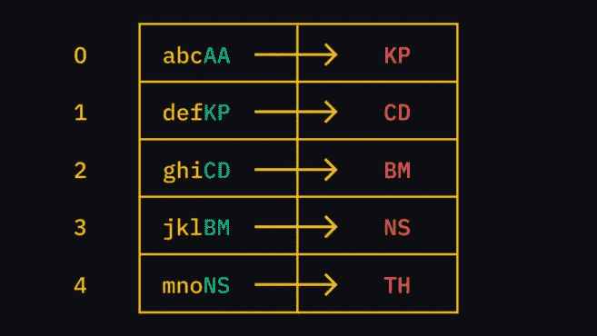
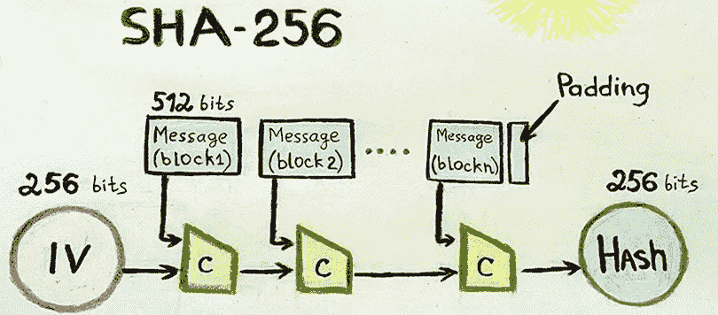

# 什么是区块链技术？初学者指南

> 原文：<https://medium.com/coinmonks/what-is-blockchain-technology-beginner-guide-3901ad8cc2f?source=collection_archive---------51----------------------->

(第一部分)

什么是区块链？

一种独特的数据库被称为区块链。术语分布式账本技术(或 DLT)经常互换使用。

区块链有特殊的品质。添加数据有指导原则，一旦保存，就不能更改或删除。

块是逐渐添加数据的结构。每个块都有一条信息，这条信息指向它前面的块，并堆叠在前一个块的顶部。我们可以通过检查最近的块来确定自上一个块以来是否已经产生了块。如果我们沿着“链”一直走下去，我们最终会到达我们的第一个区块，有时被称为“创世区块”

考虑一个有两列的电子表格作为类比。您可以在第一行的第一个单元格中输入任何所需的数据。

> 交易新手？试试[密码交易机器人](/coinmonks/crypto-trading-bot-c2ffce8acb2a)或者[复制交易](/coinmonks/top-10-crypto-copy-trading-platforms-for-beginners-d0c37c7d698c)

第一个单元格中的信息被转换成两个字母的标识符，该标识符将包含在下面的输入中。此图中第二行的后续单元格需要使用两个字母的标识符 KP (defKP)来填充。换句话说，如果您更改了第一个输入值(abcAA)，您将在每个后续单元格中获得不同的字母组合。

A database where each entry is linked to the last.

正如我们现在看到的第 4 行，我们最近的标识符是 TH。你还记得我们提到过你不能返回编辑或删除条目吗？因为这对每个人来说都是显而易见的，他们会无视你的改变。

# 区块是如何连接的？

我们上面使用的两个字母的恒等式是一个区块链如何使用散列函数的浓缩类比。将块粘合在一起的粘合剂是散列法。使用任何大小的数据，并通过数学公式进行处理，以创建相同长度的输出(哈希)。

区块链中使用的散列很有趣，因为它不太可能发现产生完全相同结果的两个数据位。就像我们之前的 IDs 一样，即使对输入数据进行很小的更改也会导致完全不同的结果。

我们用 SHA256 来举例说明，这个函数在比特币中被广泛使用。

# 区块链和权力下放

我们已经描述了区块链的基本构成。然而，当人们讨论区块链技术时，他们不是指数据库本身，而是指在区块链周围建立的生态系统。

区块链仅在作为独立数据结构的特殊应用中有帮助。当试图帮助陌生人相互交流时，事情开始变得有趣起来。当与其他技术和某些博弈论相结合时，区块链可以起到开源分布式账本的作用。

这表明没有人有权以违反系统规则的方式更改条目(稍后将详细介绍规则)。这样，你可以说每个人都拥有分类账，因为每个人在任何时候都同意它的外观。

# 为什么区块链需要分权？

当然，你可以自己管理一个区块链。但是与更好的选择相比，您最终会得到一个笨拙的数据库。它的真正潜力可以在一个分散的环境中实现，或者在一个所有用户都受到对待的环境中实现。这样，就不可能摧毁或接管区块链。真理的来源只有一个，大家都看得到。

> 加入 Coinmonks [电报频道](https://t.me/coincodecap)和 [Youtube 频道](https://www.youtube.com/c/coinmonks/videos)了解加密交易和投资

# 另外，阅读

*   [印度最佳 P2P 加密交易所](https://coincodecap.com/p2p-crypto-exchanges-in-india) | [柴犬钱包](https://coincodecap.com/baby-shiba-inu-wallets)
*   [8 大加密附属计划](https://coincodecap.com/crypto-affiliate-programs) | [eToro vs 比特币基地](https://coincodecap.com/etoro-vs-coinbase)
*   [最佳以太坊钱包](https://coincodecap.com/best-ethereum-wallets) | [电报上的加密货币机器人](https://coincodecap.com/telegram-crypto-bots)
*   [交易杠杆代币的最佳交易所](https://coincodecap.com/leveraged-token-exchanges) | [购买 Floki](https://coincodecap.com/buy-floki-inu-token)
*   [3Commas 对 Pionex 对 Cryptohopper](https://coincodecap.com/3commas-vs-pionex-vs-cryptohopper) | [Bingbon 评论](https://coincodecap.com/bingbon-review)