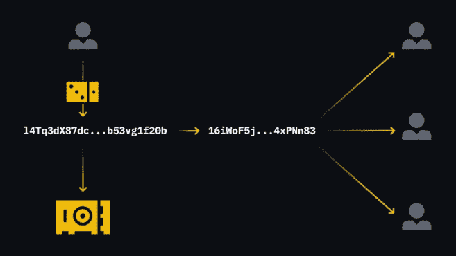
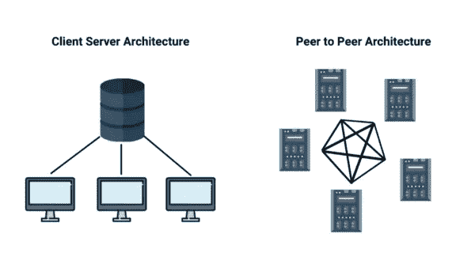

# 什么是区块链技术？初学者指南(第二部分)。

> 原文：<https://medium.com/coinmonks/what-is-blockchain-technology-beginner-guide-part-2-3632d1b437?source=collection_archive---------43----------------------->

区块链中的节点是什么？

节点只是我们用来指代网络中的计算机的术语；这些计算机存储区块链的副本并与其他计算机通信。用户不必手动管理这些操作。大多数时候，客户所要做的就是下载并执行区块链的软件；其他一切都将自动处理。

节点的概念可以包括除了上面在最一般的意义上描述的以外，参与任何种类的网络交互的其他用户。加密货币中的一个轻节点就像手机上一个简单的钱包应用程序。

**公立 vs 私立区块链**

你可能已经知道，比特币为区块链行业的现状奠定了基础。自从比特币开始成为一种值得信赖的金融工具以来，发明家们一直在考虑底层技术在不同行业的应用。这导致了对区块链在金融领域之外的大量应用的调查。

一个公开的区块链就是我们所说的比特币。根据定义，任何人只要有互联网连接和所需的软件，就可以加入并查看网上交易。我们可以称这种环境为无许可环境，因为没有进一步的参与条件。

相比之下，二等兵区块链是存在的另一类区块链。这些解决方案限制了谁可以访问和使用区块链。因此，我们称之为“许可环境”。私有区块链有一些有用的应用，主要是在商业环境中，即使它们最初看起来是多余的。

## **交易是如何进行的？**

Alice 通知她的银行，如果她希望通过银行转账给 Bob 汇款。为了简单起见，让我们假设双方使用同一家银行。在更新其数据库之前，银行确认 Alice 有必要的资金来完成交易。

这与区块链的运作方式没有什么不同。毕竟是数据库。主要区别在于余额的检查和更新不是由一方处理的。必须由每个节点来完成。

Alice 向网络广播一条消息，声明她想给 Bob 发送五个比特币。节点将会查看它，但是必须采取更多的步骤，以便在将事务放入区块链之前对其进行验证。

一旦该事务被记录在区块链上，所有节点都将能够看到它。为了反映这一点，他们将更新他们的区块链副本。现在网络知道 Alice 在之前的交易中已经使用了这五个单位，她不能将这些单位发送给 John(并避免重复花费)。

不使用用户名或密码；相反，公钥加密用于证明资金的所有权。Bob 需要创建一个私钥，以便开始收款。即使有几百年的时间，任何人都很难猜出这个非常长的随机数。然而，如果他给任何人他的私人钥匙，他们将能够证明拥有(和使用)他的钱。因此，他必须保守这个秘密。

> 交易新手？试试[加密交易机器人](/coinmonks/crypto-trading-bot-c2ffce8acb2a)或者[复制交易](/coinmonks/top-10-crypto-copy-trading-platforms-for-beginners-d0c37c7d698c)

然而，Bob 能够从他的私钥创建一个公钥。然后，他可以将公钥分发给任何人，因为任何人都很难解密它并获得密钥。为了获得公共地址，他通常对公共密钥执行另一个操作(如散列)。

他将向爱丽丝提供街道地址，这样她就知道往哪里寄钱了。她创建了一个交易，请求在特定的公共地址付款。然后，她使用自己的私人密钥生成一个数字签名，向网络证明她没有试图花不属于她的钱。任何人都可以使用 Alice 的签名消息，通过将其与她的公钥进行比较来验证她有权向 Bob 发送这些钱。

**区块链技术使用点对点(P2P)交易。**

底层的区块链技术利用 P2P 网络的优势，提供了一个共享的、可靠的交易分类账。区块链是一种分布式账本技术，将交易存储为不可变的带时间戳的数字块，包括发送方和接收方信息。区块链网络由分散的组织管理，只有参与者才能批准他们之间的交易。多亏了技术，人们和机构现在可以接受结果，而不需要对参与者有信心。这种全新的分布式数据管理和存储方法可作为所有交易和操作的公共数字分类账。

**Peer-to-Peer Transactions.**

**区块链在哪里存储交易数据？**

区块链数据的组织方式与传统数据库非常不同。与将数据组织成表的数据库不同，区块链将数据组织成块。网络上发生的每个事务都可以添加到这些具有固定存储量的块中。在用事务填充现有块之后，将一个新块添加到现有块中，以添加额外的事务，从而产生称为区块链的块链。

区块链不是放在一个地方，因为它们是分散的。作为一种选择，它们保存在网络节点或个人电脑上。换句话说，每个节点都拥有一份网络事务的拷贝，即区块链。因此，连接到网络的每个节点都为系统提供备份。

> 加入 Coinmonks [电报频道](https://t.me/coincodecap)和 [Youtube 频道](https://www.youtube.com/c/coinmonks/videos)了解加密交易和投资

# 另外，阅读

*   [Bookmap 点评](https://coincodecap.com/bookmap-review-2021-best-trading-software) | [美国 5 大最佳加密交易所](https://coincodecap.com/crypto-exchange-usa)
*   [加密交易机器人](/coinmonks/crypto-trading-bot-c2ffce8acb2a) | [硬币门评论](https://coincodecap.com/coingate-review)
*   最佳加密[硬件钱包](/coinmonks/hardware-wallets-dfa1211730c6) | [Bitbns 评论](/coinmonks/bitbns-review-38256a07e161)
*   [新加坡十大最佳加密交易所](https://coincodecap.com/crypto-exchange-in-singapore) | [购买 AXS](https://coincodecap.com/buy-axs-token)
*   [红狗赌场评论](https://coincodecap.com/red-dog-casino-review) | [Swyftx 评论](https://coincodecap.com/swyftx-review)