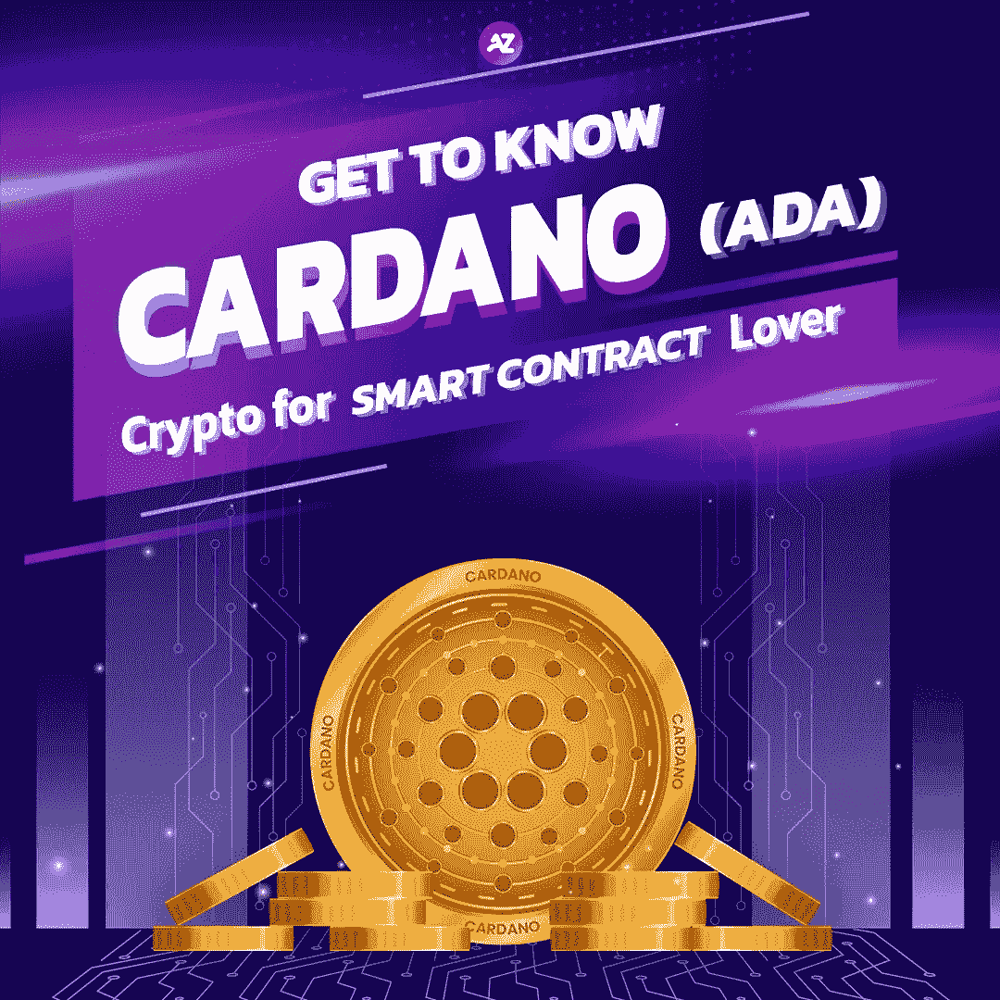
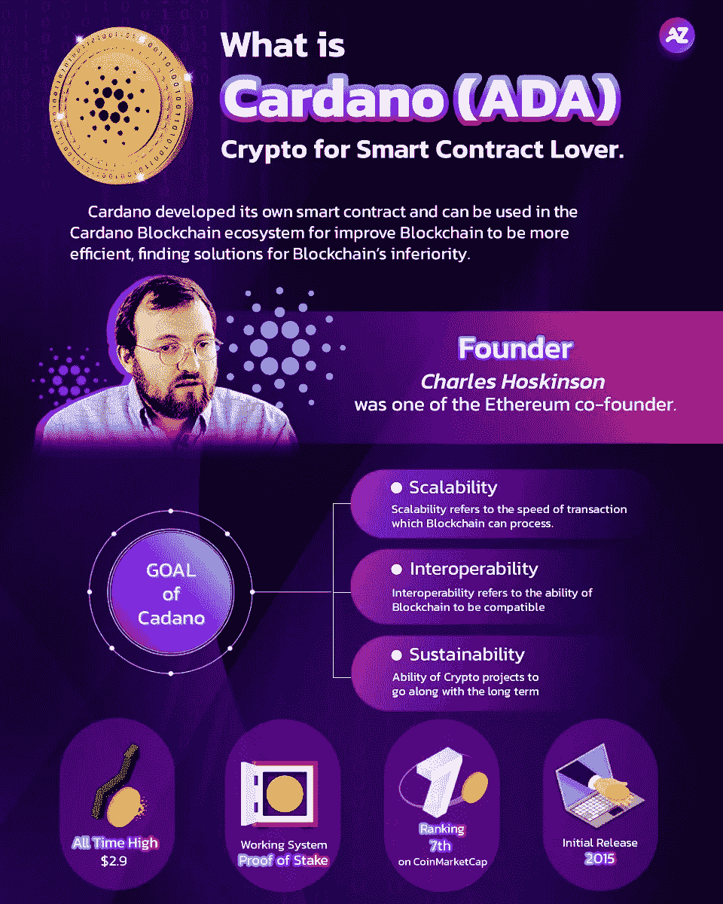

# 什么是卡尔达诺(阿达)？

> 原文：<https://medium.com/coinmonks/what-is-cardano-ada-e85022c98cd1?source=collection_archive---------67----------------------->

## 智能合同爱好者的密码

What is Cardano (ADA)?

# Cardano 或 ADA 是市值最高的加密公司之一。

## 大家可能都知道或者听说过 ADA。
今天我们将深入 Cardano 生态系统，它是如何工作的，为什么它被称为“以太坊黑仔”

What is Cardano (ADA)?

Cardano 或 ADA 由查尔斯·霍金森于 2015 年创立。查尔斯·霍金森是以太坊的创始人之一。Charles Hoskinson 希望改进区块链以提高效率，为区块链的劣势找到解决方案。Cardano 已从工作证明(PoW)机制更改为利益证明(PoS)机制。目前，Cardano 的团队还开发了自己的智能合约，可以用于 Cardano 区块链生态系统。

> 交易新手？试试[加密交易机器人](/coinmonks/crypto-trading-bot-c2ffce8acb2a)或者[复制交易](/coinmonks/top-10-crypto-copy-trading-platforms-for-beginners-d0c37c7d698c)

# Cardano 区块链的目的是:

1.  **可扩展性。**可扩展性是指区块链能够处理的交易速度。如果一个区块链配备了非常高的可扩展性，这种区块链上的交易将被处理得非常快，吞吐量更高。在以太坊区块链上处理的每笔交易大约需要 15 笔交易/秒，而 Cardano Blokchain 可以处理 270 笔交易/秒。
2.  **互通性。**互操作性是指一个区块链兼容另一个区块链的能力。
3.  **分层建筑的可持续性。**可持续性是指加密项目长期顺应市场条件的能力。可持续性由:

*   沉降层。结算层使用利益证明机制来管理交易。这一层由比特币和以太坊技术开发。
*   计算层。计算层指的是智能合约层，用户可以自行设置条件。

这就是为什么卡尔达诺将是以太坊的一个非常有竞争力的对手，它被称为“以太坊黑仔”。投资者正在进入卡尔达诺市场，因为他们相信卡尔达诺将会增长。

*本文并非投资建议。投资数字资产有风险，投资者投资前应仔细研究。

如果您对分散资产管理感兴趣，请随时联系我们。

请确保您不会错过任何更新的新闻，请关注我们的社交媒体，如下所示:
Twitter:[https://twitter.com/azirafinance](https://twitter.com/azirafinance)
Medium:[https://medium.com/@azirafinance](/@azirafinance)
脸书:[https://www.facebook.com/azirafinance](https://www.facebook.com/azirafinance)
Reddit:[https://www.reddit.com/user/azirafinance](https://www.reddit.com/user/azirafinance)
白皮书:[https://azira-finance.gitbook.io/product-docs/](https://azira-finance.gitbook.io/product-docs/)